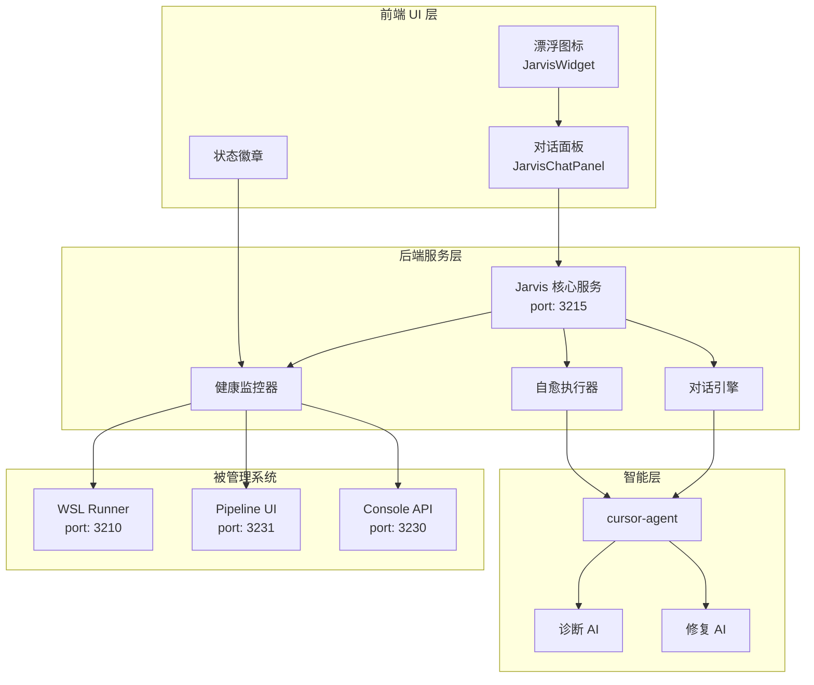
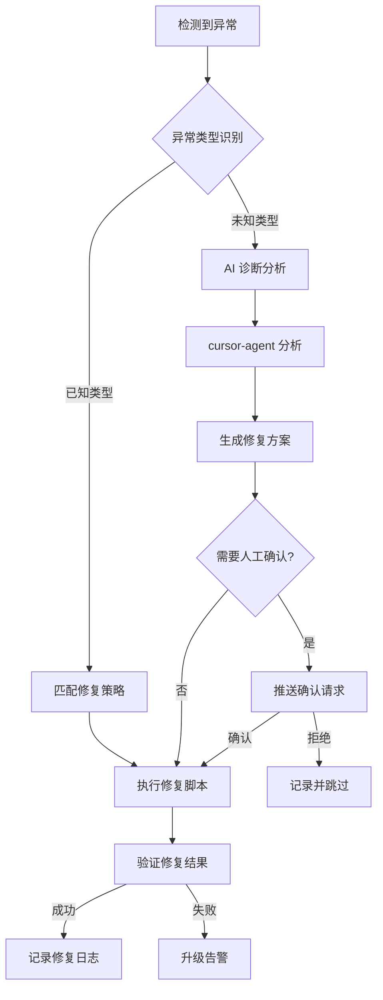

# Jarvis 智能管家系统设计文档

> **版本**: v1.0  
> **创建日期**: 2026-01-14  
> **状态**: Draft  

---

## 1. 概述

### 1.1 背景

当前 Pipeline-Sys 流程系统在运行过程中可能遇到各种问题：
- 环境依赖缺失（如 `@rollup/rollup-linux-x64-gnu`）
- 服务崩溃或无响应
- FlowSpec 执行失败
- 配置错误或路径问题

这些问题目前需要人工介入排查和修复，效率较低。

### 1.2 目标

构建一个类似"钢铁侠贾维斯"的智能管家系统 **Jarvis**，具备：

1. **自检自愈能力** - 自动检测系统异常并修复
2. **对话交互能力** - 通过自然语言与用户沟通
3. **主动服务能力** - 预防性检查和优化建议

### 1.3 核心理念

```
"Sir, I've detected an anomaly in the WSL environment. 
 The rollup module is missing. Shall I fix it?"
```

---

## 2. 系统架构



---

## 3. 功能模块

### 3.1 健康监控器（HealthMonitor）

#### 3.1.1 监控目标

| 监控项 | 检查方式 | 检查频率 | 告警阈值 |
|--------|----------|----------|----------|
| WSL Runner 可用性 | HTTP ping `/health` | 10s | 连续 3 次失败 |
| Pipeline UI 可用性 | HTTP ping | 30s | 连续 2 次失败 |
| PM2 进程状态 | `pm2 jlist` | 15s | status != 'online' |
| 磁盘空间 | `df -h` | 5min | < 10% 剩余 |
| 内存使用 | `free -m` | 30s | > 90% 使用 |
| 任务队列积压 | 查询 Runner | 30s | > 10 个待处理 |
| 最近运行失败率 | 统计 logs | 1min | > 50% 失败 |

#### 3.1.2 健康状态定义

```typescript
enum HealthStatus {
  HEALTHY = 'healthy',      // 一切正常
  DEGRADED = 'degraded',    // 部分功能受影响
  CRITICAL = 'critical',    // 核心功能不可用
  UNKNOWN = 'unknown'       // 无法确定状态
}

interface SystemHealth {
  status: HealthStatus;
  services: {
    [serviceName: string]: {
      status: HealthStatus;
      lastCheck: string;
      details?: string;
      metrics?: Record<string, number>;
    }
  };
  issues: Issue[];
  lastFullCheck: string;
}
```

#### 3.1.3 异常检测规则

```yaml
# 异常检测规则配置
detection_rules:
  - id: "service_down"
    name: "服务不可用"
    condition: "service.status == 'offline' && consecutive_failures >= 3"
    severity: "critical"
    auto_heal: true
    heal_action: "restart_service"

  - id: "high_failure_rate"
    name: "高失败率"
    condition: "recent_runs.failure_rate > 0.5 && recent_runs.count >= 5"
    severity: "warning"
    auto_heal: false
    suggest_action: "analyze_failures"

  - id: "dependency_missing"
    name: "依赖缺失"
    condition: "error_log.contains('MODULE_NOT_FOUND') || error_log.contains('ENOENT')"
    severity: "critical"
    auto_heal: true
    heal_action: "fix_dependencies"

  - id: "disk_space_low"
    name: "磁盘空间不足"
    condition: "disk.available_percent < 10"
    severity: "warning"
    auto_heal: true
    heal_action: "cleanup_logs"
```

---

### 3.2 自愈执行器（SelfHealer）

#### 3.2.1 自愈流程



#### 3.2.2 修复策略库

```typescript
interface HealStrategy {
  id: string;
  name: string;
  description: string;
  triggers: string[];           // 触发条件
  requires_confirmation: boolean;
  steps: HealStep[];
  rollback_steps?: HealStep[];
  max_attempts: number;
  cooldown_minutes: number;
}

const HEAL_STRATEGIES: HealStrategy[] = [
  {
    id: "restart_wsl_runner",
    name: "重启 WSL Runner",
    description: "当 WSL Runner 无响应时重启服务",
    triggers: ["service_down:wsl-cursor-runner", "health_check_failed:runner"],
    requires_confirmation: false,
    steps: [
      { type: "shell", command: "pm2 restart wsl-cursor-runner" },
      { type: "wait", seconds: 5 },
      { type: "health_check", target: "wsl-cursor-runner" }
    ],
    max_attempts: 3,
    cooldown_minutes: 5
  },
  {
    id: "fix_npm_dependencies",
    name: "修复 NPM 依赖",
    description: "重新安装 node_modules 以修复缺失的原生模块",
    triggers: ["error:MODULE_NOT_FOUND", "error:rollup-linux"],
    requires_confirmation: true,
    steps: [
      { type: "shell", command: "cd game && rm -rf node_modules package-lock.json" },
      { type: "shell", command: "cd game && npm install", timeout: 300000 },
      { type: "shell", command: "pm2 restart wsl-cursor-runner" }
    ],
    max_attempts: 2,
    cooldown_minutes: 30
  },
  {
    id: "ai_diagnose_and_fix",
    name: "AI 智能诊断修复",
    description: "使用 cursor-agent 分析问题并生成修复方案",
    triggers: ["unknown_error", "repeated_failure"],
    requires_confirmation: true,
    steps: [
      { type: "ai_analyze", prompt_template: "diagnose_error" },
      { type: "ai_generate", prompt_template: "generate_fix" },
      { type: "ai_execute", prompt_template: "apply_fix" },
      { type: "verify", method: "rerun_failed_task" }
    ],
    max_attempts: 1,
    cooldown_minutes: 60
  }
];
```

#### 3.2.3 AI 诊断提示词模板

```yaml
# prompts/diagnose_error.yaml
name: diagnose_error
description: 诊断系统错误
template: |
  你是 Pipeline-Sys 流程系统的智能诊断助手。

  ## 当前问题
  - 错误类型: {{error_type}}
  - 错误信息: {{error_message}}
  - 发生位置: {{error_location}}
  - 发生时间: {{error_time}}

  ## 相关日志
  ```
  {{recent_logs}}
  ```

  ## 系统状态
  - PM2 状态: {{pm2_status}}
  - 最近运行: {{recent_runs}}

  ## 任务
  1. 分析错误的根本原因
  2. 判断是否可以自动修复
  3. 如果可以，给出修复步骤
  4. 如果不可以，说明原因并建议人工处理方式

  ## 输出格式（JSON）
  {
    "diagnosis": "问题诊断描述",
    "root_cause": "根本原因",
    "can_auto_fix": true/false,
    "confidence": 0.0-1.0,
    "fix_steps": [
      { "type": "shell|file|restart", "action": "具体操作" }
    ],
    "requires_human": false,
    "human_action": "如需人工，描述操作"
  }
```

---

### 3.3 对话引擎（ChatEngine）

#### 3.3.1 对话能力

| 能力类别 | 示例指令 | 处理方式 |
|----------|----------|----------|
| 状态查询 | "系统现在怎么样？" | 返回健康状态摘要 |
| 服务控制 | "重启 Runner" | 执行服务管理命令 |
| 问题排查 | "最近的任务为什么失败了？" | AI 分析失败原因 |
| 任务管理 | "提交一个测试任务" | 调用 API 创建任务 |
| 日志查看 | "看看最新的运行日志" | 返回格式化日志 |
| 配置修改 | "把超时时间改成 5 分钟" | 修改配置并重启 |
| 代码修复 | "修复 l3-tester 的空值问题" | cursor-agent 修复 |

#### 3.3.2 意图识别

```typescript
interface Intent {
  name: string;
  confidence: number;
  entities: Record<string, string>;
  requires_ai: boolean;
}

const INTENT_PATTERNS = [
  {
    intent: "check_status",
    patterns: [
      "系统(.*)怎么样", "状态", "健康(.*)吗", "正常吗",
      "how.*system", "status", "health"
    ],
    handler: "handleCheckStatus"
  },
  {
    intent: "restart_service",
    patterns: [
      "重启(.+)", "restart (.+)", "重新启动"
    ],
    entities: ["service_name"],
    handler: "handleRestartService"
  },
  {
    intent: "analyze_failure",
    patterns: [
      "为什么失败", "失败原因", "出了什么问题",
      "why.*fail", "what.*wrong"
    ],
    handler: "handleAnalyzeFailure",
    requires_ai: true
  },
  {
    intent: "submit_task",
    patterns: [
      "提交(.*)任务", "创建(.*)任务", "新建任务",
      "submit.*task", "create.*task"
    ],
    handler: "handleSubmitTask"
  },
  {
    intent: "view_logs",
    patterns: [
      "看(.*)日志", "查看日志", "日志",
      "show.*log", "view.*log"
    ],
    handler: "handleViewLogs"
  },
  {
    intent: "fix_issue",
    patterns: [
      "修复(.+)", "解决(.+)", "fix (.+)"
    ],
    handler: "handleFixIssue",
    requires_ai: true
  },
  {
    intent: "general_question",
    patterns: [".*"],
    handler: "handleGeneralQuestion",
    requires_ai: true,
    fallback: true
  }
];
```

#### 3.3.3 对话上下文管理

```typescript
interface ConversationContext {
  session_id: string;
  user_id?: string;
  messages: ChatMessage[];
  current_task?: {
    type: string;
    status: 'pending' | 'executing' | 'completed' | 'failed';
    data: any;
  };
  system_snapshot?: SystemHealth;
  created_at: string;
  last_active: string;
}

interface ChatMessage {
  role: 'user' | 'jarvis' | 'system';
  content: string;
  timestamp: string;
  metadata?: {
    intent?: Intent;
    action_taken?: string;
    attachments?: Attachment[];
  };
}
```

---

### 3.4 前端 UI 组件

#### 3.4.1 漂浮图标（JarvisWidget）

```tsx
// 设计规格
interface JarvisWidgetProps {
  position: 'bottom-right' | 'bottom-left' | 'top-right' | 'top-left';
  size: 'small' | 'medium' | 'large';  // 40px | 56px | 72px
  theme: 'light' | 'dark' | 'auto';
}

// 状态展示
interface WidgetState {
  mode: 'idle' | 'listening' | 'thinking' | 'speaking' | 'alert';
  health: HealthStatus;
  unread_count: number;
  pulse_animation: boolean;
}
```

**视觉设计**：

```
┌─────────────────────────────────────┐
│                                     │
│                                     │
│                                     │
│                                     │
│                                     │
│                                     │
│                                     │
│                                     │
│                           ┌───────┐ │
│                           │  ●3   │ │  ← 红点表示有未读消息/告警
│                           │ 🤖    │ │  ← Jarvis 图标
│                           │ ~~~   │ │  ← 健康状态指示条
│                           └───────┘ │
└─────────────────────────────────────┘
```

**状态颜色**：
- 🟢 绿色脉冲 - 系统健康
- 🟡 黄色闪烁 - 有警告
- 🔴 红色持续 - 严重问题
- 🔵 蓝色波动 - 正在处理

#### 3.4.2 对话面板（JarvisChatPanel）

```
┌─────────────────────────────────────────┐
│ 🤖 Jarvis                    ─ □ ✕     │
├─────────────────────────────────────────┤
│ ┌─────────────────────────────────────┐ │
│ │ 🤖 你好！我是 Jarvis，Pipeline-Sys │ │
│ │    的智能管家。有什么可以帮你的？   │ │
│ └─────────────────────────────────────┘ │
│                                         │
│ ┌─────────────────────────────────────┐ │
│ │ 👤 系统现在怎么样？                 │ │
│ └─────────────────────────────────────┘ │
│                                         │
│ ┌─────────────────────────────────────┐ │
│ │ 🤖 系统状态良好 ✅                  │ │
│ │                                     │ │
│ │ • WSL Runner: 在线 (3210)          │ │
│ │ • Pipeline UI: 在线 (3231)         │ │
│ │ • 最近 10 次运行: 8 成功 / 2 失败  │ │
│ │                                     │ │
│ │ 📊 详细报告                         │ │
│ └─────────────────────────────────────┘ │
│                                         │
│ ┌─────────────────────────────────────┐ │
│ │ 👤 最近失败的任务是什么原因？       │ │
│ └─────────────────────────────────────┘ │
│                                         │
│ ┌─────────────────────────────────────┐ │
│ │ 🤖 正在分析失败原因...              │ │
│ │ ████████░░░░░░░░░░░░ 40%           │ │
│ └─────────────────────────────────────┘ │
│                                         │
├─────────────────────────────────────────┤
│ ┌─────────────────────────────────┐ 📤 │
│ │ 输入消息...                     │    │
│ └─────────────────────────────────┘    │
├─────────────────────────────────────────┤
│ 快捷操作: [状态] [重启] [日志] [清理]  │
└─────────────────────────────────────────┘
```

#### 3.4.3 告警通知

```typescript
interface JarvisNotification {
  id: string;
  type: 'info' | 'warning' | 'error' | 'success';
  title: string;
  message: string;
  timestamp: string;
  actions?: NotificationAction[];
  auto_dismiss?: number;  // 秒
  requires_ack?: boolean;
}

interface NotificationAction {
  label: string;
  action: string;  // 'approve' | 'reject' | 'view' | 'dismiss'
  style?: 'primary' | 'secondary' | 'danger';
}
```

**告警弹窗示例**：

```
┌─────────────────────────────────────────┐
│ ⚠️ 检测到依赖问题                       │
├─────────────────────────────────────────┤
│                                         │
│ WSL 环境缺少 @rollup/rollup-linux-x64   │
│ 模块，这将导致测试任务失败。            │
│                                         │
│ 建议操作：重新安装 game 目录的依赖      │
│                                         │
│ ┌─────────────┐  ┌─────────────┐        │
│ │  立即修复   │  │   稍后处理  │        │
│ └─────────────┘  └─────────────┘        │
│                                         │
└─────────────────────────────────────────┘
```

---

## 4. API 设计

### 4.1 Jarvis 核心 API

```yaml
# OpenAPI 3.0 规格
openapi: 3.0.0
info:
  title: Jarvis Smart Butler API
  version: 1.0.0
  description: Pipeline-Sys 智能管家 API

paths:
  /jarvis/health:
    get:
      summary: 获取系统健康状态
      responses:
        200:
          content:
            application/json:
              schema:
                $ref: '#/components/schemas/SystemHealth'

  /jarvis/chat:
    post:
      summary: 发送对话消息
      requestBody:
        content:
          application/json:
            schema:
              type: object
              properties:
                session_id:
                  type: string
                message:
                  type: string
                context:
                  type: object
      responses:
        200:
          content:
            application/json:
              schema:
                $ref: '#/components/schemas/ChatResponse'

  /jarvis/diagnose:
    post:
      summary: 请求诊断分析
      requestBody:
        content:
          application/json:
            schema:
              type: object
              properties:
                target:
                  type: string
                  enum: [run, service, system]
                target_id:
                  type: string
      responses:
        200:
          content:
            application/json:
              schema:
                $ref: '#/components/schemas/DiagnosisResult'

  /jarvis/heal:
    post:
      summary: 执行修复操作
      requestBody:
        content:
          application/json:
            schema:
              type: object
              properties:
                strategy_id:
                  type: string
                params:
                  type: object
                confirmed:
                  type: boolean
      responses:
        200:
          content:
            application/json:
              schema:
                $ref: '#/components/schemas/HealResult'

  /jarvis/notifications:
    get:
      summary: 获取未读通知
      responses:
        200:
          content:
            application/json:
              schema:
                type: array
                items:
                  $ref: '#/components/schemas/Notification'

  /jarvis/notifications/{id}/ack:
    post:
      summary: 确认通知
      parameters:
        - name: id
          in: path
          required: true
          schema:
            type: string

  /jarvis/ws:
    get:
      summary: WebSocket 连接（实时通信）
      description: |
        用于接收实时健康状态更新、告警推送、对话流式响应等
```

### 4.2 WebSocket 消息协议

```typescript
// 客户端 -> 服务端
type ClientMessage = 
  | { type: 'ping' }
  | { type: 'subscribe', channels: string[] }
  | { type: 'chat', session_id: string, message: string }
  | { type: 'action', action: string, params: any };

// 服务端 -> 客户端
type ServerMessage =
  | { type: 'pong' }
  | { type: 'health_update', data: SystemHealth }
  | { type: 'notification', data: JarvisNotification }
  | { type: 'chat_response', session_id: string, content: string, done: boolean }
  | { type: 'action_result', action: string, result: any }
  | { type: 'heal_progress', strategy_id: string, step: number, total: number, status: string };
```

---

## 5. 实现计划

### 5.1 阶段划分

| 阶段 | 内容 | 工期 | 优先级 |
|------|------|------|--------|
| P1 | 健康监控 + 基础自愈 | 3 天 | 高 |
| P2 | 对话 UI + 简单交互 | 2 天 | 高 |
| P3 | AI 诊断集成 | 2 天 | 中 |
| P4 | 高级自愈策略 | 2 天 | 中 |
| P5 | 完善 UI 体验 | 2 天 | 低 |

### 5.2 P1 详细任务

```yaml
P1_tasks:
  - id: P1-1
    title: "创建 Jarvis 核心服务骨架"
    deliverables:
      - workflows/reusable/jarvis/server.mjs
      - workflows/reusable/jarvis/package.json
    hours: 2

  - id: P1-2
    title: "实现健康监控器"
    deliverables:
      - workflows/reusable/jarvis/monitors/health-monitor.mjs
      - workflows/reusable/jarvis/monitors/service-checker.mjs
    hours: 4

  - id: P1-3
    title: "实现基础自愈策略"
    deliverables:
      - workflows/reusable/jarvis/healers/restart-service.mjs
      - workflows/reusable/jarvis/healers/fix-dependencies.mjs
    hours: 4

  - id: P1-4
    title: "PM2 部署配置"
    deliverables:
      - workflows/reusable/jarvis/ecosystem.config.js
    hours: 1

  - id: P1-5
    title: "健康检查 API"
    deliverables:
      - GET /jarvis/health
      - POST /jarvis/heal
    hours: 3
```

### 5.3 P2 详细任务

```yaml
P2_tasks:
  - id: P2-1
    title: "JarvisWidget 漂浮图标组件"
    deliverables:
      - workflows/reusable/pipeline-sys/ui/src/components/JarvisWidget.tsx
      - workflows/reusable/pipeline-sys/ui/src/components/JarvisWidget.css
    hours: 3

  - id: P2-2
    title: "JarvisChatPanel 对话面板"
    deliverables:
      - workflows/reusable/pipeline-sys/ui/src/components/JarvisChatPanel.tsx
      - workflows/reusable/pipeline-sys/ui/src/components/JarvisChatPanel.css
    hours: 4

  - id: P2-3
    title: "WebSocket 实时通信"
    deliverables:
      - workflows/reusable/jarvis/ws-handler.mjs
      - workflows/reusable/pipeline-sys/ui/src/hooks/useJarvisWs.ts
    hours: 3

  - id: P2-4
    title: "基础对话处理"
    deliverables:
      - workflows/reusable/jarvis/chat/intent-matcher.mjs
      - workflows/reusable/jarvis/chat/handlers/
    hours: 4
```

---

## 6. 文件结构

```
workflows/reusable/jarvis/
├── server.mjs                    # 主服务入口
├── package.json
├── ecosystem.config.js           # PM2 配置
│
├── monitors/
│   ├── health-monitor.mjs        # 健康监控主模块
│   ├── service-checker.mjs       # 服务可用性检查
│   ├── log-analyzer.mjs          # 日志分析
│   └── metrics-collector.mjs     # 指标收集
│
├── healers/
│   ├── healer-core.mjs           # 自愈核心逻辑
│   ├── strategies.json           # 修复策略配置
│   ├── restart-service.mjs       # 重启服务
│   ├── fix-dependencies.mjs      # 修复依赖
│   ├── cleanup-logs.mjs          # 清理日志
│   └── ai-diagnose.mjs           # AI 诊断修复
│
├── chat/
│   ├── chat-engine.mjs           # 对话引擎
│   ├── intent-matcher.mjs        # 意图识别
│   ├── context-manager.mjs       # 上下文管理
│   └── handlers/
│       ├── status-handler.mjs
│       ├── service-handler.mjs
│       ├── task-handler.mjs
│       └── ai-handler.mjs
│
├── prompts/
│   ├── diagnose_error.yaml
│   ├── generate_fix.yaml
│   └── general_chat.yaml
│
├── api/
│   ├── routes.mjs                # API 路由
│   └── ws-handler.mjs            # WebSocket 处理
│
└── utils/
    ├── cursor-agent.mjs          # cursor-agent 封装
    ├── pm2-utils.mjs             # PM2 操作工具
    └── notification.mjs          # 通知发送

workflows/reusable/pipeline-sys/ui/src/
├── components/
│   ├── JarvisWidget.tsx          # 漂浮图标
│   ├── JarvisWidget.css
│   ├── JarvisChatPanel.tsx       # 对话面板
│   ├── JarvisChatPanel.css
│   ├── JarvisNotification.tsx    # 告警通知
│   └── JarvisNotification.css
│
├── hooks/
│   ├── useJarvisWs.ts            # WebSocket Hook
│   └── useJarvisHealth.ts        # 健康状态 Hook
│
└── stores/
    └── jarvisStore.ts            # Jarvis 状态管理
```

---

## 7. 交互示例

### 7.1 自动检测并修复依赖问题

```
时间线:
────────────────────────────────────────────────────────────

[10:00:00] HealthMonitor 检测到 l3-tester 任务失败
           错误: Cannot find module @rollup/rollup-linux-x64-gnu

[10:00:01] DiagnosticAI 分析错误
           诊断: WSL 环境缺少 Linux 原生模块，需要重新安装依赖

[10:00:02] 匹配修复策略: fix_npm_dependencies
           需要确认: 是

[10:00:03] 推送通知到 UI
           ┌──────────────────────────────────────┐
           │ ⚠️ 检测到依赖问题                    │
           │                                      │
           │ 建议: 重新安装 game 目录的依赖       │
           │                                      │
           │ [立即修复]  [稍后处理]               │
           └──────────────────────────────────────┘

[10:00:15] 用户点击 [立即修复]

[10:00:16] SelfHealer 开始执行
           Step 1/3: 删除 node_modules...
           Step 2/3: npm install... (预计 2 分钟)
           Step 3/3: 重启 Runner...

[10:02:30] 修复完成，验证通过
           推送通知: ✅ 依赖问题已修复

────────────────────────────────────────────────────────────
```

### 7.2 对话交互示例

```
用户: 最近的任务为什么老是失败？

Jarvis: 让我分析一下最近的运行情况...

        📊 最近 24 小时运行统计:
        - 总运行数: 15
        - 成功: 10 (67%)
        - 失败: 5 (33%)

        🔍 失败原因分析:
        1. 依赖问题 (3 次) - 已通过自动修复解决
        2. 测试超时 (1 次) - vitest 执行超过 5 分钟
        3. 网络问题 (1 次) - 通知 API 调用失败

        💡 建议:
        - 考虑增加测试超时时间
        - 检查网络连接稳定性

        需要我帮你处理其中某个问题吗？

用户: 把测试超时改成 10 分钟

Jarvis: 好的，我来修改 l3-tester.flowspec.json 中的超时配置...

        ✅ 已将 execute_tests 节点的 timeout_ms 从 300000 (5分钟)
           修改为 600000 (10分钟)

        是否需要重启 Runner 使配置生效？

用户: 是

Jarvis: 正在重启 WSL Runner...

        ✅ Runner 已重启成功
        当前状态: 在线 (pid: 16234)

        还有其他需要帮助的吗？
```

---

## 8. 安全考虑

### 8.1 权限控制

```yaml
permissions:
  auto_heal:
    restart_service: true       # 允许自动重启
    fix_dependencies: confirm   # 需要确认
    modify_code: confirm        # 需要确认
    delete_files: deny          # 禁止自动删除

  chat_commands:
    view_status: public         # 公开
    view_logs: public           # 公开
    restart_service: admin      # 需要管理员
    modify_config: admin        # 需要管理员
    execute_code: admin         # 需要管理员
```

### 8.2 操作审计

```typescript
interface AuditLog {
  id: string;
  timestamp: string;
  actor: 'jarvis' | 'user';
  action: string;
  target: string;
  params: any;
  result: 'success' | 'failure';
  details?: string;
}
```

所有自愈操作和用户指令都会记录到：
`workflows/project/logs/jarvis/audit.jsonl`

---

## 9. 扩展性

### 9.1 插件机制

```typescript
interface JarvisPlugin {
  name: string;
  version: string;
  
  // 健康检查扩展
  healthCheckers?: HealthChecker[];
  
  // 修复策略扩展
  healStrategies?: HealStrategy[];
  
  // 对话处理扩展
  intentHandlers?: IntentHandler[];
  
  // 初始化钩子
  onInit?: () => Promise<void>;
  
  // 清理钩子
  onDestroy?: () => Promise<void>;
}
```

### 9.2 示例插件：Git 集成

```javascript
// plugins/git-plugin.mjs
export default {
  name: 'jarvis-git-plugin',
  version: '1.0.0',
  
  healthCheckers: [
    {
      id: 'git_status',
      name: 'Git 仓库状态',
      check: async () => {
        const status = await execShell('git status --porcelain');
        return {
          status: status.length > 0 ? 'warning' : 'healthy',
          details: status.length > 0 ? `${status.split('\n').length} 个未提交更改` : '工作区干净'
        };
      }
    }
  ],
  
  intentHandlers: [
    {
      intent: 'git_commit',
      patterns: ['提交代码', 'commit', '保存更改'],
      handler: async (context) => {
        // 实现 git commit 逻辑
      }
    }
  ]
};
```

---

## 10. 成功标准

### 10.1 功能指标

- [ ] 系统健康状态 10 秒内可查
- [ ] 服务故障 30 秒内检测到
- [ ] 常见问题（依赖缺失、服务崩溃）自动修复成功率 > 90%
- [ ] 对话响应时间 < 3 秒（简单查询）
- [ ] AI 分析响应时间 < 30 秒

### 10.2 用户体验指标

- [ ] 漂浮图标不遮挡核心功能
- [ ] 告警通知清晰易懂
- [ ] 对话交互自然流畅
- [ ] 修复操作有明确进度反馈

### 10.3 稳定性指标

- [ ] Jarvis 服务自身可用性 > 99.9%
- [ ] 不因 Jarvis 故障影响主系统运行
- [ ] 错误修复不引入新问题

---

## 附录 A: 常见问题修复策略

| 问题类型 | 检测方式 | 修复策略 | 确认要求 |
|----------|----------|----------|----------|
| 服务无响应 | HTTP ping 超时 | 重启服务 | 否 |
| 依赖缺失 | MODULE_NOT_FOUND 错误 | npm install | 是 |
| 磁盘空间不足 | df 检查 < 10% | 清理旧日志 | 是 |
| 端口占用 | EADDRINUSE 错误 | 杀死占用进程 | 是 |
| 配置错误 | JSON 解析失败 | AI 分析修复 | 是 |
| 权限问题 | EACCES 错误 | chmod 修复 | 是 |
| 网络问题 | ECONNREFUSED | 重试 + 通知 | 否 |

---

## 附录 B: 对话指令速查表

| 指令 | 别名 | 说明 |
|------|------|------|
| 状态 | status, 怎么样 | 查看系统健康状态 |
| 重启 [服务] | restart | 重启指定服务 |
| 日志 | logs, 看日志 | 查看最新日志 |
| 分析 [任务ID] | analyze | 分析任务失败原因 |
| 修复 | fix, 解决 | 触发自动修复 |
| 清理 | cleanup | 清理临时文件和旧日志 |
| 提交任务 | submit | 创建新任务 |
| 帮助 | help, ? | 显示可用指令 |

---

*文档结束*
