# 伏笔-计数器联动映射表

> **文档性质**：系统规格（L2）  
> **适用对象**：策划、程序、QA  
> **最后更新**：2026-01-19  
> **关联文档**：
> - `design/game/01-narrative/伏笔索引 v2.md`
> - `design/game/02-system/核心玩法系统设计_v1.md`

---

## 1. 概述

伏笔系统（F01-F26）与计数器系统（R/P/W）之间存在双向联动关系：

1. **伏笔行为影响计数器**：玩家触发或探索伏笔的行为会改变R/P值
2. **计数器阈值触发伏笔**：当R/P/W达到特定阈值时，特定伏笔行为会发生
3. **结局与伏笔回收**：三结局决定各伏笔的最终回收状态

---

## 2. 伏笔对R值的影响

R值（无收益残差）记录玩家进行"无收益行为"的累积。以下伏笔的相关行为会增加R值：

### 2.1 直接增加R值的伏笔

| 伏笔编号 | 伏笔名称 | 触发行为 | R值变化 | 触发位置 |
|----------|----------|----------|---------|----------|
| **F05** | 无奖励支线 | 修补路标 | +1 | C2-Z4 |
| **F05** | 无奖励支线 | 为不在的人保留空椅 | +1 | C3-Z4 |
| **F05** | 无奖励支线 | 贴无人用的地图 | +1 | C4-Z6 |
| **F23** | 非最优解被保存 | 选择保留空椅子 | +1 | C3-Z4 |
| **F25** | 对象不存在悖论 | 为不存在的对象执行行为 | +2 | C3/C4 |

### 2.2 间接影响R值的伏笔

| 伏笔编号 | 伏笔名称 | 关联机制 | 说明 |
|----------|----------|----------|------|
| **F21** | 判词 | R值阈值触发 | R≥6时首次显示，是R值的"输出"而非"输入" |
| **F07** | 顾临口癖 | 对话选择 | 质疑顾临的对话可能导致无收益选项 |
| **F15** | 祷文首字链 | 收集行为 | 收集祷文卡片本身无直接收益 |

### 2.3 R值增长行为分类

```
┌─────────────────────────────────────────────────────────────┐
│                    R值增长来源分布                           │
├─────────────────────────────────────────────────────────────┤
│                                                             │
│  F05 无奖励支线 ────────────────────────▶ 主要来源 (60%)    │
│  ├─ C2-Z4 路标修补 (+1)                                     │
│  ├─ C3-Z4 空椅子 (+1)                                       │
│  └─ C4-Z6 贴地图 (+1)                                       │
│                                                             │
│  F23 非最优解保存 ──────────────────────▶ 次要来源 (20%)    │
│  └─ 选择保留"无意义"物件 (+1)                               │
│                                                             │
│  F25 对象不存在悖论 ────────────────────▶ 强化来源 (20%)    │
│  └─ 反复执行"被否定"的行为 (+2)                             │
│                                                             │
└─────────────────────────────────────────────────────────────┘
```

---

## 3. 伏笔对P值的影响

P值（观察者压力）记录玩家使用高维能力造成的压力。以下伏笔的揭示/探索需要使用能力：

### 3.1 需要深度感知揭示的伏笔

| 伏笔编号 | 伏笔名称 | 感知内容 | P值变化 | 首次揭示位置 |
|----------|----------|----------|---------|--------------|
| **F01** | 薄墙回声 | 墙内空腔线框 | +0.1~0.3 | C2-Z2 |
| **F02** | 门牌与面积不符 | 不存在的房间结构 | +0.1~0.3 | C3-Z2 |
| **F11** | 字段空白闪现 | 半透明字段表格 | +0.1~0.3 | C3-Z2 |
| **F12** | 自相似/表示痕迹 | 地图投影残留 | +0.1~0.3 | C2-Z3 |
| **F14** | 编号/刻度点 | 病例卡深层结构 | +0.1~0.3 | C3-Z5 |

### 3.2 需要深度介入触发的伏笔

| 伏笔编号 | 伏笔名称 | 介入内容 | P值变化 | 伤痕等级 |
|----------|----------|----------|---------|----------|
| **F02** | 门牌与面积不符 | 打开不存在的房间 | +0.5~1.0 | 中等 |
| **F13** | 补丁一致性 | 触发需留下痕迹 | +0.5~2.0 | 中等~严重 |
| **F23** | 非最优解被保存 | 稳定"多余"结构 | +0.5 | 轻微 |

### 3.3 需要时间干预触发的伏笔

| 伏笔编号 | 伏笔名称 | 干预内容 | P值变化 | 污染效果 |
|----------|----------|----------|---------|----------|
| **F04** | NPC叙述互斥 | 回溯后NPC记忆变化 | +1.0~3.0 | 轻微~中等 |
| **F13** | 补丁一致性 | 回溯后补丁痕迹统一 | +1.0~3.0 | 中等 |
| **F03** | 系统提示自我更正 | 回溯后"已更正"频率变化 | +1.0~2.0 | 轻微 |

### 3.4 P值与伏笔探索深度

```
深度感知（F01/F11/F12）
│
├─ 短时感知（<5秒）: P +0，只能看到表面线索
│
├─ 中时感知（5-15秒）: P +0.1，可看到结构细节
│
└─ 长时感知（>15秒）: P +0.2~0.3，可看到完整隐藏信息
```

---

## 4. 计数器阈值与伏笔触发

### 4.1 R值阈值触发的伏笔行为

| R阈值 | 触发伏笔 | 具体表现 | 位置/条件 |
|-------|----------|----------|-----------|
| **R ≥ 3** | F03 | 系统提示出现微小延迟/停顿 | 全局 |
| **R ≥ 3** | F07 | 顾临语气出现"收敛主义"倾向 | 顾临对话 |
| **R ≥ 6** | **F21** | 判词首次出现：「此行为无可用收益」 | C5-Z7 |
| **R ≥ 6** | F24 | "解释成本"一词变成警告语气 | 系统提示 |
| **R ≥ 10** | **F21** | 判词完整触发：「条目：不可结算。已保留。」 | CF-Z2 |
| **R ≥ 10** | F26 | 牧平预言"删选项"成为现实 | CF-Z5 |

### 4.2 P值阈值触发的伏笔行为

| P阈值 | 触发伏笔 | 具体表现 | 位置/条件 |
|-------|----------|----------|-----------|
| **P ≥ 4** | F03 | "已更正"提示频率增加 | 全局 |
| **P ≥ 7** | F13 | 补丁痕迹开始可见 | 介入/回溯区域 |
| **P ≥ 7** | F22 | 冗余信息条开始出现 | UI层 |
| **P ≥ 11** | F04 | NPC叙述互斥加剧 | NPC对话 |
| **P ≥ 11** | F24 | "解释成本"变成无法回避的代价 | 系统提示 |
| **P ≥ 16** | F22 | 冗余信息条无法关闭 | C5-Z6+ |

### 4.3 W值阈值触发的伏笔行为

| W阈值 | 触发伏笔 | 具体表现 | 视觉效果 |
|-------|----------|----------|----------|
| **W ≤ 79** | F12 | 自相似痕迹开始显现 | 画面轻微抖动 |
| **W ≤ 59** | F11 | 字段空白更频繁闪现 | 色彩偏移 |
| **W ≤ 39** | F22 | 冗余字段条永久存在 | 明显失真 |
| **W ≤ 19** | F11/F12/F22 | 第三层显影：格式从句子变标签 | 临界状态 |

### 4.4 阈值触发流程图

```mermaid
flowchart TB
    subgraph R值路径
        R0["R < 3<br/>正常状态"]
        R3["R ≥ 3<br/>F03/F07 语气变化"]
        R6["R ≥ 6<br/>F21 判词首现"]
        R10["R ≥ 10<br/>F21/F26 完整触发"]
        R0 --> R3 --> R6 --> R10
    end
    
    subgraph P值路径
        P0["P < 4<br/>正常状态"]
        P4["P ≥ 4<br/>F03 更正频率↑"]
        P7["P ≥ 7<br/>F13/F22 痕迹可见"]
        P11["P ≥ 11<br/>F04/F24 纠偏加剧"]
        P16["P ≥ 16<br/>F22 不可关闭"]
        P0 --> P4 --> P7 --> P11 --> P16
    end
    
    subgraph W值路径
        W80["W > 80<br/>稳定"]
        W60["W ≤ 79<br/>F12 自相似"]
        W40["W ≤ 59<br/>F11 字段闪现"]
        W20["W ≤ 39<br/>F22 永久存在"]
        W0["W ≤ 19<br/>第三层显影"]
        W80 --> W60 --> W40 --> W20 --> W0
    end
```



---

## 5. 结局与伏笔回收

### 5.1 三结局概述

| 结局 | 条件 | 核心主题 | 计数器状态 |
|------|------|----------|------------|
| **A: 平面稳定** | R < 6, W > 60 | 继续收敛，保住可读性 | 低R低P |
| **B: 真实释放** | R 6-9, W 40-60 | 表示松动，涌现回归 | 中R中P |
| **C: 成为系统** | R ≥ 10, W < 40 | 玩家成为新字段承载者 | 高R高P |

### 5.2 伏笔回收状态矩阵

| 伏笔 | 结局A回收 | 结局B回收 | 结局C回收 |
|------|-----------|-----------|-----------|
| **F01** 薄墙回声 | 空腔被更正抹平 | 部分空腔保留 | 空腔成为新结构 |
| **F02** 门牌与面积不符 | 编号被统一 | 理解为版本互斥 | 多版本共存 |
| **F03** 系统自我更正 | 更正继续 | 更正变成字段 | 玩家定义更正规则 |
| **F04** NPC叙述互斥 | 记忆统一 | 互斥被接受 | 多版本记忆共存 |
| **F05** 无奖励支线 | 行为被归档为"无意义" | 行为获得"保留"标签 | 行为定义新字段 |
| **F06** 身份卡日期更正 | 档案保持"可读" | 履历显示拼接痕迹 | 档案变为字段表 |
| **F07** 顾临口癖 | 顾临继续收敛立场 | 顾临承认"读不下去的也能留" | 顾临成为对照组 |
| **F11** 字段空白闪现 | 字段被填充 | 字段保持空白但稳定 | 玩家定义字段内容 |
| **F12** 自相似/表示痕迹 | 投影被消除 | 投影成为装饰 | 投影成为新维度 |
| **F13** 补丁一致性 | 补丁被视为错误 | 补丁被视为历史 | 补丁成为可承载现象 |
| **F14** 编号/刻度点 | 编号统一为数字 | 刻度点保留 | 玩家设置刻度 |
| **F15** 祷文首字链 | 祷文被归档 | 祷文拼读出"字段已接受" | 祷文成为操作手册 |
| **F21** 判词 | 判词消失 | 判词变为"已保留" | 判词变为"字段已接受" |
| **F22** 冗余信息 | 信息条关闭 | 信息条保留 | 信息条可被定义 |
| **F23** 非最优解被保存 | 非最优解被删除 | 非最优解获合法性 | 非最优解成为选项 |
| **F24** 解释成本 | 继续作为代价 | 代价被理解 | 代价由玩家承担 |
| **F25** 对象不存在悖论 | 悖论被修正 | 悖论被接受为格式差异 | 悖论成为新语法 |
| **F26** 删选项预言 | 选项继续被删 | 选项变多 | 玩家决定删或保 |

### 5.3 核心伏笔回收详情

#### F21 判词回收路径

```
结局A路径:
  判词不再出现，系统恢复"正常"
  → 玩家的无收益行为被归档为"历史误差"

结局B路径:
  CF-Z2: 判词从「此行为无可用收益」变为「条目：不可结算。已保留。」
  CF-Z3: 玩家可定义字段，系统说「字段已接受」
  → 无收益行为获得存在合法性

结局C路径:
  CF-Z3: 玩家定义字段后，判词彻底消失
  玩家成为新的"模型"，可决定什么有意义
  → 玩家取代原系统的判定权
```

#### F11/F22 字段类伏笔回收

```
字段演变:
  「字段：＿」
  ↓
  「字段：＿（待定义）」  [结局A: 被系统填充]
  ↓                      [结局B: 保持待定义]
  「字段：◦◦◦」         [结局C: 玩家定义为◦◦◦]
```

---

## 6. 联动实现检查清单

### 6.1 R值联动检查

- [ ] F05无奖励支线的每个实例都正确增加R值
- [ ] R≥3时F03/F07的语气变化已实现
- [ ] R≥6时F21判词首次显示逻辑正确
- [ ] R≥10时模型改写路径开启

### 6.2 P值联动检查

- [ ] 深度感知时长与P值增量正确对应
- [ ] 深度介入的伤痕等级与P值增量正确对应
- [ ] 时间干预的回溯距离与P值增量正确对应
- [ ] P阈值触发的伏笔表现已实现

### 6.3 W值联动检查

- [ ] W值计算公式正确：`W = max(0, 100 - (R×3 + P×2) - 异常事件修正)`
- [ ] W阈值的视觉效果已实现
- [ ] W≤19时第三层显影正确触发

### 6.4 结局联动检查

- [ ] 三结局的计数器条件判定正确
- [ ] 每个伏笔在三结局中的回收状态已实现
- [ ] 终局Zone的伏笔回收演出完整

---

## 7. 附录：快速查阅表

### 7.1 伏笔→计数器速查

| 伏笔 | 影响R | 影响P | 需要能力 |
|------|-------|-------|----------|
| F01 | - | +0.1~0.3 | 深度感知 |
| F02 | - | +0.5~1.3 | 深度感知+介入 |
| F03 | - | +1.0~2.0 | 时间干预 |
| F04 | - | +1.0~3.0 | 时间干预 |
| F05 | **+1~3** | - | 无 |
| F06 | - | - | 无 |
| F07 | - | - | 无 |
| F11 | - | +0.1~0.3 | 深度感知 |
| F12 | - | +0.1~0.3 | 深度感知 |
| F13 | - | +0.5~3.0 | 深度介入/时间干预 |
| F14 | - | +0.1~0.3 | 深度感知 |
| F15 | +0~1 | - | 无 |
| F21 | 由R触发 | - | 无 |
| F22 | - | 由P触发 | 无 |
| F23 | **+1** | +0.5 | 深度介入 |
| F24 | - | - | 无 |
| F25 | **+2** | - | 无 |
| F26 | - | - | 无 |

### 7.2 计数器→伏笔速查

| 计数器 | 阈值 | 触发伏笔 |
|--------|------|----------|
| R | ≥3 | F03, F07 |
| R | ≥6 | F21, F24 |
| R | ≥10 | F21, F26 |
| P | ≥4 | F03 |
| P | ≥7 | F13, F22 |
| P | ≥11 | F04, F24 |
| P | ≥16 | F22 |
| W | ≤79 | F12 |
| W | ≤59 | F11 |
| W | ≤39 | F22 |
| W | ≤19 | F11, F12, F22 |

---

*文档版本: v1.0*
*创建日期: 2026-01-19*
