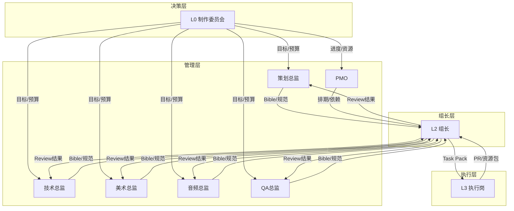
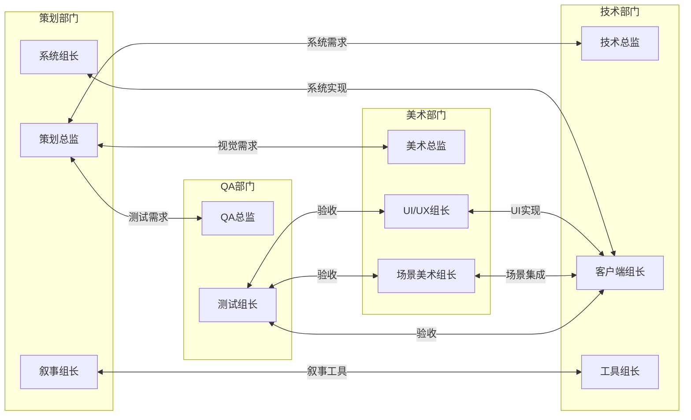
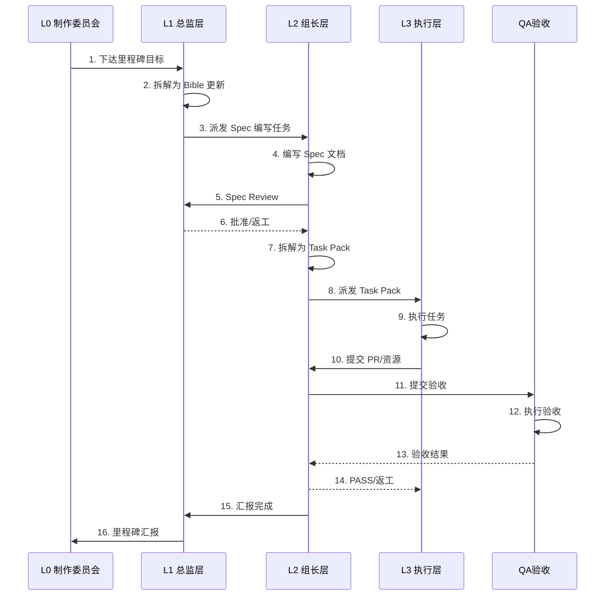
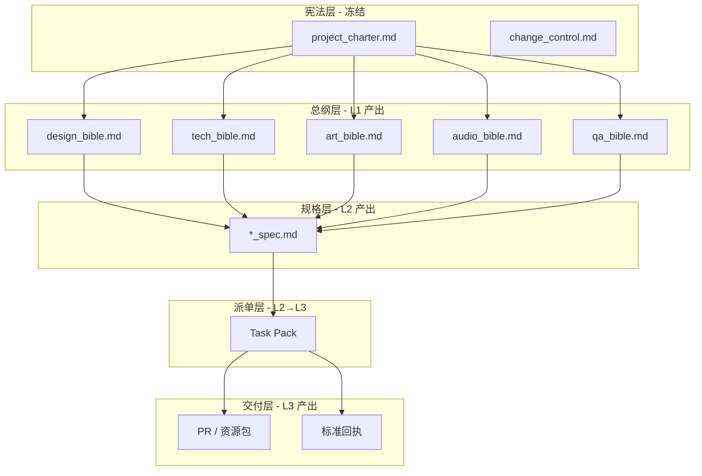
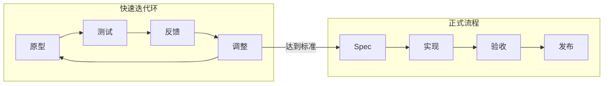

# 3A 游戏开发团队架构分析

> **文档性质**：团队组织结构规格文档  
> **版本**: v1.0  
> **创建日期**: 2026-01-19  
> **参考来源**: TGDC 2020 - Steve Martin《Evolving AAA Game Development》  
> **维护者**: L1 层

---

## 1. 概述

### 1.1 背景

本文档基于腾讯游戏开发者大会（TGDC 2020）Steve Martin 关于 3A 游戏开发团队建设的分享，结合项目实际需求，建立一套适合 AI-Native 工作流的团队架构模型。

### 1.2 核心理念

> **"用高质量人才替代大量平庸人力，保持团队精简"**  
> — Steve Martin（前 R* 14年老兵）

关键原则：
- 团队规模非线性成本：40人团队需51人，400人团队需约550人
- 个体重要性：从2%到0.18%，参与感急剧下降
- 质量优先于数量：先确保内容质量和多样性，最后才在数量上妥协
- 迭代允许失败：为团队提供安全的试错空间

---

## 2. 完整岗位清单

### 2.1 组织架构总览

```mermaid
flowchart TB
    subgraph L0["L0 制作委员会"]
        EP["Executive Producer<br/>执行制作人"]
        CD["Creative Director<br/>创意总监"]
    end
    
    subgraph L1["L1 部门总监层"]
        DD["Design Director<br/>策划总监"]
        TD["Tech Director<br/>技术总监"]
        AD["Art Director<br/>美术总监"]
        AUD["Audio Director<br/>音频总监"]
        QAD["QA Director<br/>QA总监"]
        PMO["PMO<br/>项目管理"]
    end
    
    subgraph L2_Design["L2 策划组"]
        SL["Systems Lead<br/>系统组长"]
        NL["Narrative Lead<br/>叙事组长"]
        LL["Level Lead<br/>关卡组长"]
        EL["Economy Lead<br/>经济组长"]
    end
    
    subgraph L2_Tech["L2 技术组"]
        CL["Client Lead<br/>客户端组长"]
        TL["Tools Lead<br/>工具组长"]
        ENL["Engine Lead<br/>引擎组长"]
        NWL["Network Lead<br/>网络组长"]
    end
    
    subgraph L2_Art["L2 美术组"]
        EAL["Environment Art Lead<br/>场景美术组长"]
        CAL["Character Art Lead<br/>角色美术组长"]
        UIL["UI/UX Lead<br/>UI/UX组长"]
        VFL["VFX Lead<br/>特效组长"]
        ANL["Animation Lead<br/>动画组长"]
        COL["Concept Lead<br/>概念设计组长"]
    end
    
    subgraph L2_Audio["L2 音频组"]
        SDL["Sound Design Lead<br/>音效组长"]
        MUL["Music Lead<br/>音乐组长"]
    end
    
    subgraph L2_QA["L2 QA组"]
        QAL["QA Lead<br/>测试组长"]
        ATL["Automation Lead<br/>自动化组长"]
    end
    
    EP --> DD & TD & AD & AUD & QAD & PMO
    CD --> DD
    
    DD --> SL & NL & LL & EL
    TD --> CL & TL & ENL & NWL
    AD --> EAL & CAL & UIL & VFL & ANL & COL
    AUD --> SDL & MUL
    QAD --> QAL & ATL
```



### 2.2 L0 制作委员会（2人）

| 角色 | 英文名 | 职责 | 决策范围 | 产出物 |
|------|--------|------|----------|--------|
| **执行制作人** | Executive Producer | 项目方向、资源、风险、里程碑 | 全局决策、预算审批 | Charter、里程碑计划 |
| **创意总监** | Creative Director | 核心体验、创意把控、玩法方向 | 创意决策、玩法裁定 | 愿景文档、体验标准 |

### 2.3 L1 部门总监层（6人）

| 角色 | 英文名 | 职责 | 管理范围 | 产出物 |
|------|--------|------|----------|--------|
| **策划总监** | Design Director | 系统设计、叙事框架、关卡结构 | 所有策划组 | Design Bible |
| **技术总监** | Tech Director | 架构设计、技术规范、质量门禁 | 所有技术组 | Tech Bible |
| **美术总监** | Art Director | 视觉风格、美术规范、品质把控 | 所有美术组 | Art Bible |
| **音频总监** | Audio Director | 音频风格、音效/音乐规范 | 所有音频组 | Audio Bible |
| **QA总监** | QA Director | 测试策略、质量标准、验收流程 | 所有QA组 | QA Bible |
| **PMO** | Project Management | 进度管理、资源协调、依赖跟踪 | 全项目 | 排期表、风险台账 |

### 2.4 L2 组长层（16人）

#### 2.4.1 策划组（4人）

| 角色 | 英文名 | 职责 | 典型任务 |
|------|--------|------|----------|
| **系统组长** | Systems Lead | 核心系统设计、数值规划 | 能力系统Spec、计数器设计 |
| **叙事组长** | Narrative Lead | 故事结构、角色弧线、伏笔管理 | 章节Pack、伏笔追踪表 |
| **关卡组长** | Level Lead | Zone设计、事件编排、节奏控制 | Zone Spec、事件流程图 |
| **经济组长** | Economy Lead | 资源循环、收集系统、奖励设计 | 卡片系统Spec、收集设计 |

#### 2.4.2 技术组（4人）

| 角色 | 英文名 | 职责 | 典型任务 |
|------|--------|------|----------|
| **客户端组长** | Client Lead | 游戏逻辑、场景管理、系统集成 | 模块Task Pack、PR Review |
| **工具组长** | Tools Lead | 开发工具、校验器、管线脚本 | 工具Spec、脚本开发 |
| **引擎组长** | Engine Lead | 渲染优化、性能调优、底层能力 | 性能Spec、优化方案 |
| **网络组长** | Network Lead | 数据同步、存档系统、后端对接 | 存档Spec、同步方案 |

#### 2.4.3 美术组（6人）

| 角色 | 英文名 | 职责 | 典型任务 |
|------|--------|------|----------|
| **场景美术组长** | Environment Art Lead | 背景场景、环境氛围 | 场景资源Pack、风格指南 |
| **角色美术组长** | Character Art Lead | 角色立绘、表情系统 | 角色资源Pack、表情规范 |
| **UI/UX组长** | UI/UX Lead | 界面设计、交互流程、用户体验 | UI Spec、交互流程图 |
| **特效组长** | VFX Lead | 视觉特效、转场效果、能力表现 | 特效资源Pack、特效规范 |
| **动画组长** | Animation Lead | 角色动画、场景动画、过场动画 | 动画资源Pack、动画规范 |
| **概念设计组长** | Concept Lead | 概念图、风格探索、视觉原型 | 概念图Pack、风格验证 |

#### 2.4.4 音频组（2人）

| 角色 | 英文名 | 职责 | 典型任务 |
|------|--------|------|----------|
| **音效组长** | Sound Design Lead | SFX、环境音、UI音效 | 音效资源Pack、音效列表 |
| **音乐组长** | Music Lead | BGM、过场音乐、情感音乐 | 音乐资源Pack、配乐方案 |

#### 2.4.5 QA组（2人）

| 角色 | 英文名 | 职责 | 典型任务 |
|------|--------|------|----------|
| **测试组长** | QA Lead | 测试计划、用例管理、缺陷跟踪 | 测试Checklist、缺陷报告 |
| **自动化组长** | Automation Lead | 自动化测试、CI/CD、回归测试 | 测试脚本、自动化流程 |

### 2.5 L3 执行岗层（按需扩展）

#### 2.5.1 策划执行（4类）

| 角色 | 英文名 | 职责 | 产出粒度 |
|------|--------|------|----------|
| **系统策划** | Systems Designer | 数值表、配置文件 | 单系统配置 |
| **文案策划** | Writer | 对白文本、卡片文案 | 单场景≤12轮对话 |
| **关卡策划** | Level Designer | Zone脚本、事件配置 | 单Zone≤8事件 |
| **脚本策划** | Scripter | 事件脚本、触发逻辑 | 单脚本≤120行 |

#### 2.5.2 技术执行（4类）

| 角色 | 英文名 | 职责 | 产出粒度 |
|------|--------|------|----------|
| **玩法程序** | Gameplay Engineer | 游戏系统实现 | PR≤400行 |
| **UI程序** | UI Engineer | 界面实现、交互逻辑 | PR≤400行 |
| **工具程序** | Tools Engineer | 工具脚本、校验器 | 单工具文件 |
| **数据程序** | Data Engineer | 数据格式、存档迁移 | PR≤400行 |

#### 2.5.3 美术执行（6类）

| 角色 | 英文名 | 职责 | 产出粒度 |
|------|--------|------|----------|
| **场景美术** | Environment Artist | 背景绘制 | 单场景 |
| **角色美术** | Character Artist | 角色立绘 | 单角色 |
| **UI美术** | UI Artist | 界面素材 | 单界面 |
| **特效美术** | VFX Artist | 特效制作 | 单特效 |
| **动画师** | Animator | 动画制作 | 单动画 |
| **概念美术** | Concept Artist | 概念草图 | 单概念 |

#### 2.5.4 音频执行（2类）

| 角色 | 英文名 | 职责 | 产出粒度 |
|------|--------|------|----------|
| **音效师** | Sound Designer | 音效制作 | 单音效 |
| **作曲** | Composer | 音乐创作 | 单曲目 |

#### 2.5.5 QA执行（2类）

| 角色 | 英文名 | 职责 | 产出粒度 |
|------|--------|------|----------|
| **测试执行** | Tester | 用例执行、缺陷报告 | 单用例组 |
| **自动化测试** | Automation Tester | 脚本编写、维护 | 单测试模块 |

---

## 3. 组织关系与汇报线

### 3.1 汇报关系图



### 3.2 跨部门协作关系



---

## 4. 任务分发流程

### 4.1 标准任务流



### 4.2 Task Pack 结构

```yaml
# Task Pack 标准结构
task_id: T-YYYYMMDD-NNNN
title: "任务标题"
level: L3
priority: P0/P1/P2

# 上下游关系
owner: L2_XXX_LEAD
executor: L3_XXX
reviewer: L2_XXX_LEAD / L2_QA_LEAD

# 输入约束
allowed_inputs:
  - "/design/02_specs/xxx_spec.md"
  - "/game/src/xxx/**"

# 输出要求
deliverables:
  - path: "/game/src/xxx/xxx.ts"
    format: "TypeScript"
    constraints: "≤400行"

# 验收标准
acceptance_criteria:
  - "编译通过"
  - "测试通过"
  - "功能符合 Spec"

# 预算
budget:
  dialogue_rounds: 3-5
  estimated_hours: 2-4
```

---

## 5. 上下文传递机制

### 5.1 工件契约体系

> **核心原则：靠工件契约，不靠长上下文记忆**



### 5.2 上下文传递规则

| 层级 | 可读范围 | 可写范围 | 上下文来源 |
|------|---------|---------|-----------|
| **L0** | 全部 | 全部 | 外部输入、决策会议 |
| **L1** | 宪法层 + 下属文档 | 总纲层 | Charter + L0 指令 |
| **L2** | 总纲层 + 下属文档 | 规格层 + 派单层 | Bible + L1 指令 |
| **L3** | Task Pack 指定范围 | 交付物路径 | Task Pack 全部内容 |

### 5.3 信息隔离原则

```
┌─────────────────────────────────────────────────────────────┐
│ L3 执行岗只需要知道：                                         │
│ 1. Task Pack 内容                                           │
│ 2. AllowedInputs 列出的文件                                  │
│ 3. 验收标准                                                  │
│                                                             │
│ L3 不需要知道：                                              │
│ 1. 项目全局目标（除非 Task Pack 提及）                        │
│ 2. 其他模块的实现细节                                        │
│ 3. 历史决策背景（除非影响当前任务）                           │
└─────────────────────────────────────────────────────────────┘
```

---

## 6. ABC 内容分级法

### 6.1 分级定义

| 等级 | 含义 | 优先级 | 完成标准 |
|------|------|--------|----------|
| **A** | 最小可行内容 | 必须 | 里程碑门禁 |
| **B** | 性价比最优内容 | 应该 | 发布标准 |
| **C** | 最大理想内容 | 可选 | 超预期体验 |

### 6.2 应用示例

| 内容类型 | A（最小） | B（最优） | C（最大） |
|----------|----------|----------|----------|
| Zone数量 | 45（主线） | 50（+变体） | 57（全部） |
| 卡片数量 | 80（核心） | 120（标准） | 150（收藏） |
| 伏笔数量 | 12（关键） | 20（标准） | 26（全部） |
| 音效数量 | 30（基础） | 50（标准） | 80（丰富） |
| 动画帧数 | 4（基础） | 8（流畅） | 12（精致） |

### 6.3 执行规则

```
1. 先完成所有 A 级内容
2. A 级验收通过后，开始 B 级
3. B 级完成度 ≥80% 后，可开始 C 级
4. 时间紧张时，砍 C 级，保 A/B 级
```

---

## 7. 迭代与试错机制

### 7.1 迭代流程



### 7.2 试错安全区

| 阶段 | 允许试错 | 不允许试错 |
|------|---------|-----------|
| **原型期** | 大胆尝试、快速验证 | 直接进入正式流程 |
| **开发期** | 小范围实验、A/B测试 | 大规模重构 |
| **验收期** | 修复问题 | 引入新功能 |

### 7.3 降低试错成本的方法

1. **模块化设计**：失败只影响单模块
2. **版本控制**：随时可回滚
3. **自动化测试**：快速发现问题
4. **小步快跑**：PR 粒度控制

---

## 8. 与 AI-Native 工作流的映射

### 8.1 角色映射表

| 3A 团队角色 | AI-Native 角色 | 当前状态 |
|------------|---------------|----------|
| Executive Producer | L0_producer | ✅ 已有 |
| Creative Director | L0_producer (合并) | ✅ 已有 |
| Design Director | L1_design_director | ✅ 已有 |
| Tech Director | L1_tech_director | ✅ 已有 |
| Art Director | L1_art_director | ✅ 已有 |
| Audio Director | L1_audio_director | ✅ 已有 |
| QA Director | L1_qa_director | ✅ 已有 |
| PMO | L1_pmo | ✅ 已有 |
| Systems Lead | L2_systems_lead | ✅ 已有 |
| Narrative Lead | L2_narrative_lead | ✅ 已有 |
| Level Lead | L2_level_lead | ✅ 已有 |
| Economy Lead | L2_economy_lead | ✅ 已有 |
| Client Lead | L2_client_lead | ✅ 已有 |
| Tools Lead | L2_tools_lead | ✅ 已有 |
| Engine Lead | L2_engine_lead | ✅ 已有 |
| Network Lead | L2_network_lead | ✅ 已有 |
| Environment Art Lead | L2_env_art_lead | ✅ 已有 |
| Character Art Lead | L2_char_art_lead | ✅ 已有 |
| UI/UX Lead | L2_ui_lead | ✅ 已有 |
| VFX Lead | L2_vfx_lead | ✅ 已有 |
| Animation Lead | L2_animation_lead | ✅ 已有 |
| Concept Lead | L2_concept_lead | ✅ 已有 |
| Sound Design Lead | L2_sound_lead | ✅ 已有 |
| Music Lead | L2_music_lead | ✅ 已有 |
| QA Lead | L2_qa_lead | ✅ 已有 |
| Automation Lead | L2_automation_lead | ✅ 已有 |
| Gameplay Engineer | L3_gameplay_engineer | ✅ 已有 |
| UI Engineer | L3_ui_engineer | ✅ 已有 |
| Tools Engineer | L3_engineer (通用) | ✅ 已有 |
| Writer | L3_writer | ✅ 已有 |
| Scripter | L3_scripter | ✅ 已有 |
| Tester | L3_tester | ✅ 已有 |
| Artist (各类) | L3_artist | ✅ 已有 |
| Sound Designer | L3_sound_designer | ✅ 已有 |

### 8.2 角色补充状态

> **状态更新**: 2026-01-19，所有角色已补充完成

#### 8.2.1 L1 层（已全部补充）
- ✅ **L1_audio_director** - 音频总监（音效+音乐规范）

#### 8.2.2 L2 层（已全部补充，共12个）
- ✅ **L2_level_lead** - 关卡组长
- ✅ **L2_economy_lead** - 经济系统组长
- ✅ **L2_engine_lead** - 引擎组长
- ✅ **L2_network_lead** - 网络组长
- ✅ **L2_env_art_lead** - 场景美术组长
- ✅ **L2_char_art_lead** - 角色美术组长
- ✅ **L2_vfx_lead** - 特效组长
- ✅ **L2_animation_lead** - 动画组长
- ✅ **L2_concept_lead** - 概念设计组长
- ✅ **L2_sound_lead** - 音效组长
- ✅ **L2_music_lead** - 音乐组长
- ✅ **L2_automation_lead** - 自动化测试组长

#### 8.2.3 L3 层（已全部补充，共2个）
- ✅ **L3_artist** - 美术执行岗（通用，含变体）
- ✅ **L3_sound_designer** - 音效执行岗（含变体）

### 8.3 角色文件清单

所有角色定义文件位于 `.cursor/agents/` 目录下（Cursor 原生格式）：

> 注：原 `workflows/project/promptx/roles/` 目录的 YAML 格式已废弃，详见该目录的 README.md。

| 层级 | 角色数量 | 文件清单 |
|------|---------|----------|
| L0 | 1 | L0_producer.yaml |
| L1 | 7 | L1_art_director.yaml, L1_audio_director.yaml, L1_design_director.yaml, L1_pmo.yaml, L1_qa_director.yaml, L1_tech_director.yaml |
| L2 | 19 | L2_automation_lead.yaml, L2_animation_lead.yaml, L2_char_art_lead.yaml, L2_client_lead.yaml, L2_concept_lead.yaml, L2_economy_lead.yaml, L2_engine_lead.yaml, L2_env_art_lead.yaml, L2_event_lead.yaml, L2_level_lead.yaml, L2_music_lead.yaml, L2_narrative_lead.yaml, L2_network_lead.yaml, L2_qa_lead.yaml, L2_sound_lead.yaml, L2_systems_lead.yaml, L2_tools_lead.yaml, L2_ui_lead.yaml, L2_vfx_lead.yaml, L2_writing_lead.yaml |
| L3 | 7 | L3_artist.yaml, L3_engineer.yaml, L3_gameplay_engineer.yaml, L3_scripter.yaml, L3_sound_designer.yaml, L3_tester.yaml, L3_ui_engineer.yaml, L3_writer.yaml |

**总计**: 34个完整角色定义

---

## 9. 附录

### 9.1 参考资料

1. TGDC 2020 - Steve Martin《Evolving AAA Game Development》
2. 《AI-Native 流程改造落地计划》
3. 现有 PromptX 角色包

### 9.2 版本历史

| 版本 | 日期 | 变更内容 | 作者 |
|------|------|---------|------|
| v1.0 | 2026-01-19 | 初版创建 | AI |
| v1.1 | 2026-01-19 | 补充全部15个缺失角色（L1:1, L2:12, L3:2），更新角色映射表 | AI |

---

*文档版本: v1.1*  
*创建日期: 2026-01-19*  
*维护者: L1 层*
