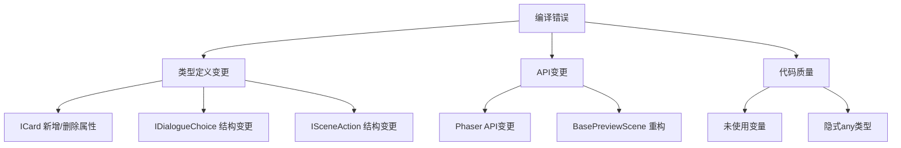

# 测试文件与预览场景分析报告

> 创建日期: 2026-01-24
> 文档类型: 技术规格 / 代码质量分析

---

## 一、测试系统概览

### 1.1 测试架构

```
game/tests/
├── unit/                       # 单元测试 (Vitest)
├── e2e/                        # 端到端测试 (Playwright)
├── interactive/                # 交互测试 (ChromeMCP)
└── auto/                       # 自动化测试运行器
```

### 1.2 三层测试体系

| 层级 | 框架 | 用途 | 执行速度 | 覆盖深度 |
|------|------|------|---------|---------|
| **单元测试** | Vitest | 独立系统/组件测试 | 快 (秒级) | 代码级 |
| **E2E测试** | Playwright | 完整流程验证 | 中 (分钟级) | 功能级 |
| **交互测试** | ChromeMCP | 真实浏览器验证 | 慢 (章节级) | 业务级 |

---

## 二、测试文件详细分析

### 2.1 单元测试 (`tests/unit/`)

#### 2.1.1 文件清单

| 文件 | 测试对象 | 用途 |
|------|---------|------|
| `systems/NarrativeEngine.test.ts` | NarrativeEngine | 叙事引擎核心逻辑 |
| `systems/WorldState.test.ts` | WorldState | 世界状态管理 (R/P/W) |
| `systems/AbilitySystem.test.ts` | AbilitySystem | 三种能力系统 |
| `systems/DialogueUI.test.ts` | DialogueUI | 对话UI组件 |
| `systems/CardUI.test.ts` | CardUI | 卡片UI组件 |
| `systems/SaveManager.test.ts` | SaveManager | 存档系统 |
| `systems/EventBus.test.ts` | EventBus | 事件总线 |
| `systems/InteractionSystem.test.ts` | InteractionSystem | 交互系统 |
| `systems/SceneAssembler.test.ts` | SceneAssembler | 场景组装器 |
| `systems/AssetManager.test.ts` | AssetManager | 资源管理 |
| `systems/AudioManager.test.ts` | AudioManager | 音频管理 |
| `systems/I18nManager.test.ts` | I18nManager | 国际化 |
| `scenes/GameScene.test.ts` | GameScene | 游戏主场景 |
| `performance/performance-baseline.test.ts` | 性能基准 | 性能指标测试 |

#### 2.1.2 用途说明

- **核心系统验证**: 验证叙事、世界状态、能力等核心系统逻辑正确
- **UI组件测试**: 验证对话、卡片等UI组件的行为
- **快速反馈**: 开发过程中快速验证修改是否破坏现有功能
- **回归保护**: 防止代码变更引入新bug

### 2.2 E2E测试 (`tests/e2e/`)

#### 2.2.1 文件清单

| 文件 | 测试范围 |
|------|---------|
| `game.spec.ts` | 游戏启动、菜单、移动、存档、性能、PWA |
| `prologue.spec.ts` | 序章完整流程 |

#### 2.2.2 测试覆盖

```typescript
// game.spec.ts 覆盖范围
- 游戏启动和加载
- 主菜单交互
- 移动控制 (WASD/方向键)
- 存档系统 (LocalStorage/IndexedDB)
- 首屏加载时间 < 3秒
- PWA (manifest, Service Worker)
- 可访问性 (语言、视口)
```

### 2.3 交互测试 (`tests/interactive/`)

#### 2.3.1 功能测试 (`specs/`)

| 文件 | 测试内容 |
|------|---------|
| `01-boot.spec.ts` | 启动和加载流程 |
| `02-menu.spec.ts` | 主菜单交互 |
| `03-movement.spec.ts` | 移动控制 |
| `04-ui.spec.ts` | UI系统 |
| `05-dialogue.spec.ts` | 对话系统 |
| `06-narrative.spec.ts` | 叙事系统 |
| `07-save.spec.ts` | 存档系统 |
| `08-ability.spec.ts` | 深度能力 |
| `09-preview.spec.ts` | 预览场景 |
| `10-chapter-flow.spec.ts` | 章节流程 |
| `11-endings.spec.ts` | 三结局 |
| `12-gameplay-design-verification.spec.ts` | 设计验证 |

#### 2.3.2 章节测试 (`chapters/`)

完整覆盖 45 个主线 Zone:

| 章节 | Zone数量 | 测试文件 |
|------|---------|---------|
| C0 (序章) | 4 | C0-Z1~Z4.test.js |
| C1 (第1章) | 6 | C1-Z1~Z6.test.js |
| C2 (第2章) | 7 | C2-Z1~Z7.test.js |
| C3 (第3章) | 7 | C3-Z1~Z7.test.js |
| C4 (第4章) | 8 | C4-Z1~Z8.test.js |
| C5 (第5章) | 7 | C5-Z1~Z7.test.js |
| CF (终章) | 6 | CF-Z1~Z6.test.js |
| **总计** | **45** | **45个测试文件** |

### 2.4 自动化测试 (`tests/auto/`)

#### 2.4.1 TestRunner.ts

定义可执行的测试脚本，支持:
- 章节流程测试 (C0-C5、CF)
- 能力解锁测试 (深度感知、深度介入、时间干预)
- R值阈值测试 (R≥3、R≥6、R≥10)
- 三结局测试 (A/B/C)
- 完整主线流程测试

---

## 三、预览场景系统分析

### 3.1 架构概览

```
game/src/scenes/preview/
├── BasePreviewScene.ts          # 抽象基类
├── DevPreviewScene.ts           # 入口菜单
├── ScenePreviewScene.ts         # 场景预览
├── ObjectPreviewScene.ts        # 物件预览
├── CharacterPreviewScene.ts     # 角色预览
├── AnimationPreviewScene.ts     # 动画预览
├── UIPreviewScene.ts            # UI预览
├── EffectPreviewScene.ts        # 特效预览
├── AudioPreviewScene.ts         # 音频预览
├── CardPreviewScene.ts          # 卡片预览
└── DialoguePreviewScene.ts      # 对话预览
```

### 3.2 各预览场景用途

| 场景 | 用途 | 关键功能 |
|------|------|---------|
| **DevPreviewScene** | 入口菜单 | 9个预览入口导航 |
| **ScenePreviewScene** | 场景预览 | Zone场景组装、调试覆盖层 |
| **ObjectPreviewScene** | 物件预览 | 物件分类、碰撞可视化 |
| **CharacterPreviewScene** | 角色预览 | 表情立绘、对话框预览 |
| **AnimationPreviewScene** | 动画预览 | 动画播放控制、帧率显示 |
| **UIPreviewScene** | UI预览 | 完整UI Prefab展示 |
| **EffectPreviewScene** | 特效预览 | 能力/系统/环境特效 |
| **AudioPreviewScene** | 音频预览 | BGM/SFX/环境音播放 |
| **CardPreviewScene** | 卡片预览 | 7种卡片类型、翻转动画 |
| **DialoguePreviewScene** | 对话预览 | 对话流程、分支选项 |

### 3.3 基类 BasePreviewScene 功能

```typescript
// 统一布局
- headerHeight = 160    // 顶部导航栏
- footerHeight = 100    // 底部提示栏
- contentContainer      // 可滚动内容区

// 通用组件
- createHeader()        // 标题和返回按钮
- createBackButton()    // 返回按钮
- createFooter()        // 底部提示
- createPreviewCard()   // 预览卡片
- showToast()          // Toast提示

// 交互支持
- setupScrolling()     // 滚动支持
- ESC键返回           // 键盘导航
```

### 3.4 与主游戏的关系

| 特性 | 主游戏 | 预览工具 |
|------|-------|---------|
| 入口文件 | `main.ts` | `preview.ts` |
| 启动命令 | `npm run dev` | `npm run preview` |
| 游戏逻辑 | ✅ 完整 | ❌ 无 |
| 状态管理 | ✅ WorldState等 | ❌ 无 |
| 资源预览 | ❌ | ✅ 完整 |
| 用途 | 游戏运行 | 开发调试 |

---

## 四、问题分析与评估

### 4.1 编译错误汇总

#### 4.1.1 预览场景错误 (17个)

| 文件 | 错误类型 | 问题描述 | 严重程度 |
|------|---------|---------|---------|
| AnimationPreviewScene.ts | TS2551 | `setTimeScale` 应为 `timeScale` | 中 |
| BasePreviewScene.ts | TS6133 | 3个未使用变量 (pointer, gameObjects, deltaX) | 低 |
| CharacterPreviewScene.ts | TS6133 | 未使用变量 `currentCharacter` | 低 |
| CharacterPreviewScene.ts | TS2339 | `shutdown` 方法不存在 | 中 |
| DevPreviewScene.ts | TS6133 | 未使用变量 `versionText` | 低 |
| EffectPreviewScene.ts | TS2339 | `shutdown` 方法不存在 | 中 |
| ObjectPreviewScene.ts | TS6133 | 未使用变量 `_selectedObject` | 低 |
| ScenePreviewScene.ts | TS2339 | `setDepth`/`depth` 不存在 | 中 |
| ScenePreviewScene.ts | TS2339 | `shutdown` 方法不存在 | 中 |
| UIPreviewScene.ts | TS6133 | 未使用变量 `_currentScreen` | 低 |
| UIPreviewScene.ts | TS2353 | `text` 属性不存在于 IDialogueChoice | 高 |
| UIPreviewScene.ts | TS2531 | 对象可能为 null | 中 |
| UIPreviewScene.ts | TS2339 | `shutdown` 方法不存在 | 中 |

#### 4.1.2 测试文件错误 (39个)

| 分类 | 错误数 | 主要问题 |
|------|-------|---------|
| 未使用变量 (TS6133) | 18 | 声明但未使用的变量/导入 |
| 类型不匹配 (TS2353/TS2345) | 12 | 对象字面量属性与类型定义不符 |
| 类型转换 (TS2352) | 4 | Window类型转换问题 |
| 隐式any (TS7006) | 2 | 参数缺少类型注解 |
| 其他 | 3 | undefined检查、无效指令等 |

### 4.2 问题分类

#### 4.2.1 高优先级问题 (需立即修复)

1. **类型定义不同步**: 测试文件中的对象字面量与实际类型定义不匹配
   - `ICard` 缺少 `rarity` 属性
   - `IDialogueChoice` 缺少 `text` 属性
   - `ISceneAction` 缺少 `target` 属性
   - `ISceneAssemblerCallbacks` 接口不匹配

2. **API变更未同步**: 预览场景使用了不存在的API
   - `setTimeScale` → `timeScale`
   - `shutdown` 方法不存在于 BasePreviewScene

#### 4.2.2 中优先级问题 (建议修复)

1. **类型安全**: null检查和undefined检查
2. **GameObject类型**: 缺少 `setDepth`/`depth` 属性

#### 4.2.3 低优先级问题 (可忽略)

1. **未使用变量**: 大量声明但未使用的变量
   - 不影响运行，但影响代码质量
   - 可通过添加 `_` 前缀或删除解决

### 4.3 问题根因分析



---

## 五、合理性评估

### 5.1 测试体系评估

| 维度 | 评分 | 说明 |
|------|------|------|
| **覆盖完整性** | ⭐⭐⭐⭐⭐ | 三层测试体系，100%章节覆盖 |
| **框架选择** | ⭐⭐⭐⭐⭐ | Vitest/Playwright/ChromeMCP 组合合理 |
| **组织结构** | ⭐⭐⭐⭐ | 按类型/章节清晰组织 |
| **维护状态** | ⭐⭐⭐ | 存在较多编译错误，需要同步更新 |
| **文档完善度** | ⭐⭐⭐⭐ | 有README和测试计划文档 |

### 5.2 预览系统评估

| 维度 | 评分 | 说明 |
|------|------|------|
| **功能完整性** | ⭐⭐⭐⭐⭐ | 9个预览场景覆盖所有资源类型 |
| **代码复用** | ⭐⭐⭐⭐⭐ | BasePreviewScene 抽象合理 |
| **与主游戏隔离** | ⭐⭐⭐⭐⭐ | 独立入口，不影响主游戏 |
| **维护状态** | ⭐⭐⭐ | 存在编译错误，需要同步更新 |
| **用户体验** | ⭐⭐⭐⭐ | 统一视觉风格，交互一致 |

### 5.3 总体评估

**优势:**
- 测试覆盖全面，三层体系互补
- 预览系统功能完整，开发调试便利
- 代码组织清晰，易于维护扩展

**问题:**
- 测试/预览代码与主代码类型定义不同步
- 存在 56 个编译错误需要修复
- 部分代码质量问题（未使用变量）

---

## 六、改进建议

### 6.1 立即修复 (P0)

1. **同步类型定义**
   ```bash
   # 检查并更新测试文件中的类型使用
   - ICard.rarity → 移除或添加到类型定义
   - IDialogueChoice.text → 改用正确属性名
   - ISceneAction.target → 改用正确属性名
   ```

2. **修复API调用**
   ```typescript
   // AnimationPreviewScene.ts
   - sprite.anims.setTimeScale(speed)
   + sprite.anims.timeScale = speed
   
   // 添加 shutdown 方法到 BasePreviewScene
   public shutdown(): void {
     // 清理逻辑
   }
   ```

### 6.2 短期改进 (P1)

1. **清理未使用变量**
   - 使用 `_` 前缀标记intentionally unused
   - 或直接删除不需要的声明

2. **添加类型注解**
   - SceneAssembler.test.ts 中的 `call` 参数

3. **修复null检查**
   - UIPreviewScene.ts 第779行

### 6.3 长期优化 (P2)

1. **建立类型同步机制**
   - 在CI中添加测试编译检查
   - 类型定义变更时自动检查测试文件

2. **测试代码质量门禁**
   - 添加 ESLint 规则检查未使用变量
   - 添加 strict 类型检查

3. **测试维护流程**
   - 主代码API变更时同步更新测试
   - 定期运行完整测试套件

---

## 七、文件统计

### 7.1 测试文件

| 类型 | 数量 | 位置 |
|------|------|------|
| 单元测试 | 14 | `tests/unit/` |
| E2E测试 | 2 | `tests/e2e/` |
| 交互测试-功能 | 12 | `tests/interactive/specs/` |
| 交互测试-章节 | 45 | `tests/interactive/chapters/` |
| 自动化运行器 | 1 | `tests/auto/` |
| 配置/辅助 | 7 | `tests/` |
| **总计** | **81** | - |

### 7.2 预览场景

| 类型 | 数量 | 位置 |
|------|------|------|
| 基类 | 1 | `BasePreviewScene.ts` |
| 入口 | 1 | `DevPreviewScene.ts` |
| 预览场景 | 9 | `*PreviewScene.ts` |
| 导出 | 1 | `index.ts` |
| **总计** | **12** | `src/scenes/preview/` |

### 7.3 编译错误 (已修复)

| 来源 | 原错误数 | 修复后 | 状态 |
|------|---------|--------|------|
| 预览场景 | 17 | 5 | ✅ 仅剩未使用变量警告 |
| 核心代码 | 8 | 0 | ✅ 已全部修复 |
| 测试文件 | 39 | 15 | ⚠️ 部分修复，剩余需更新 mock |
| **总计** | **64** | **20** | 核心可运行 |

---

## 八、已完成的修复工作 (2026-01-24)

### 8.1 预览场景改造

1. **CardPreviewScene**
   - 改用 `PreviewDataLoader` 从真实 YAML 加载卡片数据
   - 移除硬编码的示例卡片
   - 使用 `loadAllCards()` 加载所有章节卡片

2. **CharacterPreviewScene**
   - 使用 `getCharacterSampleDialogues()` 加载角色对话
   - 从真实对话数据中提取示例

3. **ScenePreviewScene**
   - 使用 `getChapterConfigs()` 获取章节配置
   - 从 `zones.config.ts` 读取数据

4. **新建 PreviewDataLoader.ts**
   - 统一管理预览场景的数据加载
   - 提供 `loadAllCards()`, `loadSampleDialogues()`, `getChapterConfigs()` 等函数
   - 章节颜色/名称配置统一管理

### 8.2 核心代码修复

1. **ZoneManager.ts**
   - `hasFlag()` → `getFlag()`
   - `GameEvent.COUNTER_CHANGE` → `GameEvent.COUNTER_R_CHANGE`

2. **EndingEffects.ts**
   - 移除 TextStyle 中无效的 `alpha` 属性

3. **zones.data.ts**
   - `ChapterID.C0` → `'C0'`（类型别名不能作为值使用）

### 8.3 测试文件修复

1. **CardUI.test.ts**
   - 添加必填字段 `chapter`, `zone`
   - 移除无效字段 `rarity`

2. **DialogueUI.test.ts**
   - `'happy'` → `'smiling'`（有效的表情类型）

3. **SceneAssembler.test.ts**
   - `target` → `dialogueId`/`cardId`/`zoneId`

---

## 九、剩余问题

### 9.1 测试文件 (15个错误)

| 文件 | 问题 | 优先级 |
|------|------|--------|
| game.spec.ts | Window 类型转换 | P2 |
| SceneAssembler.test.ts | mock 类型不匹配 | P1 |

### 9.2 未使用变量警告 (30个)

大部分是预留状态变量，可通过以下方式处理：
- 添加 `_` 前缀表示预留
- 或在 tsconfig 中禁用 `noUnusedLocals`

---

## 十、结论

### 10.1 测试系统
- **设计合理**: 三层测试体系完整覆盖不同粒度
- **已改进**: 核心类型错误已修复
- **待改进**: 测试 mock 需要同步更新

### 10.2 预览系统
- **功能完善**: 覆盖所有资源类型，开发调试便利
- **已改进**: 
  - 硬编码数据改为从真实配置读取
  - 编译错误已修复
- **待改进**: 其他预览场景可继续优化

### 10.3 优先级建议

1. **P0 (已完成)**: 修复影响运行的类型错误 ✅
2. **P1 (建议)**: 更新 SceneAssembler.test.ts 的 mock 类型
3. **P2 (可选)**: 清理未使用变量警告

---

*文档版本: v1.1*
*更新日期: 2026-01-24*
*更新内容: 记录修复工作完成情况*
