# 资产生产流程图汇总

> 本文档包含所有资产类型的Mermaid流程图，可直接在支持Mermaid的编辑器/渲染器中查看。

---

## 1. 通用生产流程

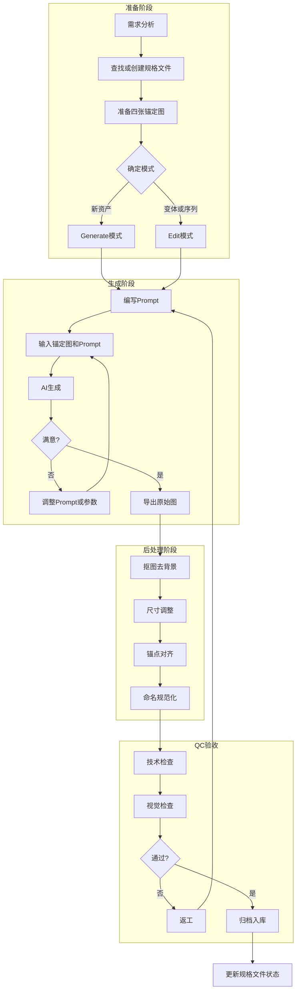

---

## 2. 角色资产完整工作流

### 2.1 角色设定阶段（三视图系统）

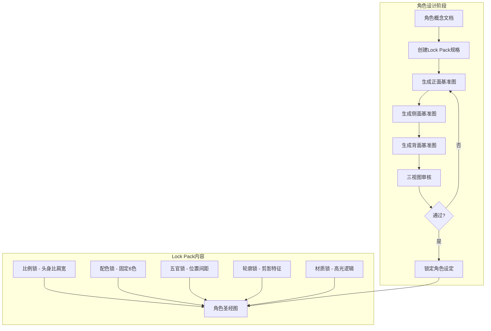

### 2.2 立绘生产流程

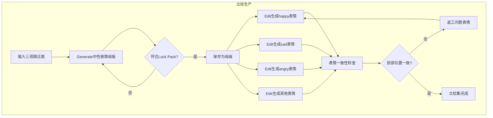

### 2.3 动作起手帧生产流程

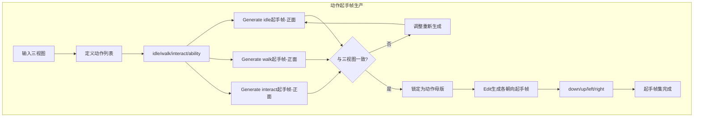

### 2.4 序列帧生产流程

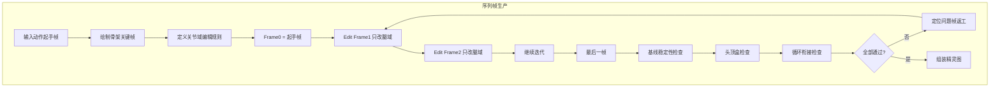

---

## 3. 场景资产完整工作流

### 3.1 场景设计到实现流程

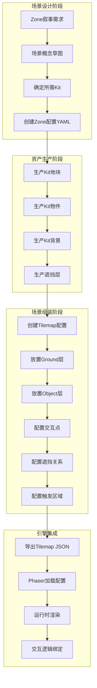

### 3.2 Zone配置结构

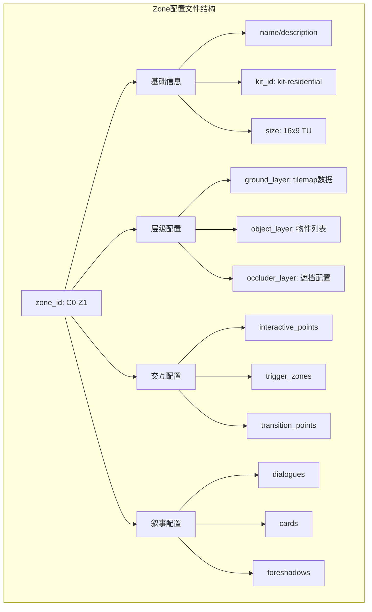

### 3.3 Tileset生产流程

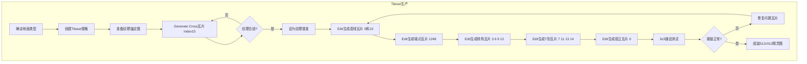

### 3.4 物件与交互状态

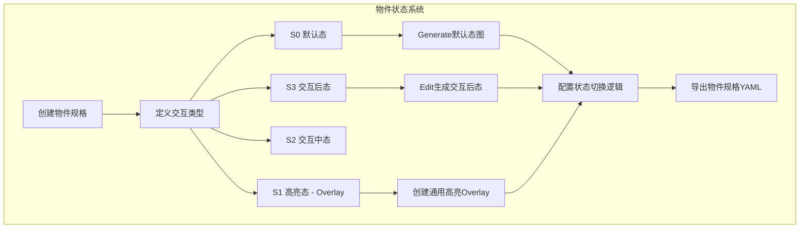

---

## 4. UI资产完整工作流

### 4.1 UI系统设计到实现

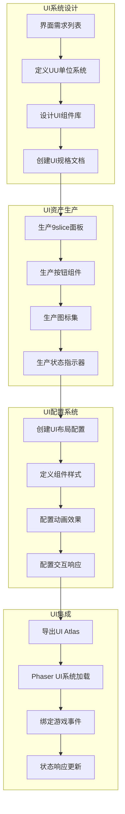

### 4.2 UI组件状态系统

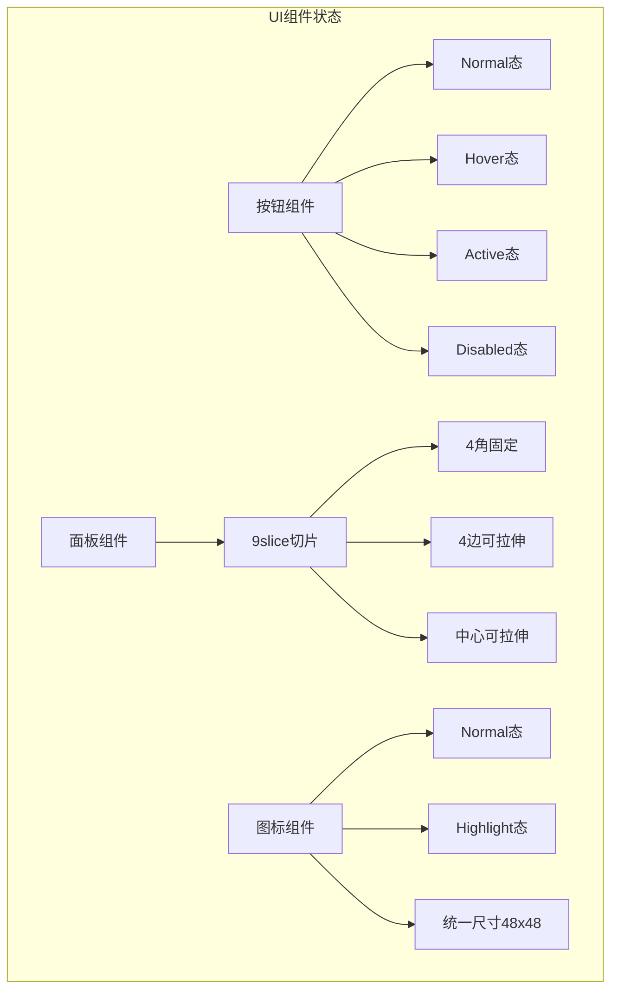

### 4.3 对话系统UI配置

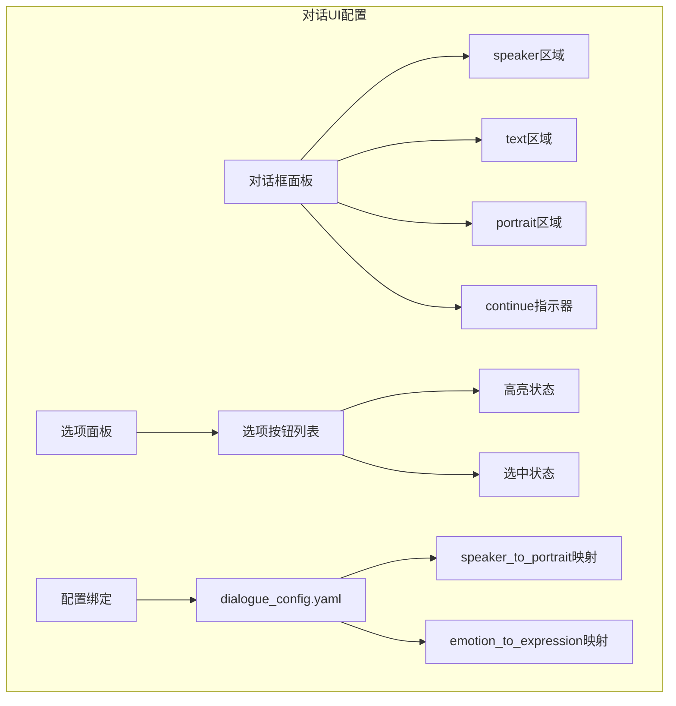

---

## 5. VFX特效工作流

### 5.1 VFX生产流程

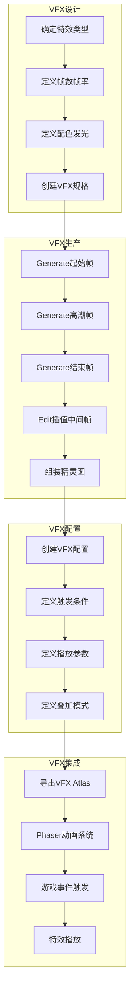

---

## 6. 完整Kit套件工作流

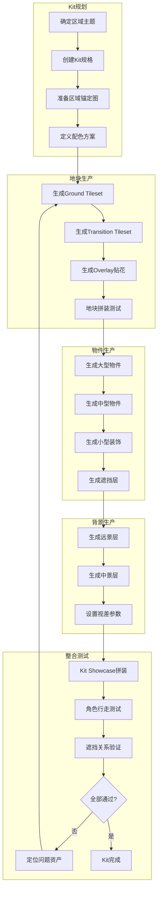

---

## 7. 生成模式选择决策树

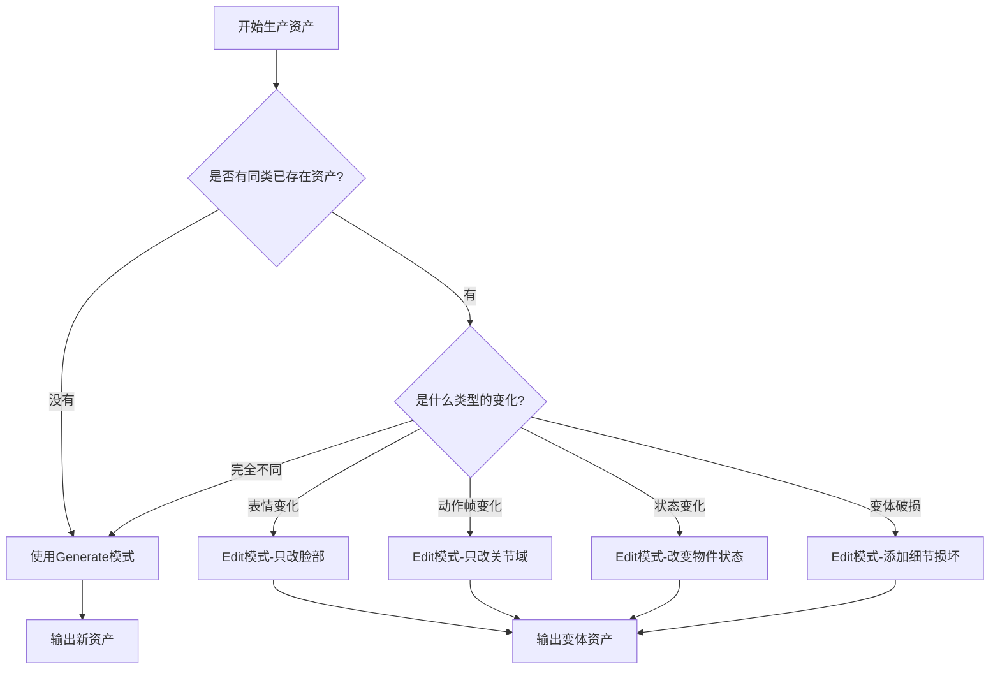

---

## 8. 资产与配置集成总览

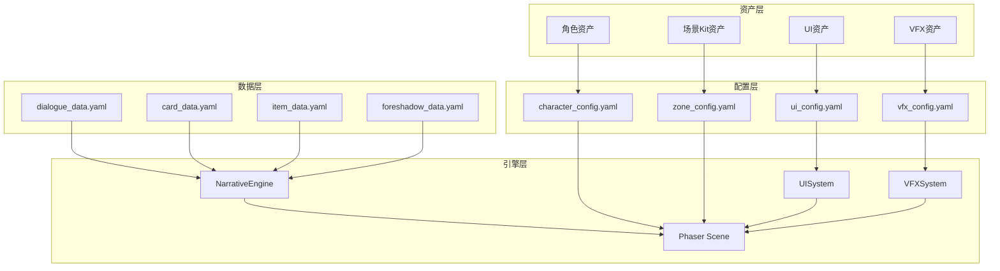

---

## 9. QC验收流程

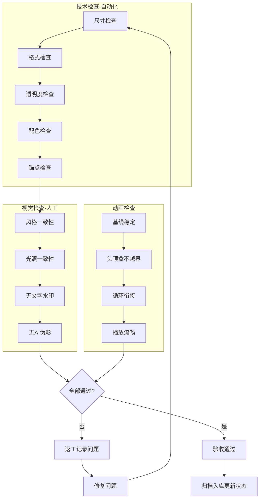

---

## 使用说明

### 查看流程图

1. **VS Code**: 安装 "Markdown Preview Mermaid Support" 扩展
2. **GitHub**: 直接在仓库中查看，GitHub原生支持Mermaid
3. **在线工具**: 复制Mermaid代码到 [mermaid.live](https://mermaid.live)

### Mermaid语法注意

- 子图名称避免使用冒号，使用方括号包裹中文
- 节点文本使用双引号或方括号包裹
- 连线标签使用双引号包裹

---

*文档版本：v1.1 | 最后更新：2025-12-25*
