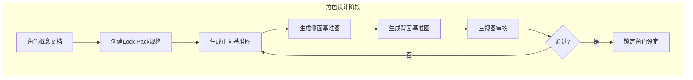
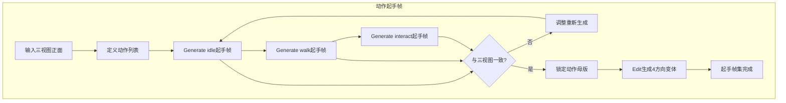
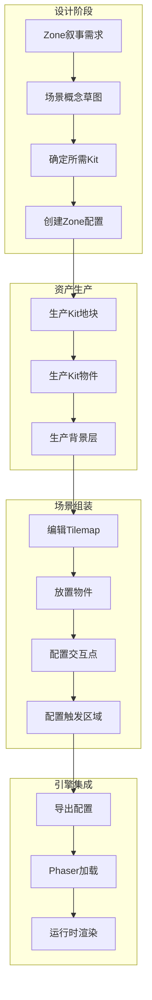

# 资产生产流程详解 v2.0

> **文档性质**：AI美术资产生产执行手册（业务集成版）  
> **适用对象**：美术执行、技术美术、AI生成操作员  
> **最后更新**：2025-12-25  
> **对齐文档**：美术工作流总纲 v2、06-ai-art-generation.mdc

---

## 一、总体生产架构

### 1.1 核心原则

```
┌─────────────────────────────────────────────────────────────────┐
│                    AI美术生产四原则                              │
├─────────────────────────────────────────────────────────────────┤
│ 1. 设定先行：角色先做三视图/Lock Pack，场景先做Kit规格          │
│ 2. 锚定优先：所有生成必须基于锚定图，不从零抽卡                  │
│ 3. 编辑迭代：系列资产用Edit模式，保证一致性                      │
│ 4. 配置驱动：资产通过YAML配置与引擎集成                          │
└─────────────────────────────────────────────────────────────────┘
```

### 1.2 资产-配置-引擎三层架构

```
┌─────────────────────────────────────────────────────────────────┐
│                         引擎层                                   │
│  Phaser Scenes / NarrativeEngine / UISystem / VFXSystem        │
└─────────────────────────────────────────────────────────────────┘
                              ▲
                              │ 加载
┌─────────────────────────────────────────────────────────────────┐
│                         配置层                                   │
│  character_config / zone_config / ui_config / vfx_config       │
│  dialogue_data / card_data / item_data / foreshadow_data       │
└─────────────────────────────────────────────────────────────────┘
                              ▲
                              │ 引用
┌─────────────────────────────────────────────────────────────────┐
│                         资产层                                   │
│  角色精灵/立绘 / 场景Kit / UI组件 / VFX序列                     │
└─────────────────────────────────────────────────────────────────┘
```

---

## 二、角色资产完整工作流

### 2.1 阶段一：角色设定（三视图系统）

在生成任何角色资产之前，必须先完成角色设定阶段。

#### 2.1.1 流程图



#### 2.1.2 Lock Pack规格模板

```yaml
# 角色Lock Pack - 这是所有后续生成的基准
character_id: cenhui
name: 岑回
role: protagonist

# ═══ 三视图文件 ═══
reference_views:
  front: "assets/refs/char_cenhui_ref_front.webp"
  side: "assets/refs/char_cenhui_ref_side.webp"
  back: "assets/refs/char_cenhui_ref_back.webp"
  
# ═══ 比例锁 ═══
proportion:
  head_to_body: "1:5"           # 头身比
  shoulder_width_ratio: 0.3      # 肩宽占画布比例
  eye_line_y: 0.35               # 眼线在头部的相对位置
  
# ═══ 配色锁（最多6色）═══
palette:
  hair: "#1A1A2E"
  skin: "#E8D5C4"
  eye: "#00FFF0"
  cloth_primary: "#2D3436"
  cloth_secondary: "#4A4A66"
  accent: "#00FFF0"
  
# ═══ 五官布局锁（基于512px画布）═══
facial_layout:
  eye_y: 180
  eye_spacing: 60
  nose_y: 220
  mouth_y: 260
  face_width: 120
  
# ═══ 轮廓特征（剪影可识别）═══
silhouette_features:
  - "不对称刘海-左侧较长"
  - "尖锐眼角"
  - "修长脖子"
  - "连帽衫轮廓"
  
# ═══ 材质规则 ═══
material:
  hair: "matte-dark"      # 哑光深色
  skin: "soft-glow"       # 柔和光泽
  cloth: "tech-fabric"    # 科技布料
  eye: "emissive"         # 自发光
  
# ═══ 线边规则 ═══
line_rules:
  outline_weight: 2       # 外轮廓线粗细(px)
  internal_weight: 1      # 内部线条粗细(px)
  outline_color: "#0D0D1A"
```

#### 2.1.3 三视图生成步骤

**Step 1: 生成正面基准图**
```
pixel art character design sheet,
[角色描述] front view,
full body standing pose, neutral expression,
cyberpunk aesthetic,
[配色描述] color palette,
white background for reference,
512x512, detailed pixel art,
consistent lighting from top-left,
no text, no watermark
```

**Step 2: 基于正面生成侧面（Edit模式）**
```
based on the front view reference,
generate side view (left profile) of the same character,
maintain exact same proportions, colors, clothing details,
same lighting direction,
white background
```

**Step 3: 基于正面生成背面（Edit模式）**
```
based on the front view reference,
generate back view of the same character,
maintain exact same proportions, colors, clothing details,
same lighting direction,
white background
```

#### 2.1.4 三视图验收标准

- [ ] 三视图比例一致（头身比、肩宽）
- [ ] 配色完全一致（HSL误差<5）
- [ ] 服装细节一致（拉链、口袋、图案位置）
- [ ] 发型从不同角度合理
- [ ] 轮廓特征明确可识别

---

### 2.2 阶段二：动作起手帧生产

起手帧是每个动作序列的"母版"，所有后续帧都基于它编辑生成。

#### 2.2.1 流程图



#### 2.2.2 起手帧规格

```yaml
# 动作起手帧规格
action_keyframes:
  canvas: [128, 192]          # 精灵画布尺寸
  baseline_y: 188             # 脚底基线
  headbox_y_max: 32           # 头顶上限
  pivot: [64, 188]            # 锚点位置
  
  actions:
    idle:
      description: "站立待机，双脚并拢，手自然下垂"
      keyframe_file: "char_cenhui_idle_key.webp"
      
    walk:
      description: "行走接触位，左脚着地，右脚抬起"
      keyframe_file: "char_cenhui_walk_key.webp"
      
    interact:
      description: "交互准备姿势，手臂微抬"
      keyframe_file: "char_cenhui_interact_key.webp"
      
  directions:
    - down   # 面向玩家
    - up     # 背对玩家
    - left   # 面向左
    - right  # 面向右（可由left翻转）
```

#### 2.2.3 起手帧生成步骤

**Step 1: 生成正面方向起手帧**
```
pixel art game sprite,
[角色名] [动作描述],
facing down (towards viewer),
128x192 pixels canvas,
feet at baseline y=188,
transparent background,
matching character reference sheet exactly,
same proportions and colors,
pixel art style, 2px pixel size,
consistent top-left lighting,
no text, no watermark
```

**Step 2: Edit生成其他方向**
```
based on the down-facing keyframe,
generate [up/left] facing version,
maintain exact same pose and proportions,
only rotate character perspective,
keep baseline at y=188
```

---

### 2.3 阶段三：序列帧生产

基于起手帧，使用"关节域编辑"方法生成动画序列。

#### 2.3.1 核心原则：关节域编辑

```
┌─────────────────────────────────────────────────────────────────┐
│                    关节域编辑原则                                │
├─────────────────────────────────────────────────────────────────┤
│ 每次Edit只允许改动一个关节域，其他部位必须保持不变：              │
│                                                                 │
│ • idle动画 → 只改胸腔域（轻微呼吸起伏）                         │
│ • walk动画 → 只改腿域（骨盆以下）                               │
│ • interact动画 → 只改臂域（肩膀以下到手）                       │
│ • talk动画 → 只改头域（表情、嘴型）                             │
│                                                                 │
│ ⚠️ 如果一次改动多个域，AI会重新设计整个角色！                   │
└─────────────────────────────────────────────────────────────────┘
```

#### 2.3.2 序列帧生成流程

```yaml
# Walk动画生成SOP
animation_id: walk
direction: down
total_frames: 8
fps: 12
loop: true

production_steps:
  - frame: 0
    source: "起手帧（接触位-左脚着地）"
    edit: null  # 直接使用起手帧
    
  - frame: 1
    source: "frame_0"
    edit: "只改腿域 - 左腿开始推进，右腿开始下降"
    edit_region: "legs only (below pelvis)"
    
  - frame: 2
    source: "frame_1"
    edit: "只改腿域 - 进入单脚支撑中间位"
    edit_region: "legs only"
    
  - frame: 3
    source: "frame_2"
    edit: "只改腿域 - 右腿抬起准备迈步"
    edit_region: "legs only"
    
  - frame: 4
    source: "frame_3"
    edit: "只改腿域 - 接触位-右脚着地"
    edit_region: "legs only"
    
  # frame 5-7 同理，完成另半个周期
```

#### 2.3.3 Edit模式Prompt模板

```
based on the previous frame,
change ONLY the leg position to [目标姿势描述],
keep torso, head, arms, facial expression EXACTLY the same,
maintain baseline at y=188,
maintain head top within y=32,
do not change colors or proportions,
no other modifications
```

#### 2.3.4 序列帧QC清单

- [ ] 帧数正确
- [ ] 所有帧基线y一致（±1px）
- [ ] 所有帧头顶不超过y=32
- [ ] 躯干/头部无帧间漂移
- [ ] 配色无帧间漂移
- [ ] 循环动画首尾帧可无缝衔接
- [ ] 播放测试流畅无跳帧

---

### 2.4 角色资产与引擎集成

#### 2.4.1 角色配置文件结构

```yaml
# src/data/characters/cenhui.yaml
id: cenhui
name: 岑回
name_en: "Cen Hui"
role: protagonist

# 资产引用
assets:
  portraits:
    neutral: "assets/images/characters/portraits/char_portrait_cenhui_neutral.webp"
    happy: "assets/images/characters/portraits/char_portrait_cenhui_happy.webp"
    sad: "assets/images/characters/portraits/char_portrait_cenhui_sad.webp"
    # ... 更多表情
    
  sprites:
    idle:
      down: "assets/images/characters/sprites/char_sprite_cenhui_idle_down.webp"
      up: "assets/images/characters/sprites/char_sprite_cenhui_idle_up.webp"
      left: "assets/images/characters/sprites/char_sprite_cenhui_idle_left.webp"
      right: "assets/images/characters/sprites/char_sprite_cenhui_idle_right.webp"
    walk:
      down: "assets/images/characters/sprites/char_sprite_cenhui_walk_down.webp"
      # ...
      
# 动画配置
animations:
  idle:
    frames: 4
    fps: 8
    loop: true
  walk:
    frames: 8
    fps: 12
    loop: true
  interact:
    frames: 6
    fps: 12
    loop: false

# 精灵规格
sprite_config:
  frame_width: 128
  frame_height: 192
  pivot: [64, 188]
  
# 对话映射
dialogue_mapping:
  default_portrait: "neutral"
  emotion_map:
    happy: "happy"
    sad: "sad"
    angry: "angry"
    surprised: "surprised"
```

---

## 三、场景资产完整工作流

### 3.1 场景设计到实现流程

场景不是一张大图，而是由Kit资产+配置组装而成。

#### 3.1.1 总体流程



#### 3.1.2 Zone配置文件完整结构

```yaml
# src/data/zones/c0-z1.yaml
zone_id: "C0-Z1"
name: "宿舍走廊"
chapter: 0
kit_id: "kit-residential"

# ═══ 基础配置 ═══
dimensions:
  width_tu: 16
  height_tu: 9
  
# ═══ 地块层配置 ═══
tilemap:
  ground:
    tileset: "tileset-res-floor-metal"
    data: |
      15,15,15,15,15,15,15,15,15,15,15,15,15,15,15,15
      15,15,15,15,15,15,15,15,15,15,15,15,15,15,15,15
      # ... 9行数据，每行16个tile索引
      
  walls:
    tileset: "tileset-res-wall-panel"
    data: |
      # 墙体tile数据
      
# ═══ 物件层配置 ═══
objects:
  - id: "door_01"
    type: "obj-res-door"
    position: [3, 4]          # TU坐标
    state: "default"          # 初始状态
    interactive: true
    interaction:
      type: "transition"
      target_zone: "C0-Z2"
      
  - id: "terminal_01"
    type: "obj-res-terminal"
    position: [8, 2]
    state: "default"
    interactive: true
    interaction:
      type: "dialogue"
      dialogue_id: "TERMINAL_C0Z1_01"
      
  - id: "notice_board"
    type: "obj-res-notice-board"
    position: [12, 1]
    state: "default"
    interactive: true
    interaction:
      type: "card"
      card_id: "CARD_NOTICE_01"

# ═══ 装饰物件（不可交互）═══
decorations:
  - type: "obj-res-pipe-h"
    position: [0, 0]
    variant: "a"
  - type: "obj-res-light-wall"
    position: [5, 0]
    state: "on"
    
# ═══ 遮挡层配置 ═══
occluders:
  - id: "pillar_01"
    type: "occluder-res-pillar"
    position: [6, 3]
    
# ═══ 背景层配置 ═══
backgrounds:
  - layer: "distant"
    asset: "bg-res-skyline"
    parallax: 0.3
  - layer: "midground"
    asset: "bg-res-building"
    parallax: 0.7
    
# ═══ 触发区域 ═══
triggers:
  - id: "trigger_dialogue_01"
    bounds: [2, 5, 4, 2]      # x, y, width, height (TU)
    type: "dialogue"
    dialogue_id: "CENHUI_MONO_01"
    once: true                # 只触发一次
    
  - id: "trigger_foreshadow"
    bounds: [10, 4, 2, 2]
    type: "foreshadow"
    foreshadow_id: "F01"
    condition: "R >= 3"
    
# ═══ 出入口 ═══
transitions:
  - id: "exit_south"
    position: [8, 8]
    direction: "down"
    target_zone: "C0-Z2"
    target_spawn: [8, 1]
    
# ═══ 玩家初始位置 ═══
player_spawn:
  default: [8, 5]
  from_C0-Z2: [8, 7]
  
# ═══ 环境配置 ═══
environment:
  ambient: "AMB-001"          # 环境音
  bgm: "BGM-002"              # 背景音乐
  lighting: "indoor-warm"     # 光照预设
```

### 3.2 Kit生产流程

#### 3.2.1 Kit规格文件

```yaml
# src/data/kits/kit-residential.yaml
kit_id: "kit-residential"
name: "居民区套件"
region: "residential"

# ═══ 视觉规格 ═══
visual:
  palette:
    primary: ["#1A1A2E", "#2D2D44"]
    secondary: ["#2D3436", "#4A4A66"]
    accent: ["#00FFF0", "#FFD93D"]
  lighting:
    direction: "top-left"
    ambient_color: "#1A1A2E"
  material:
    primary: "worn-metal"
    secondary: "tech-panel"

# ═══ 资产清单 ═══
assets:
  tilesets:
    - id: "tileset-res-floor-metal"
      type: "blob-16"
      file: "assets/images/tilesets/tileset_res_floor_metal.webp"
    - id: "tileset-res-floor-concrete"
      type: "blob-16"
      file: "assets/images/tilesets/tileset_res_floor_concrete.webp"
      
  objects:
    functional:
      - id: "obj-res-door"
        footprint: [1, 2]
        states: ["default", "highlight", "open", "locked"]
        files:
          default: "assets/images/objects/obj_res_door_default.webp"
          open: "assets/images/objects/obj_res_door_open.webp"
      # ... 更多物件
      
  occluders:
    - id: "occluder-res-pillar"
      file: "assets/images/objects/occluder_res_pillar.webp"
      
  backgrounds:
    - id: "bg-res-skyline"
      parallax: 0.3
      file: "assets/images/backgrounds/bg_res_skyline.webp"
```

#### 3.2.2 Tileset生产详细流程

**生成顺序（关键！）**

```
Blob-16位掩码：
位0(1)=上有连接, 位1(2)=右有连接, 位2(4)=下有连接, 位3(8)=左有连接

推荐生成顺序（从易到难）：

1. index=15 (1111) Cross - 四边连接，最完整，作为纹理基准
2. index=5  (0101) 垂直线 - 上下连接
3. index=10 (1010) 水平线 - 左右连接
4. index=0  (0000) 孤立 - 无连接
5. index=1,2,4,8 端点 - 单边连接
6. index=3,6,9,12 L形转角 - 双边连接
7. index=7,11,13,14 T形 - 三边连接
```

**Step 1: 生成Cross瓦片（纹理基准）**
```
pixel art tileset tile,
[地面类型] floor, fully connected on all 4 edges,
128x128 pixels,
seamless edges on all sides,
consistent texture scale about 16px pattern repeat,
top-left lighting,
[配色描述],
cyberpunk worn metal aesthetic,
no text, no watermark
```

**Step 2: 基于Cross编辑生成其他瓦片**
```
based on the cross tile,
create [bitmask描述] variant,
add edge/border on [N/S/E/W] side(s),
keep [opposite sides] seamless,
maintain exact same texture density and colors
```

### 3.3 物件交互状态系统

#### 3.3.1 四态系统

```yaml
# 可交互物件必须有4种状态
interactive_states:
  S0_default:
    description: "默认未交互状态"
    asset_suffix: ""
    
  S1_highlight:
    description: "玩家靠近时的高亮提示"
    asset_suffix: "_highlight"
    implementation: "统一Overlay叠加，不修改物件本体"
    
  S2_active:
    description: "交互进行中"
    asset_suffix: "_active"
    implementation: "可选，短暂过渡态"
    
  S3_depleted:
    description: "交互完成后状态"
    asset_suffix: "_depleted"
    examples:
      - "门打开"
      - "箱子空了"
      - "开关被按下"
```

#### 3.3.2 物件状态配置

```yaml
# 单个物件的状态配置
object_id: "obj-res-container"
states:
  default:
    sprite: "obj_res_container.webp"
    collision: true
    
  highlight:
    sprite: "obj_res_container.webp"  # 同default
    overlay: "ui_highlight_overlay.webp"  # 叠加高亮
    
  open:
    sprite: "obj_res_container_open.webp"
    collision: true
    
  empty:
    sprite: "obj_res_container_empty.webp"
    collision: false  # 空箱子可穿过
    
# 状态转换规则
transitions:
  - from: "default"
    to: "highlight"
    trigger: "player_nearby"
    
  - from: "highlight"
    to: "open"
    trigger: "player_interact"
    action: "play_sfx_open"
    
  - from: "open"
    to: "empty"
    trigger: "item_taken"
```

---

## 四、UI资产完整工作流

### 4.1 UI系统设计

#### 4.1.1 UI配置架构

```yaml
# src/data/ui/ui_config.yaml

# ═══ 全局UI配置 ═══
global:
  unit: 8  # 1 UU = 8px
  base_resolution: [750, 1334]
  font_family: "PixelFont"
  
# ═══ 主题配色 ═══
theme:
  colors:
    bg_primary: "rgba(10, 10, 15, 0.95)"
    bg_secondary: "rgba(20, 20, 25, 0.9)"
    bg_panel: "rgba(30, 30, 36, 0.85)"
    text_primary: "#E8E6E3"
    text_secondary: "#A8A6A3"
    text_accent: "#00FFF0"
    border_default: "rgba(100, 100, 120, 0.3)"
    border_active: "rgba(0, 255, 240, 0.5)"
    
# ═══ 组件库 ═══
components:
  # 对话框
  dialogue_panel:
    asset: "panel_dialogue_9slice.webp"
    slice_border: 16  # 9-slice边界
    padding: [16, 16, 16, 16]
    position: "bottom"
    margin_bottom: 20
    max_height_percent: 40
    
  # 按钮
  button_primary:
    asset: "btn_primary_states.webp"  # 包含4态
    size: [280, 56]
    states: ["normal", "hover", "active", "disabled"]
    
  # 选项按钮
  button_choice:
    asset: "btn_choice_states.webp"
    size: [640, 80]
    states: ["normal", "hover", "selected", "disabled"]
```

#### 4.1.2 对话UI配置

```yaml
# src/data/ui/dialogue_ui.yaml

dialogue_box:
  # 面板配置
  panel:
    component: "dialogue_panel"
    width: "90%"
    
  # 说话人名称
  speaker:
    position: [16, 8]
    font_size: 16
    color: "text_accent"
    
  # 对话文本
  text:
    position: [16, 32]
    font_size: 18
    line_height: 1.6
    color: "text_primary"
    typewriter_speed: 50  # ms per character
    
  # 头像
  portrait:
    enabled: true
    position: "left"  # left | right | top
    size: [80, 80]
    border_color: "border_active"
    
  # 继续提示
  continue_indicator:
    asset: "icon_continue.webp"
    position: "bottom-right"
    animation: "bounce"
    
# 选项面板
choice_panel:
  max_choices: 4
  choice_spacing: 12
  
# 角色头像映射
portrait_mapping:
  cenhui:
    default: "char_portrait_cenhui_neutral.webp"
    emotions:
      happy: "char_portrait_cenhui_happy.webp"
      sad: "char_portrait_cenhui_sad.webp"
      angry: "char_portrait_cenhui_angry.webp"
  gulin:
    default: "char_portrait_gulin_neutral.webp"
    # ...
```

### 4.2 UI组件生产流程

#### 4.2.1 9-slice面板生产

```
生产步骤：

1. Generate基础面板图（至少64×64px）
   - 包含完整的边框、角落、中心纹理
   
2. 定义切片边界
   - 角落：16×16px（固定不拉伸）
   - 边缘：8px宽度（单向拉伸）
   - 中心：自由拉伸

3. 验证拉伸效果
   - 测试不同尺寸：200×100, 400×300, 600×400
   - 确保无变形、无断裂
```

**9-slice Prompt模板**
```
pixel art game UI panel,
rounded rectangle frame,
dark sci-fi theme,
subtle border glow cyan accent,
64x64 pixels minimum,
clear corner design (16x16 each corner),
tileable center texture,
transparent or semi-transparent center,
no text, no watermark
```

#### 4.2.2 按钮状态生产

```yaml
# 按钮4态生产
button_states:
  normal:
    description: "默认状态"
    visual: "基础样式"
    
  hover:
    description: "悬停状态"
    visual: "边框变为accent色"
    edit_from: "normal"
    edit_instruction: "add cyan border glow, slightly brighter"
    
  active:
    description: "按下状态"
    visual: "背景变亮，略微缩放0.98"
    edit_from: "normal"
    edit_instruction: "brighter background with cyan tint, scale 0.98"
    
  disabled:
    description: "禁用状态"
    visual: "整体灰化，透明度50%"
    edit_from: "normal"
    edit_instruction: "desaturate colors, 50% opacity"
```

---

## 五、VFX特效工作流

### 5.1 VFX与游戏事件绑定

```yaml
# src/data/vfx/vfx_config.yaml

# ═══ 能力特效 ═══
ability_vfx:
  depth_perception:
    activate:
      asset: "fx_depth_activate.webp"
      frames: 12
      fps: 24
      trigger_event: "ability_depth_start"
      play_mode: "once"
      
    持续:
      asset: "fx_depth_持续.webp"
      frames: 8
      fps: 12
      trigger_event: "ability_depth_active"
      play_mode: "loop"
      
    deactivate:
      asset: "fx_depth_deactivate.webp"
      frames: 8
      fps: 24
      trigger_event: "ability_depth_end"
      play_mode: "once"

# ═══ 交互特效 ═══
interaction_vfx:
  item_pickup:
    asset: "fx_item_pickup.webp"
    frames: 12
    fps: 12
    trigger_event: "item_collected"
    attach_to: "item"
    
  door_open:
    asset: "fx_door_open.webp"
    frames: 6
    fps: 12
    trigger_event: "door_opened"
    
# ═══ UI特效 ═══
ui_vfx:
  card_flip:
    asset: "fx_card_flip.webp"
    frames: 12
    fps: 12
    trigger_event: "card_flip"
```

---

## 六、完整资产-配置-引擎集成示例

### 6.1 Zone加载流程

```typescript
// 伪代码：Zone加载流程
async function loadZone(zoneId: string) {
  // 1. 加载Zone配置
  const zoneConfig = await loadYaml(`zones/${zoneId}.yaml`);
  
  // 2. 加载Kit资产
  const kit = await loadKit(zoneConfig.kit_id);
  
  // 3. 创建Tilemap
  const tilemap = createTilemap(zoneConfig.tilemap, kit.tilesets);
  
  // 4. 放置物件
  for (const obj of zoneConfig.objects) {
    const objAsset = kit.objects[obj.type];
    placeObject(obj, objAsset);
    
    // 绑定交互
    if (obj.interactive) {
      bindInteraction(obj);
    }
  }
  
  // 5. 配置背景层
  for (const bg of zoneConfig.backgrounds) {
    addBackground(bg.asset, bg.parallax);
  }
  
  // 6. 配置触发区域
  for (const trigger of zoneConfig.triggers) {
    createTrigger(trigger);
  }
  
  // 7. 设置环境
  playAmbient(zoneConfig.environment.ambient);
  playBGM(zoneConfig.environment.bgm);
  
  // 8. 放置玩家
  spawnPlayer(zoneConfig.player_spawn.default);
}
```

### 6.2 角色动画播放流程

```typescript
// 伪代码：角色动画系统
class CharacterSprite {
  private config: CharacterConfig;
  private currentAnim: string;
  private currentDirection: string;
  
  async load(characterId: string) {
    this.config = await loadYaml(`characters/${characterId}.yaml`);
    
    // 加载所有精灵图
    for (const [action, directions] of Object.entries(this.config.assets.sprites)) {
      for (const [dir, file] of Object.entries(directions)) {
        loadSpritesheet(file, this.config.sprite_config);
      }
    }
    
    // 创建动画
    for (const [animName, animConfig] of Object.entries(this.config.animations)) {
      createAnimation(animName, animConfig);
    }
  }
  
  playAnimation(action: string, direction: string) {
    const animKey = `${this.config.id}_${action}_${direction}`;
    this.sprite.play(animKey);
  }
}
```

---

## 七、QC验收与自动化

### 7.1 自动化QC脚本

```python
# scripts/qc_assets.py

def check_character_asset(sprite_path, config_path):
    """检查角色精灵资产"""
    config = load_yaml(config_path)
    img = load_image(sprite_path)
    
    checks = {
        # 尺寸检查
        'frame_size': check_frame_size(img, config['sprite_config']),
        
        # 基线检查（分析每帧脚底位置）
        'baseline': check_baseline_stability(img, config['sprite_config']['pivot'][1]),
        
        # 头顶盒检查
        'headbox': check_headbox(img, config.get('headbox_y_max', 32)),
        
        # 透明度检查
        'transparency': check_transparent_bg(img),
        
        # 配色检查
        'palette': check_palette_match(img, config['palette'])
    }
    
    return all(checks.values()), checks

def check_tileset_seams(tileset_path):
    """检查Tileset接缝"""
    img = load_image(tileset_path)
    tiles = split_tileset(img, 128, 128)
    
    # 3x3铺设测试每个tile
    for idx, tile in enumerate(tiles):
        test_img = create_3x3_test(tile)
        seam_score = detect_seams(test_img)
        if seam_score > THRESHOLD:
            print(f"Tile {idx} has seam issues: {seam_score}")
            return False
            
    return True
```

### 7.2 必备测试场景

```yaml
# 每次Kit更新后必须通过这些测试

test_scenes:
  - name: "Tile Seam Test"
    description: "同一tile 3x3铺设，检查接缝"
    auto: true
    
  - name: "Kit Showcase"
    description: "16×9 TU场景，放置所有Kit资产"
    manual: true
    checklist:
      - "所有资产风格一致"
      - "光照方向统一"
      - "尺度比例正确"
      
  - name: "Character Walk Test"
    description: "角色在场景中行走"
    manual: true
    checklist:
      - "遮挡关系正确"
      - "动画流畅"
      - "与场景风格融合"
      
  - name: "Animation Strip"
    description: "动画帧水平排列检查"
    manual: true
    checklist:
      - "基线稳定"
      - "无明显抖动"
      - "循环衔接自然"
```

---

*文档版本：v2.0 | 最后更新：2025-12-25*
