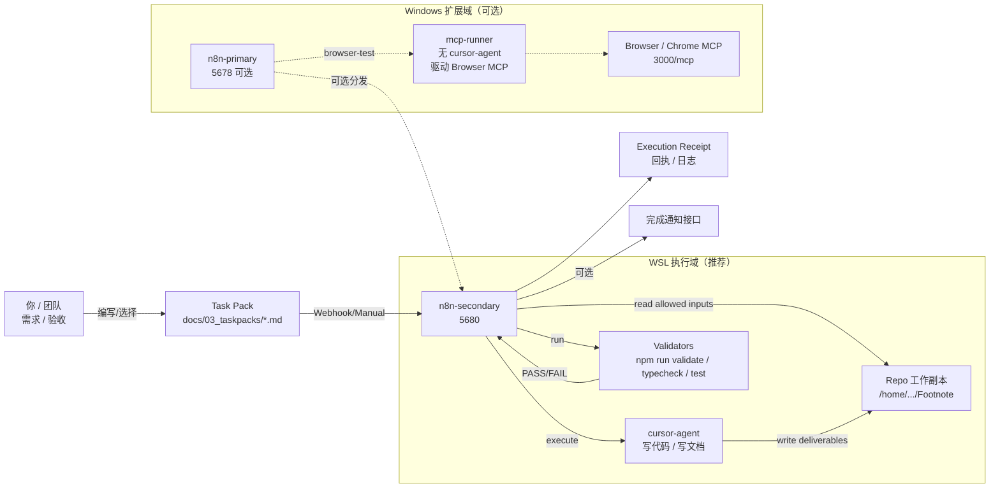
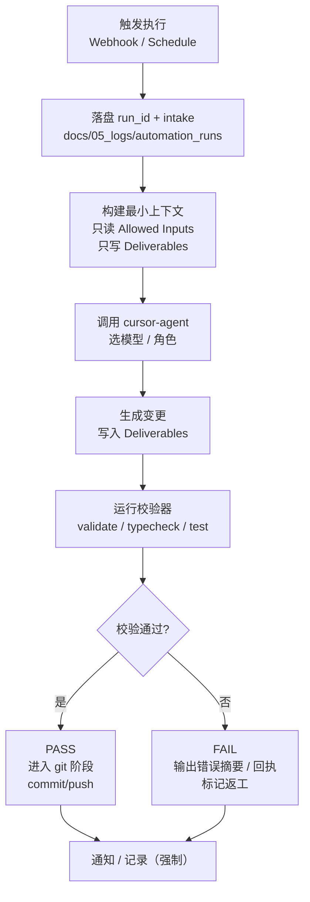
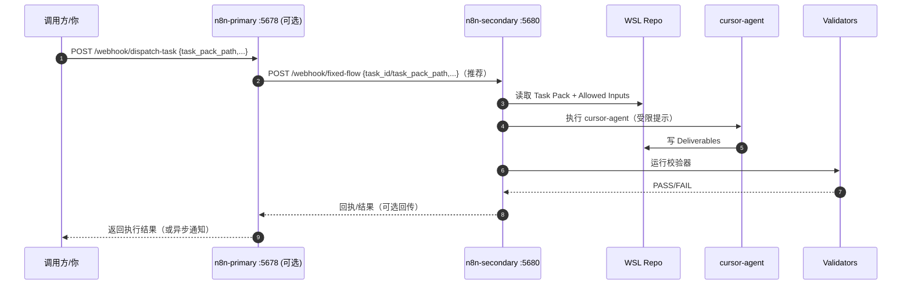
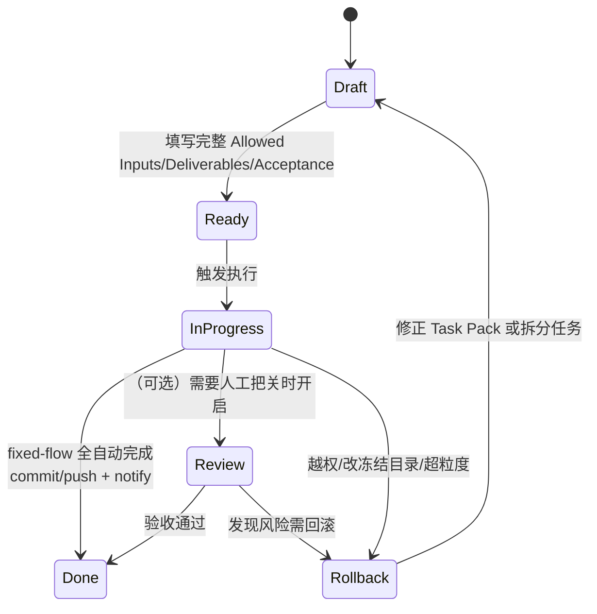

# n8n + Cursor CLI（cursor-agent）AI-Native 工厂方案总览（可对外介绍）

> 目的：用一份文档讲清楚《备注 / Footnote》的 **n8n + Task Pack + Cursor CLI（cursor-agent）** 自动化执行体系，便于：
> - 你快速判断设计/实现是否合理（边界、护栏、可追溯性）
> - 你把整套方案讲给其他人（架构图、流程图、表格齐全）
>
> 深入规格与落地计划请看：
> - 架构规格：`docs/02_specs/pipelines/n8n_cursor_cli_pipeline_spec.md`
> - 推进计划：`docs/02_specs/pipelines/n8n_cursor_cli_rollout_plan.md`

---

## 1. 一句话总结（What / Why）

**把“自然语言需求”转换成可审计的 Task Pack，然后由 n8n 触发执行器（WSL 的 `cursor-agent` 或 Windows 的 MCP Runner），在严格“只读/只写”护栏下产出 Deliverables、跑校验器并输出回执与通知。**

核心价值：
- **可控**：Task Pack 明确 Allowed Inputs / Deliverables / Constraints / Acceptance
- **可追溯**：每次执行都能回指到 `task_pack_path`、产物路径、执行结果
- **可扩展**：同一条执行链路覆盖多岗位（writer/engineer/tester/tools…），岗位差异由参数驱动

---

## 2. 关键概念（Artifacts）

| 工件 | 作用 | 位置/格式 |
|---|---|---|
| **Task Pack（工单契约）** | 定义“允许读什么/必须写什么/怎么验收” | `docs/03_taskpacks/*.md`（模板：`docs/03_taskpacks/_template.md`） |
| **Execution Receipt（执行回执）** | 执行者按固定格式总结：完成内容/输出文件/自检/风险 | 由执行器生成（也可写入审计目录或 Issue） |
| **Audit Log（审计记录）** | 记录每次执行：时间、参数、结果、产物 | 推荐落到 `docs/05_logs/`（由工作流/脚本实现） |

> 强制约束：冻结目录不可修改 `docs/00_charter/**`、`docs/01_bibles/**`（见 `.cursor/rules/09-ai-native-workflow.mdc`）。

---

## 3. 当前推荐运行形态（What we run today）

当前工程在多处文档中已选择 **形态 C（单入口）**：
- **统一入口**：WSL `n8n-secondary`（端口 `5680`）作为“工厂入口”
- **执行主链路（推荐）**：`POST /webhook/fixed-flow`（`tools/n8n/fixed-flow-pipeline.json`）
- **状态查询（配套）**：`GET /webhook/status?run_id=...`（`tools/n8n/status-query-workflow.json`）
- **Windows 5678**：暂不作为分发入口（后续需要浏览器/MCP 任务再启用）

### 3.1 新标准：固定流程驱动 + 自动流转 + 可续跑

你已确认工作方式偏好：
- **不需要每步人工确认**：默认全自动流转（auto=true）
- **每一步都必须落盘**：任何阶段都可回看与定位
- **可续跑**：保留 `resume_from_stage` 参数（但当前落地版本仅支持“跳过 preflight”，完整分段续跑待补齐）
- **单任务串行**：一次只跑一个任务，避免 repo 并发写

对应标准文档：
- `docs/02_specs/pipelines/n8n_fixed_flow_standard.md`

### 3.2 两条线边界（Env/Process vs Production）

为避免“改流程/改部署”污染“做产品/出产物”，两条线的工作环境与提交策略必须区分：
- `docs/02_specs/pipelines/workstreams_boundary.md`

相关说明：
- 工厂流水线规格：`docs/02_specs/pipelines/factory_pipeline_spec.md`
- n8n 使用说明：`tools/n8n/README.md`
- 部署指南：`tools/n8n/DEPLOYMENT-GUIDE.md`

---

## 4. 架构总览（组件图）

要点：
- **代码/文档任务**：走 WSL 执行域（`n8n-secondary -> cursor-agent -> validators`）
- **浏览器/ChromeMCP 任务**（且 Windows 无 `cursor-agent`）：走 Windows 扩展域（`n8n-primary -> mcp-runner -> Browser MCP`）

---

## 5. 标准工作流程（端到端）

### 5.1 WSL 执行链路（最常用：code/doc）

### 5.2 主从分发链路（可选：5678 → 5680）

> 兼容说明：仓库中仍保留旧链路 `/webhook/execute-task` 与 `/webhook/compose-taskpack`（Runner 版本），部分“工厂入口”工作流仍在使用；迁移到 fixed-flow 后可逐步下线。

---

## 6. 状态机（任务从 Draft 到 Done）

> 以 Task Pack 模板字段为准（`docs/03_taskpacks/_template.md`）。

---

## 7. 入口/端口/工作流清单（表格速查）

### 7.1 端口与实例

| 实例 | 端口 | 用途 | 备注 |
|---|---:|---|---|
| n8n-secondary（WSL） | 5680 | **执行主入口（推荐）** | 代码/文档任务主要在此执行 |
| n8n-primary（Windows） | 5678 | 可选分发/浏览器任务入口 | 需要主从分发或 browser-test 时启用 |

### 7.2 关键 Webhook（常用）

| Webhook | 位置 | 用途 |
|---|---|---|
| `POST /webhook/fixed-flow` | WSL 5680 | **固定流程主入口（推荐）**：异步启动 run_id，落盘审计并自动完成 |
| `GET /webhook/status` | WSL 5680 | **状态查询（配套）**：读取 `docs/05_logs/automation_runs/<run_id>/status.json` |
| `POST /webhook/execute-task` | WSL 5680 | 旧链路：执行指定 Task Pack（Runner 版本，兼容保留） |
| `POST /webhook/compose-taskpack` | WSL 5680 | 旧链路：生成 Task Pack（Runner 版本，兼容保留） |
| `POST /webhook/dispatch-task` | Windows 5678 | 主→从分发（可选） |
| `POST /webhook/browser-test` | Windows 5678 | Windows MCP Runner 浏览器任务（可选） |

### 7.3 可导入的工作流 JSON

| 工作流 | 文件 | 建议导入到 |
|---|---|---|
| **Fixed Flow Pipeline（推荐）** | `tools/n8n/fixed-flow-pipeline.json` | WSL 5680 |
| **Status Query（配套）** | `tools/n8n/status-query-workflow.json` | WSL 5680 |
| Cursor CLI 执行器（旧） | `tools/n8n/cursor-cli-task-workflow.json` | WSL 5680（兼容保留；依赖 `wsl-runner:3210`） |
| Windows 桥接 WSL 执行器 | `tools/n8n/cursor-cli-task-workflow-windows.json` | Windows 5678（可选） |
| 主→从分发 | `tools/n8n/dispatch-to-secondary-workflow.json` | Windows 5678（可选） |
| 工厂入口 /intake | `tools/n8n/factory-intake-workflow.json` | Windows 5678（可选） |
| 工厂入口 /run-role | `tools/n8n/factory-run-role-workflow.json` | Windows 5678（可选） |
| 生成 Task Pack（旧 /compose-taskpack） | `tools/n8n/taskpack-factory-workflow.json` | WSL 5680（兼容保留；依赖 `wsl-runner:3210`） |
| 岗位 Launcher：writer | `tools/n8n/launcher-l3-writer-to-wsl.json` | Windows 5678（可选） |
| 岗位 Launcher：engineer | `tools/n8n/launcher-l3-engineer-to-wsl.json` | Windows 5678（可选） |
| Windows Browser Test | `tools/n8n/windows-mcp-runner-browser-test-workflow.json` | Windows 5678（可选） |

完整目录：`tools/n8n/WORKFLOW-CATALOG.md`

---

## 8. 护栏设计（你用来判断“有没有风险/会不会跑偏”的关键）

### 8.1 约束来自哪里？
- **Task Pack 契约**：Allowed Inputs / Deliverables / Constraints / Acceptance
- **规则层（alwaysApply）**：`.cursor/rules/09-ai-native-workflow.mdc`
- **执行器护栏（建议封装）**：`tools/n8n/run-cursor-task.sh`（在规格中被强烈建议）

### 8.2 最关键的护栏（建议必须具备）

| 风险 | 典型表现 | 护栏/阻断点 |
|---|---|---|
| 越权修改文件 | 改到了非 Deliverables 路径 | 执行后 `git diff --name-only` 白名单校验 |
| 修改冻结目录 | 改动 `docs/00_charter` 或 `docs/01_bibles` | 执行后检测改动路径，直接 fail |
| 产物不可验收 | 没有回执/回执不含输出路径 | 强制回执模板；工作流最后一步生成回执 |
| 校验未阻断 | 测试/类型错误仍被标记完成 | 校验结果必须决定 PASS/FAIL 分支 |
| 路径/运行域错配 | 在 `/mnt/*` 跑导致慢/权限坑 | 强制 WSL repo 在 `/home/...` |

---

## 9. 给别人演示时的“讲解顺序”（建议照着讲）

1. **先讲契约**：Task Pack（Allowed Inputs / Deliverables / Acceptance）= 让 AI 可控
2. **再讲执行链**：n8n 负责编排；执行器负责产出；校验器负责阻断
3. **最后讲扩展**：同一链路覆盖 writer/engineer/tester；浏览器任务用 Windows MCP Runner

---

## 10. 深入阅读索引（从“看懂”到“落地”）

- **总规则/边界**：`.cursor/rules/09-ai-native-workflow.mdc`
- **架构规格（细节）**：`docs/02_specs/pipelines/n8n_cursor_cli_pipeline_spec.md`
- **推进与 DoD（怎么把它跑稳）**：`docs/02_specs/pipelines/n8n_cursor_cli_rollout_plan.md`
- **工厂化封装**：`docs/02_specs/pipelines/factory_pipeline_spec.md`
- **部署/导入/参数**：`tools/n8n/README.md`、`tools/n8n/DEPLOYMENT-GUIDE.md`
- **Windows 浏览器任务（无 cursor-agent）**：`tools/mcp-runner/README.md`

