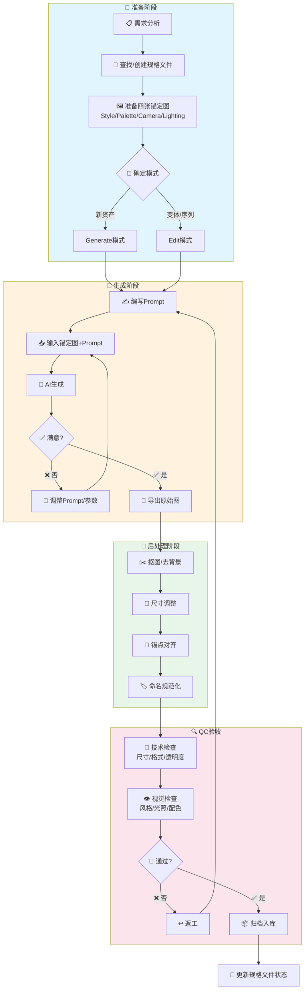
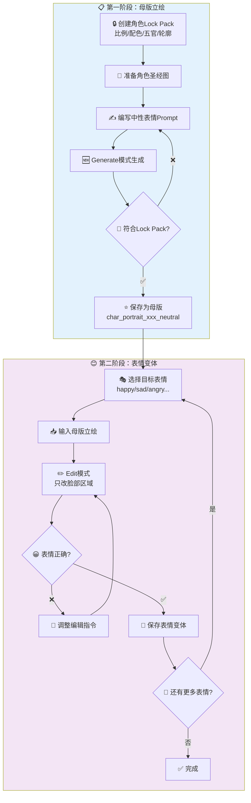
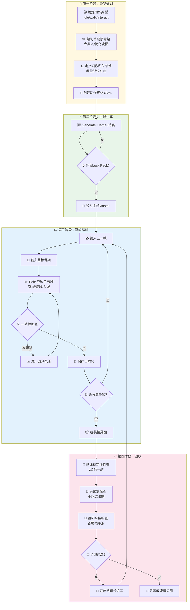
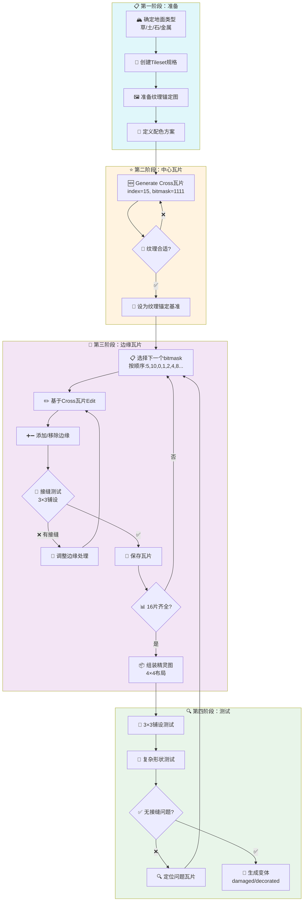
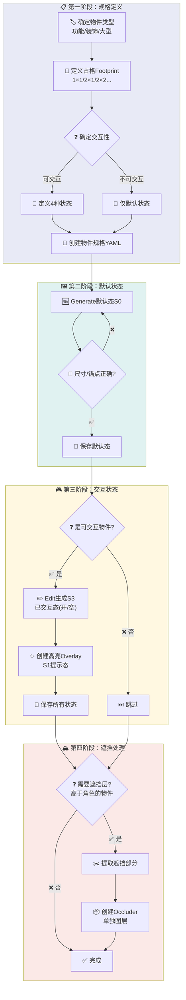
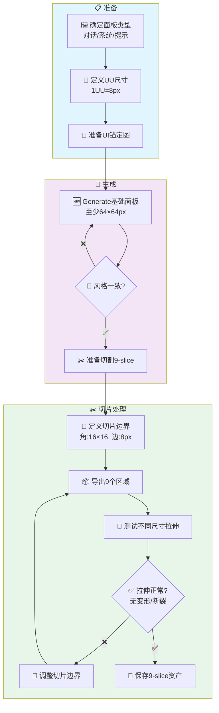
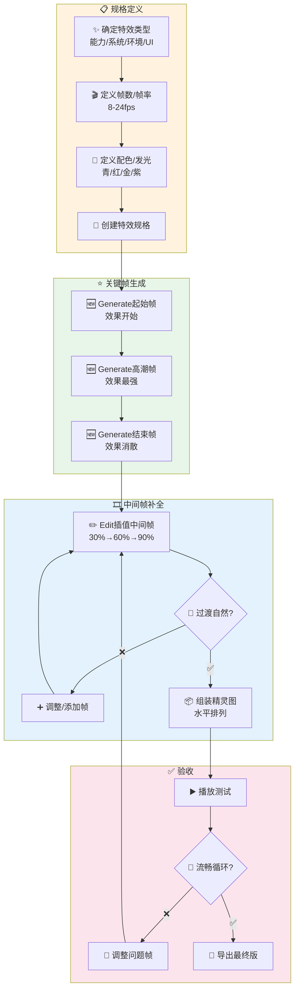
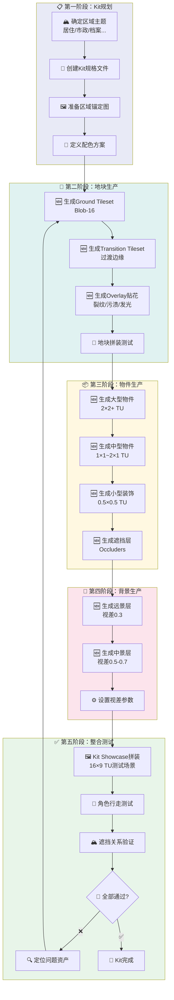
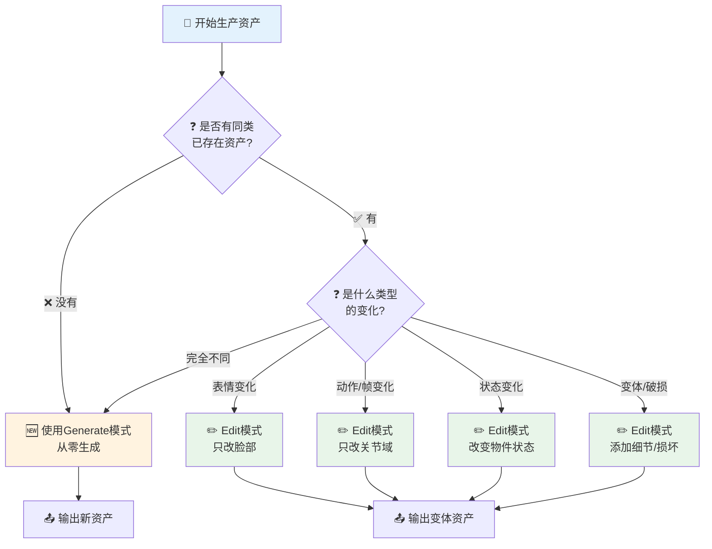
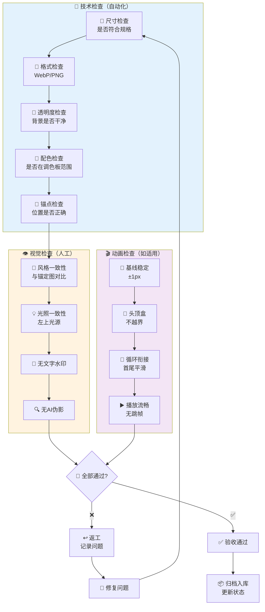

# 资产生产流程图汇总

> 本文档包含所有资产类型的Mermaid流程图，可直接在支持Mermaid的编辑器/渲染器中查看。

---

## 1. 通用生产流程

---

## 2. 角色立绘生产流程

---

## 3. 角色序列帧生产流程

---

## 4. Tileset生产流程（Blob-16）

---

## 5. 物件(Props)生产流程

---

## 6. UI面板生产流程（9-slice）

---

## 7. VFX特效生产流程

---

## 8. 完整Kit套件生产流程

---

## 9. 生成模式选择决策树

---

## 10. QC验收流程

---

## 使用说明

### 查看流程图

1. **VS Code**: 安装 "Markdown Preview Mermaid Support" 扩展
2. **GitHub**: 直接在仓库中查看，GitHub原生支持Mermaid
3. **在线工具**: 复制Mermaid代码到 [mermaid.live](https://mermaid.live)

### 流程图符号说明

| 符号 | 含义 |
|------|------|
| 📋 | 规划/准备 |
| 🆕 | Generate生成 |
| ✏️ | Edit编辑 |
| 💾 | 保存 |
| 🔍 | 检查 |
| ✅ | 通过/完成 |
| ❌ | 失败/返工 |
| 🔧 | 调整/修复 |

---

*文档版本：v1.0 | 最后更新：2025-12-25*

