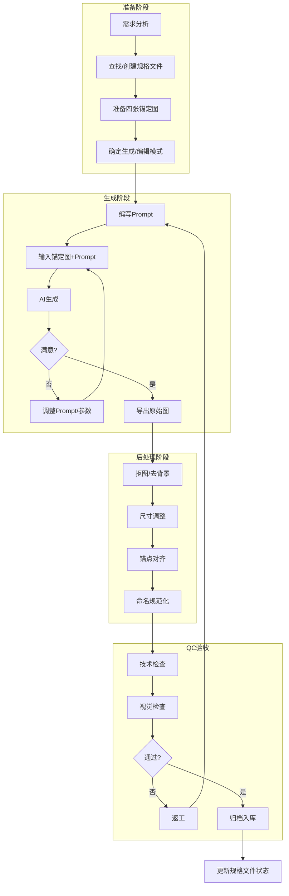
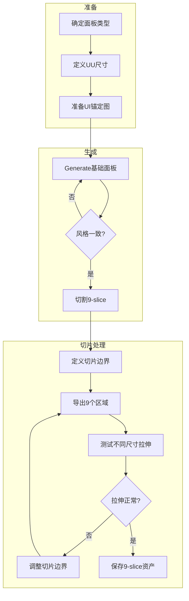
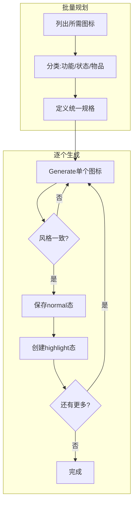
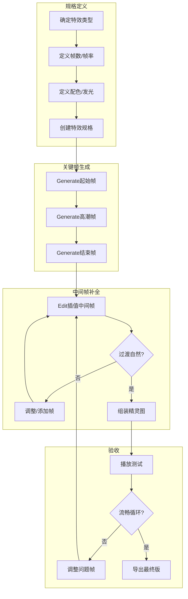

# 资产生产流程详解 v1.0

> **文档性质**：AI美术资产生产执行手册  
> **适用对象**：美术执行、技术美术、AI生成操作员  
> **最后更新**：2025-12-25  
> **对齐文档**：美术工作流总纲 v2、06-ai-art-generation.mdc

---

## 一、总体生产架构

### 1.1 核心原则

```
┌─────────────────────────────────────────────────────────────────┐
│                    AI美术生产三原则                              │
├─────────────────────────────────────────────────────────────────┤
│ 1. 锚定优先：所有生成必须基于四张锚定图，不从零抽卡              │
│ 2. 编辑迭代：系列资产用Edit模式，保证一致性                      │
│ 3. 规格先行：先定义YAML规格，再生成资产                          │
└─────────────────────────────────────────────────────────────────┘
```

### 1.2 通用生产流程（所有资产适用）



---

## 二、角色资产生产流程

### 2.1 立绘生产流程

#### 流程概述

立绘是角色的"母版"，所有表情变体都基于它编辑生成。

```mermaid
flowchart TB
    subgraph 第一阶段：母版立绘
        A1[创建角色Lock Pack] --> A2[准备角色圣经图]
        A2 --> A3[编写中性表情Prompt]
        A3 --> A4[Generate模式生成]
        A4 --> A5{符合Lock Pack?}
        A5 -->|否| A3
        A5 -->|是| A6[保存为母版]
    end
    
    subgraph 第二阶段：表情变体
        B1[选择目标表情] --> B2[输入母版立绘]
        B2 --> B3[Edit模式: 只改脸部]
        B3 --> B4{表情正确?}
        B4 -->|否| B5[调整编辑指令]
        B5 --> B3
        B4 -->|是| B6[保存表情变体]
        B6 --> B7{还有更多表情?}
        B7 -->|是| B1
        B7 -->|否| B8[完成]
    end
    
    A6 --> B1
```

#### 详细步骤

**Step 1: 创建角色Lock Pack**
```yaml
# 示例：岑回的Lock Pack
character_id: cenhui
lock_pack:
  proportion:
    head_to_body: "1:5"
    shoulder_width: 0.3
  palette:
    hair: "#1A1A2E"
    skin: "#E8D5C4"
    eye: "#00FFF0"
    cloth_primary: "#2D3436"
    cloth_secondary: "#4A4A66"
    accent: "#00FFF0"
  facial_layout:
    eye_y: 180
    eye_spacing: 60
    nose_y: 220
    mouth_y: 260
  silhouette_features:
    - "不对称刘海"
    - "尖锐眼角"
```

**Step 2: 生成母版立绘（中性表情）**
```
# Prompt模板
pixel art portrait of [角色描述],
[年龄] [性别],
[服装描述],
neutral calm expression,
cyberpunk aesthetic,
dark tones with [强调色] accent lighting,
transparent background,
front facing, 512x512,
consistent top-left lighting,
no text, no watermark
```

**Step 3: 编辑生成表情变体**
```
# Edit模式Prompt
change expression to [目标表情],
keep hair, clothing, pose, lighting exactly the same,
only modify: eyes, eyebrows, mouth,
maintain character consistency
```

#### 立绘QC清单
- [ ] 尺寸：512×512px
- [ ] 配色与Lock Pack误差 < 5 HSL
- [ ] 五官位置与布局锁一致
- [ ] 所有表情头部位置一致
- [ ] 透明背景无杂色
- [ ] 光照方向左上一致

---

### 2.2 精灵/序列帧生产流程

#### 流程概述

序列帧必须使用"骨架先行+逐帧编辑"方法，禁止每帧从零生成。

```mermaid
flowchart TB
    subgraph 第一阶段：骨架规划
        A1[确定动作类型] --> A2[绘制关键帧骨架]
        A2 --> A3[定义帧数和关节域]
        A3 --> A4[创建动作规格]
    end
    
    subgraph 第二阶段：主帧生成
        B1[生成Frame0站姿] --> B2{符合Lock Pack?}
        B2 -->|否| B1
        B2 -->|是| B3[设为主帧Master]
    end
    
    subgraph 第三阶段：逐帧编辑
        C1[输入上一帧] --> C2[输入目标骨架]
        C2 --> C3[Edit: 只改关节域]
        C3 --> C4{一致性检查}
        C4 -->|失败| C5[减小改动范围]
        C5 --> C3
        C4 -->|通过| C6[保存当前帧]
        C6 --> C7{还有更多帧?}
        C7 -->|是| C1
        C7 -->|否| C8[组装精灵图]
    end
    
    subgraph 第四阶段：验收
        D1[基线稳定性检查] --> D2[头顶盒检查]
        D2 --> D3[循环衔接检查]
        D3 --> D4{全部通过?}
        D4 -->|否| D5[定位问题帧返工]
        D5 --> C1
        D4 -->|是| D6[导出最终精灵图]
    end
    
    A4 --> B1
    B3 --> C1
    C8 --> D1
```

#### 详细步骤

**Step 1: 动作规格定义**
```yaml
animation:
  id: walk
  direction: down
  frames: 8
  fps: 12
  loop: true
  
  keyframes:
    - frame: 0
      description: "接触位-左脚着地"
      edit_region: "legs"
    - frame: 1
      description: "下降位"
      edit_region: "legs"
    # ... 继续定义
    
  constraints:
    baseline_y: 188
    headbox_y_max: 32
    pivot: [64, 188]
```

**Step 2: 主帧生成**
```
# Generate模式生成站姿主帧
pixel art game sprite,
[角色名] standing facing down,
128x192 pixels, feet at y=188,
transparent background,
consistent with character reference,
pixel art style, 2px pixel size,
no text, no watermark
```

**Step 3: 逐帧编辑**
```
# Edit模式 - Frame N
based on previous frame,
change leg position to match skeleton reference,
ONLY modify: legs and feet (knee down),
keep torso, head, arms EXACTLY same,
maintain baseline at y=188,
maintain head top within y=32
```

#### 序列帧QC清单
- [ ] 帧数正确
- [ ] 所有帧基线y一致（±1px）
- [ ] 所有帧头顶不超过限制
- [ ] 躯干/头部在各帧间无漂移
- [ ] 循环动画首尾可衔接
- [ ] 精灵图布局正确（水平排列）

---

## 三、场景资产生产流程

### 3.1 Tileset生产流程

#### 流程概述

Tileset使用Blob-16语法，需要16个瓦片覆盖所有连接情况。

```mermaid
flowchart TB
    subgraph 第一阶段：准备
        A1[确定地面类型] --> A2[创建Tileset规格]
        A2 --> A3[准备纹理锚定图]
        A3 --> A4[定义配色方案]
    end
    
    subgraph 第二阶段：中心瓦片
        B1[生成Cross瓦片-index15] --> B2{纹理合适?}
        B2 -->|否| B1
        B2 -->|是| B3[设为纹理锚定基准]
    end
    
    subgraph 第三阶段：边缘瓦片
        C1[选择下一个bitmask] --> C2[基于Cross瓦片Edit]
        C2 --> C3[添加/移除边缘]
        C3 --> C4{接缝测试}
        C4 -->|失败| C5[调整边缘处理]
        C5 --> C2
        C4 -->|通过| C6[保存瓦片]
        C6 --> C7{16片齐全?}
        C7 -->|否| C1
        C7 -->|是| C8[组装精灵图]
    end
    
    subgraph 第四阶段：测试
        D1[3×3铺设测试] --> D2[复杂形状测试]
        D2 --> D3{无接缝问题?}
        D3 -->|否| D4[定位问题瓦片]
        D4 --> C1
        D3 -->|是| D5[生成变体]
    end
    
    A4 --> B1
    B3 --> C1
    C8 --> D1
```

#### Blob-16瓦片生成顺序

```
推荐生成顺序（从易到难）：
1. index 15 (1111) - Cross/中心 - 四边连接，最完整
2. index 5  (0101) - 垂直线
3. index 10 (1010) - 水平线
4. index 0  (0000) - 孤立 - 四边都是边缘
5. 边缘瓦片 (1,2,4,8) - 端点
6. 转角瓦片 (3,6,9,12) - L形
7. T形瓦片 (7,11,13,14)
```

#### 详细步骤

**Step 1: 生成中心瓦片（Cross）**
```
# Generate模式
pixel art tileset tile,
[地面类型] floor, fully connected on all 4 sides,
128x128 pixels,
seamless edges,
consistent texture scale 16px pattern repeat,
top-left lighting,
[配色描述],
game asset style,
no text, no watermark
```

**Step 2: 编辑生成边缘瓦片**
```
# Edit模式 - 生成北边缘(index 4)
based on cross tile,
add edge/border on NORTH side only,
keep other 3 sides seamless,
maintain texture consistency,
same lighting and color
```

#### Tileset QC清单
- [ ] 16个瓦片全部存在
- [ ] 3×3铺设无明显接缝
- [ ] 纹理密度一致
- [ ] 光照方向统一
- [ ] 配色无漂移

---

### 3.2 物件(Props)生产流程

#### 流程概述

物件需要考虑占格、交互状态和遮挡层。

```mermaid
flowchart TB
    subgraph 第一阶段：规格定义
        A1[确定物件类型] --> A2[定义占格Footprint]
        A2 --> A3[确定交互性]
        A3 --> A4[创建物件规格YAML]
    end
    
    subgraph 第二阶段：默认状态
        B1[Generate默认态S0] --> B2{尺寸/锚点正确?}
        B2 -->|否| B1
        B2 -->|是| B3[保存默认态]
    end
    
    subgraph 第三阶段：交互状态
        C1{是可交互物件?}
        C1 -->|否| C5[跳过]
        C1 -->|是| C2[Edit生成S3已交互态]
        C2 --> C3[创建高亮Overlay]
        C3 --> C4[保存所有状态]
    end
    
    subgraph 第四阶段：遮挡处理
        D1{需要遮挡层?}
        D1 -->|否| D4[完成]
        D1 -->|是| D2[提取遮挡部分]
        D2 --> D3[创建Occluder]
        D3 --> D4
    end
    
    A4 --> B1
    B3 --> C1
    C4 --> D1
    C5 --> D1
```

#### 详细步骤

**Step 1: 创建物件规格**
```yaml
id: obj-res-container
category: prop
footprint:
  width_tu: 1
  height_tu: 1
pivot:
  x: 0.5
  y: 1.0
interactive: true
states:
  - default
  - highlight
  - open
  - empty
```

**Step 2: 生成默认状态**
```
# Generate模式
pixel art game object sprite,
[物件描述],
isometric view,
cyberpunk style,
1x1 tile unit size (128x128 canvas),
pivot at bottom center,
transparent background,
top-left lighting,
no text, no watermark
```

**Step 3: 生成交互后状态**
```
# Edit模式
change object state to [opened/empty/broken],
keep same size, position, lighting,
show interior/changed appearance
```

#### 物件QC清单
- [ ] 画布尺寸符合占格规格
- [ ] 锚点位置正确
- [ ] 所有交互状态齐全
- [ ] 光照方向一致
- [ ] 透明背景干净

---

## 四、UI资产生产流程

### 4.1 UI面板生产流程



#### 9-slice切片规格

```
┌────────┬──────────────┬────────┐
│ 16×16  │   可拉伸     │ 16×16  │
│ 左上角 │   上边缘     │ 右上角 │
├────────┼──────────────┼────────┤
│ 可拉伸 │   中心区域   │ 可拉伸 │
│ 左边缘 │   (可拉伸)   │ 右边缘 │
├────────┼──────────────┼────────┤
│ 16×16  │   可拉伸     │ 16×16  │
│ 左下角 │   下边缘     │ 右下角 │
└────────┴──────────────┴────────┘

切片尺寸: 2UU × 2UU = 16×16px (角)
最小源图: 64×64px
```

### 4.2 图标生产流程



---

## 五、VFX特效生产流程

### 5.1 能力特效生产流程



#### 详细步骤

**Step 1: 生成关键帧**
```
# Generate模式 - 起始帧
pixel art effect sprite,
[特效描述] starting state,
[颜色] glowing effect,
transparent background,
64x64 or 128x128 pixels,
game VFX style,
no text, no watermark
```

**Step 2: 编辑中间帧**
```
# Edit模式
interpolate effect between start and peak,
[进度描述: 30% intensity],
maintain color and glow style,
smooth transition
```

---

## 六、Kit套件整体生产流程

### 6.1 完整Kit生产流程

```mermaid
flowchart TB
    subgraph 第一阶段：Kit规划
        A1[确定区域主题] --> A2[创建Kit规格文件]
        A2 --> A3[准备区域锚定图]
        A3 --> A4[定义配色方案]
    end
    
    subgraph 第二阶段：地块生产
        B1[生成Ground Tileset] --> B2[生成Transition Tileset]
        B2 --> B3[生成Overlay贴花]
        B3 --> B4[地块拼装测试]
    end
    
    subgraph 第三阶段：物件生产
        C1[生成大型物件] --> C2[生成中型物件]
        C2 --> C3[生成小型装饰]
        C3 --> C4[生成遮挡层]
    end
    
    subgraph 第四阶段：背景生产
        D1[生成远景层] --> D2[生成中景层]
        D2 --> D3[设置视差参数]
    end
    
    subgraph 第五阶段：整合测试
        E1[Kit Showcase拼装] --> E2[角色行走测试]
        E2 --> E3[遮挡关系验证]
        E3 --> E4{全部通过?}
        E4 -->|否| E5[定位问题资产]
        E5 --> B1
        E4 -->|是| E6[Kit完成]
    end
    
    A4 --> B1
    B4 --> C1
    C4 --> D1
    D3 --> E1
```

### 6.2 Kit生产检查清单

```yaml
Kit完成标准:
  地块:
    - [ ] Ground Base: ≥2种 × 16片Blob
    - [ ] Transition: 主要组合覆盖
    - [ ] Overlay: ≥10种贴花
    
  物件:
    - [ ] 功能物件: ≥5种(含交互状态)
    - [ ] 装饰物件: ≥10种
    - [ ] 遮挡层: 所有高物件配套
    
  背景:
    - [ ] 远景: ≥1层
    - [ ] 中景: ≥2层
    
  测试:
    - [ ] 16×9 TU测试场景通过
    - [ ] 角色遮挡正确
    - [ ] 无明显接缝
```

---

## 七、生产工具与自动化

### 7.1 推荐工具链

```
┌─────────────────────────────────────────────────────────────┐
│                      生产工具链                              │
├─────────────────────────────────────────────────────────────┤
│ AI生成    : Cursor + Banana (Gemini 2.5 Flash Image)       │
│ 后处理    : Photoshop / GIMP / Aseprite                     │
│ 精灵图打包 : TexturePacker / Aseprite                        │
│ 规格管理  : YAML文件 + VS Code                              │
│ 版本控制  : Git                                             │
│ QC自动化  : Python脚本 (PIL/OpenCV)                         │
└─────────────────────────────────────────────────────────────┘
```

### 7.2 批量处理脚本建议

```python
# QC自动检查示例（伪代码）
def check_asset(image_path, spec_path):
    spec = load_yaml(spec_path)
    img = load_image(image_path)
    
    checks = {
        'size': check_size(img, spec.canvas),
        'transparency': check_transparent_bg(img),
        'palette': check_palette_drift(img, spec.palette),
        'pivot': check_pivot_alignment(img, spec.pivot),
    }
    
    return all(checks.values()), checks
```

---

## 八、常见问题与解决方案

### 8.1 一致性问题

| 问题 | 原因 | 解决方案 |
|------|------|----------|
| 风格漂移 | 未使用锚定图 | 每次生成必须输入Style Anchor |
| 配色偏差 | 未锁定调色板 | 使用Palette Anchor + 后处理校色 |
| 光照不一致 | Prompt描述模糊 | 明确"top-left lighting" |
| 尺寸错误 | 未指定画布 | Prompt中明确像素尺寸 |

### 8.2 序列帧问题

| 问题 | 原因 | 解决方案 |
|------|------|----------|
| 帧间抖动 | 每帧从零生成 | 使用Edit模式逐帧编辑 |
| 比例变化 | 改动范围太大 | 严格限制关节域编辑 |
| 基线漂移 | 未锁定脚底位置 | Prompt明确baseline_y |
| 循环跳帧 | 首尾帧不匹配 | 检查首尾帧衔接 |

### 8.3 拼装问题

| 问题 | 原因 | 解决方案 |
|------|------|----------|
| Tile接缝明显 | 边缘处理不一致 | 使用Edit模式保证纹理连续 |
| 物件悬浮感 | 锚点位置错误 | 统一pivot为底部中心 |
| 遮挡错误 | 缺少遮挡层 | 为高物件创建单独Occluder |
| 尺度不统一 | 未参考尺度图 | 使用Scale Ruler锚定图 |

---

*文档版本：v1.0 | 最后更新：2025-12-25*

