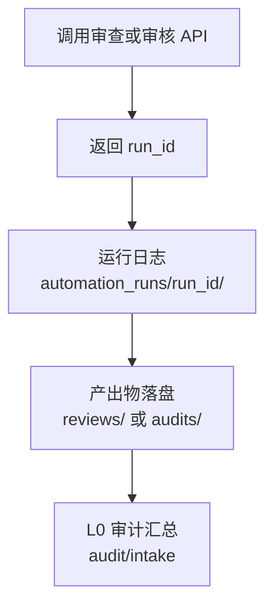

# 审查/审核体系执行指南（Review System Guide）

> 适用范围：Footnote 仓库的**代码/文档/任务交付**质量门禁与 L0 总体审核  
> 参考设计：`workflows/reusable/pipeline-sys/v2-design/REVIEW-SYSTEM-DESIGN.md`

---

## 1. 目标与原则

### 1.1 目标

- **可追溯**：每一次交付都能回答“改了什么、谁审了、结论是什么、证据在哪”
- **可落盘**：审查结果必须以文件形式归档，支持回溯与审计
- **可汇总**：L0 一键发起总体审核，自动汇总进度与问题，给出决策建议

### 1.2 原则（强约束）

- **审查记录必须落盘**到 `workflows/project/logs/reviews/`
- **审核报告必须落盘**到 `workflows/project/logs/audits/`
- **自动化运行必须可追溯**到 `workflows/project/logs/automation_runs/{run_id}/`

---

## 2. 归档目录与工件（Artifacts）

### 2.1 目录一览

| 目录 | 用途 | 典型文件 |
|---|---|---|
| `workflows/project/logs/reviews/` | 所有审查/签字/验收记录（结构化 JSON） | `CR-*.json` / `DR-*.json` / `QA-*.json` / `ACC-*.json` |
| `workflows/project/logs/audits/` | 总体审核报告（JSON + Markdown） | `AUDIT-*.json` / `AUDIT-*-progress.md` / `AUDIT-*-issues.md` |
| `workflows/project/logs/automation_runs/` | 每次流程运行的审计日志 | `{run_id}/status.json` / `events.ndjson` / `node_runs.json` |

### 2.2 文件命名约定

- **Code Review**：`CR-YYYYMMDD-XXXX.json`
- **Design Review**：`DR-YYYYMMDD-XXXX.json`
- **QA Signoff**：`QA-YYYYMMDD-XXXX.json`
- **Acceptance Review**：`ACC-{milestone_id}-YYYYMMDD.json`
- **Audit Intake**：`AUDIT-YYYYMMDD-XXXX.json`

### 2.3 “run_id / review_id / audit_id” 的关系



- **run_id**：一次“流程运行”的唯一标识（可在返回值中获得）
- **review_id / signoff_id / acceptance_id**：一次“审查记录”的唯一标识（落盘到 `reviews/`）
- **audit_id**：一次“总体审核”的唯一标识（落盘到 `audits/`）

---

## 3. 四类审查流程（What / When / Output）

> 下述 4 类流程由 WSL Runner 提供 HTTP 端点触发（见第 5 节）。

### 3.1 Code Review（L2 代码审查）

- **触发时机**：PR/提交完成、任务交付前
- **输入**：`task_id` + `commit_range`（可选 `changed_files`、`review_dimensions`、`pass_threshold`）
- **检查维度**（建议参考）：`workflows/project/promptx/skills/code_review.yaml`
- **输出**：在 `workflows/project/logs/reviews/CR-*.json` 落盘，至少包含：
  - `review_id` / `task_id` / `result` / `score` / `dimensions` / `issues` / `summary` / `completed_at`

### 3.2 Design Review（L1 设计审查）

- **触发时机**：Spec/TaskPack 提交后、分发执行前
- **输入**：`doc_path` + `doc_type`（可选 `review_focus`、`parent_doc_path`、`pass_threshold`）
- **核心检查**：
  - 完整性（必要章节、约束、验收点）
  - 一致性（与上层 Bible/Spec 的契约一致）
  - 可行性（资源/工期/技术边界）
  - 清晰度（无歧义，可执行）
- **输出**：在 `workflows/project/logs/reviews/DR-*.json` 落盘

### 3.3 QA Signoff（L3 测试签字）

- **触发时机**：功能开发完成、合入/发布前
- **输入**：`task_id` + `task_pack_path`（可选 `auto_checks`、`signoff_type`）
- **执行方式**：
  - 从 TaskPack 解析 `Acceptance Checklist`
  - 自动执行 lint/typecheck/test/build（可配置）
  - 对必须人工验证项标记 `MANUAL_REQUIRED`
- **输出**：在 `workflows/project/logs/reviews/QA-*.json` 落盘

### 3.4 Acceptance Review（L0 里程碑验收）

- **触发时机**：里程碑节点（如 M1-Alpha、Alpha/Beta/RC）
- **输入**：`milestone_id`（可选 `scope_chapters`、`scope_systems`、`period_start/end`）
- **输出**：
  - `workflows/project/logs/reviews/ACC-*.json`（结构化验收结论）
  - （可选）`workflows/project/logs/reports/ACC-*-progress.md`（人类可读摘要）

---

## 4. L0 总体审核入口（Audit Intake）

### 4.1 解决的问题

- 自动回答：
  - **周期内发生了什么**（TaskPack/Spec/Commit 的数量与清单）
  - **完成了多少审查**（CR/DR/QA 的数量与均分）
  - **有哪些阻塞/警告**（从审查记录聚合）
  - **是否建议继续推进**（决策建议 + 下一步）

### 4.2 归档输出

落盘位置：`workflows/project/logs/audits/`

- `AUDIT-*.json`：结构化完整报告（用于 UI/二次统计）
- `AUDIT-*-progress.md`：进度报告（给人看）
- `AUDIT-*-issues.md`：问题报告（给人看）

---

## 5. 如何发起（Windows PowerShell 示例）

> 直接调用 WSL Runner (port 3210)，`project_root` 使用 Windows 路径格式。

### 5.1 发起总体审核（L0）

```powershell
$body = @{
  project_root = "F:/workspace/github/Footnote"
  audit_scope = "all"
  period_days = 7
  include_code_review = $true
  include_design_review = $true
  include_qa_signoff = $true
  # $false = 仅汇总（快速）
  # $true  = 完整审核（会自动补齐缺失审查，耗时更久）
  auto_trigger_missing = $true
  requester = "L0_producer"
} | ConvertTo-Json

Invoke-RestMethod -Method Post -Uri "http://localhost:3210/audit/intake" -ContentType "application/json" -Body $body
```

> UI 入口：在 **审查中心** 点击 `⚡ 一键完整审核`，无需手填参数（默认 period_days=7，包含 Code/Design/QA）。

### 5.2 发起代码审查（L2）

```powershell
$body = @{
  project_root = "F:/workspace/github/Footnote"
  task_id = "TASK-001"
  commit_range = "HEAD~3..HEAD"
  pass_threshold = 60
  reviewer = "AI"
} | ConvertTo-Json

Invoke-RestMethod -Method Post -Uri "http://localhost:3210/review/code" -ContentType "application/json" -Body $body
```

### 5.3 发起设计审查（L1）

```powershell
$body = @{
  project_root = "F:/workspace/github/Footnote"
  doc_path = "design/ai-native/02_specs/ui_system_spec.md"
  doc_type = "spec"
  pass_threshold = 70
  reviewer = "AI"
} | ConvertTo-Json

Invoke-RestMethod -Method Post -Uri "http://localhost:3210/review/design" -ContentType "application/json" -Body $body
```

### 5.4 发起 QA 签字（L3）

```powershell
$body = @{
  project_root = "F:/workspace/github/Footnote"
  task_id = "TASK-001"
  task_pack_path = "design/ai-native/03_taskpacks/TASK-001_xxx.md"
  auto_checks = "lint,typecheck,test,build"
  signer = "L3_tester"
} | ConvertTo-Json

Invoke-RestMethod -Method Post -Uri "http://localhost:3210/review/qa-signoff" -ContentType "application/json" -Body $body
```

---

## 6. 常见问题（FAQ）

### 6.1 为什么总体审核显示 reviews=0？

因为 `workflows/project/logs/reviews/` 目录里没有（或很少）审查记录文件。  
先触发 `/review/code`、`/review/design`、`/review/qa-signoff` 生成对应 JSON，Audit 才能汇总出真实数据。

### 6.2 为什么审核报告 Markdown 里出现 `$(date ...)` 或 `$(echo ...)`？

这是旧版报告生成脚本把 bash 模板**原样写入**导致的（占位符未展开）。  
本仓库已将报告生成改为**直接写入最终 Markdown 内容**（不依赖 bash 展开），若仍出现说明流程文件未更新或未被加载。

### 6.3 路径格式说明

统一使用 Windows 路径格式：`F:/workspace/github/Footnote`

---

## 7. 建议的“最小可用门禁”（推荐）

- **每个任务交付**至少应满足：
  - 1 条 `CR-*` 或（任务不涉及代码则给出解释）
  - 1 条 `QA-*`（或明确标记哪些项需要人工）
  - 交付物落盘（TaskPack Deliverables）
- **每周/每阶段**至少跑一次 `Audit Intake`，把结果沉淀进 `audits/` 供回溯与决策。

