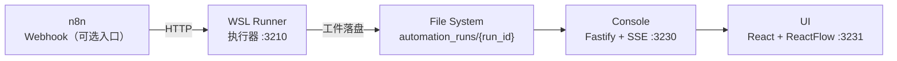

# Pipeline-Sys v1

Pipeline-Sys 是一个自建的流程执行可视化系统，提供行为树展示和执行控制能力。

## 文档索引（最新）

- `WORKFLOW-OVERVIEW.md`：**粗/中/低粒度**端到端工作流总览（含 Mermaid 图与示例）
- `v2-design/ROLE-FLOWS-DESIGN.md`：多岗位流程设计（含白盒→正式资产两阶段）
- `v2-design/examples/`：可直接执行的 FlowSpec 定义（WSL Runner 通过端点加载执行）
- `IMPLEMENTATION-STATUS.md`：实现状态（v1/v2 集成与迁移进度）
- `ANALYSIS-REPORT.md`：完整分析报告（架构/模块/API/运行语义）

## 架构概览



## 目录结构

```
pipeline-sys/
├── shared/           # 共享类型（TypeScript）
│   └── src/
│       ├── enums.ts      # 状态和事件枚举
│       ├── graph.ts      # graph.json 类型
│       ├── events.ts     # events.ndjson 类型
│       ├── nodeRuns.ts   # node_runs.json 类型
│       ├── status.ts     # status.json 类型
│       └── guards.ts     # 运行时校验
│
├── console/          # 后端服务（Fastify + SSE）
│   └── src/
│       ├── main.ts       # 入口
│       ├── server.ts     # Fastify 实例
│       ├── config.ts     # 配置
│       ├── services/     # 业务逻辑
│       ├── routes/       # API 路由
│       └── clients/      # Runner 客户端
│
├── ui/               # 前端应用（Vite + React + ReactFlow）
│   └── src/
│       ├── main.tsx      # 入口
│       ├── app/          # 应用组件
│       ├── pages/        # 页面
│       ├── components/   # UI 组件
│       ├── api/          # API 客户端
│       └── state/        # 状态管理
│
└── design.md         # 设计规格
└── code-architecture.md  # 代码架构
```

## 快速开始

### 1. 安装依赖

```bash
# shared
cd shared && npm install && npm run build && cd ..

# console
cd console && npm install && cd ..

# ui
cd ui && npm install && cd ..
```

### 2. 启动服务

```bash
# 启动 Console（后端）
cd console && npm run dev

# 启动 UI（前端）
cd ui && npm run dev
```

### 3. 访问

- Console API: http://127.0.0.1:3230
- UI: http://127.0.0.1:3231

## API 接口

### 运行列表
```
GET /api/runs
```

### 运行详情
```
GET /api/runs/:runId
```

### 事件流（SSE）
```
GET /api/runs/:runId/events
```

### 文件读取
```
GET /api/runs/:runId/file?path=<rel_path>
```

### 取消运行
```
POST /api/runs/:runId/cancel
```

### 重试节点
```
POST /api/runs/:runId/retry
Body: { "node_id": "execute.edit" }
```

## 运行工件

每次运行会在 `workflows/project/logs/automation_runs/<run_id>/` 下生成：

- `status.json` - 运行状态快照
- `graph.json` - 行为树图谱
- `events.ndjson` - 事件流
- `node_runs.json` - 节点状态快照
- `control.json` - 控制请求
- `00_intake.json` ~ `07_notify.json` - 阶段产物
- `nodes/` - 子节点产物

## 节点状态

- `PENDING` - 等待执行
- `RUNNING` - 执行中
- `SUCCESS` - 成功
- `FAILED` - 失败
- `SKIPPED` - 跳过
- `CANCELLED` - 已取消
- `TIMEOUT` - 超时

## 事件类型

- `RUN_STARTED` / `RUN_FINISHED` - 运行生命周期
- `NODE_STARTED` / `NODE_FINISHED` - 节点生命周期
- `NODE_LOG` - 节点日志
- `NODE_TIMEOUT` - 节点超时
- `NODE_RETRY_SCHEDULED` - 节点重试调度
- `RUN_CANCEL_REQUESTED` / `RUN_CANCELLED` - 取消
- `LOCK_*` - 锁事件

## 配置

环境变量：

| 变量 | 默认值 | 说明 |
|------|--------|------|
| `PIPELINE_SYS_HOST` | `127.0.0.1` | Console 监听地址 |
| `PIPELINE_SYS_PORT` | `3230` | Console 端口 |
| `PROJECT_ROOT` | `/home/shash/work/Footnote` | 项目根目录 |
| `RUNNER_BASE_URL` | `http://127.0.0.1:3210` | Runner 地址 |

## 版本规划

- **v1** (当前): 固定流程可观测 + 可控
- **v2**: FlowSpec DSL 支持
- **v3**: 多执行器与治理能力

