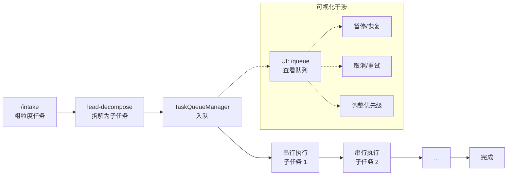
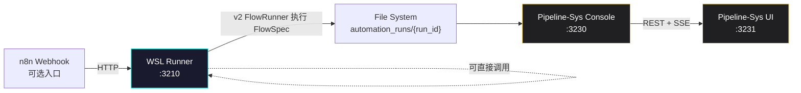
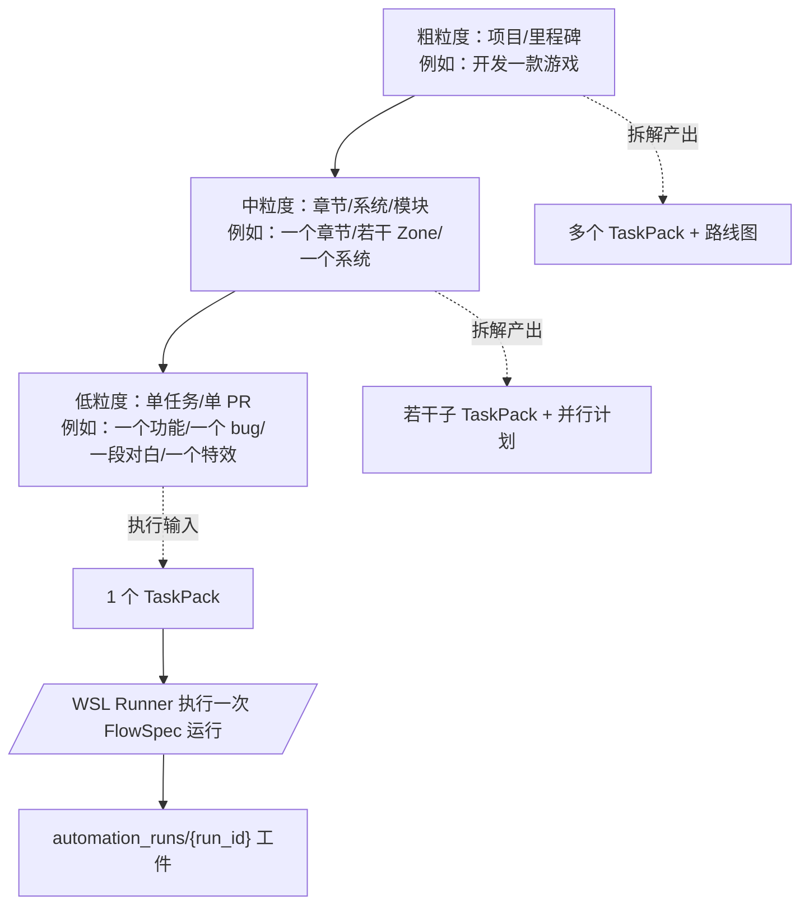
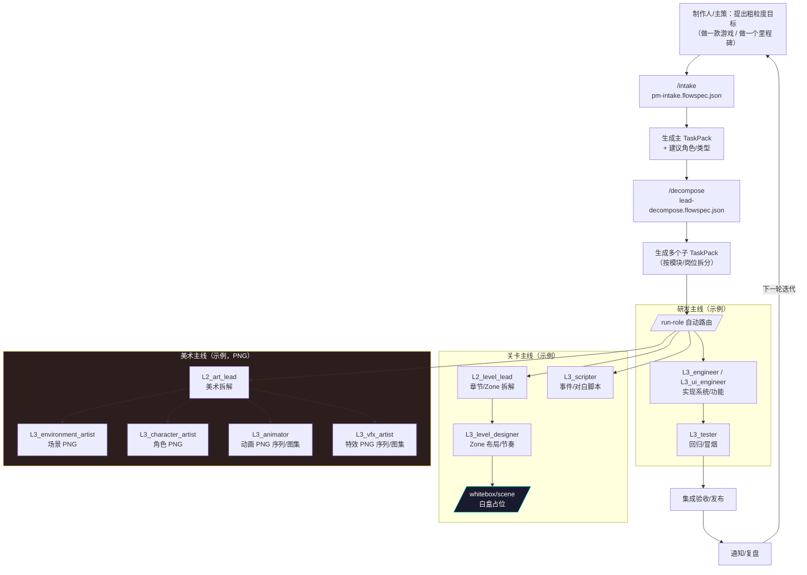
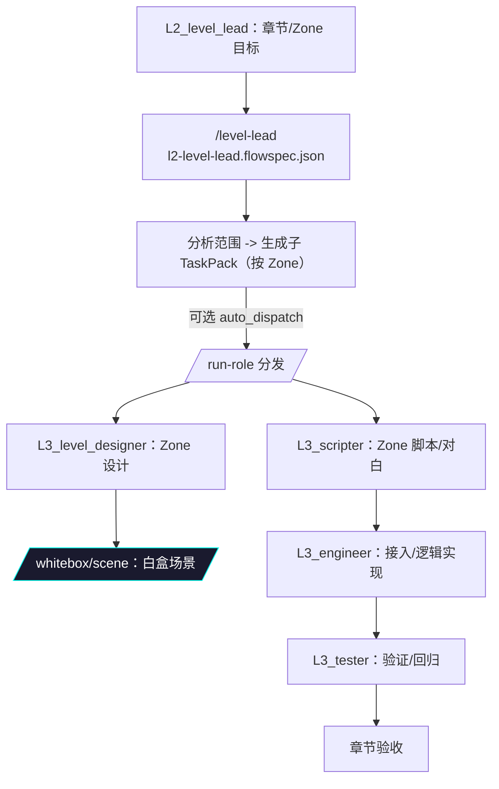
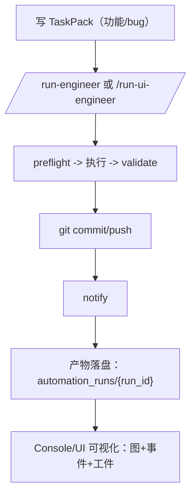
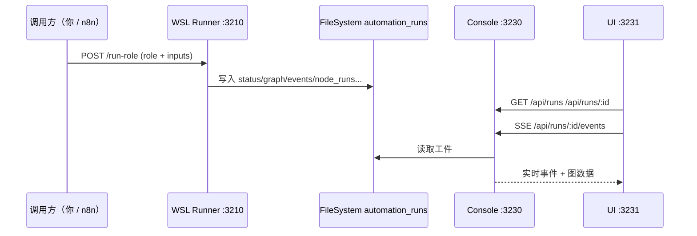

## Pipeline-Sys 工作流总览（最新实现：v2.4 队列编排 + 可视化干涉）

> 更新时间：2026-01-08  
> 适用范围：当前仓库实现（WSL Runner `server.mjs` + v2 FlowRunner + TaskQueueManager + FlowSpec 示例集 + Pipeline-Sys Console/UI 可视化）

### 🆕 v2.4 新增：任务队列编排

粗粒度任务（如 `/intake`）现在可以**自动拆解并按队列轮转执行所有子任务**：



**队列管理端点**（WSL Runner :3210）：
| 端点 | 方法 | 说明 |
|------|------|------|
| `/queue` | GET | 获取队列状态 |
| `/queue/pause` | POST | 暂停队列 |
| `/queue/resume` | POST | 恢复队列 |
| `/queue/clear` | POST | 清空待执行 |
| `/queue/:taskId` | DELETE | 取消任务 |
| `/queue/:taskId/retry` | POST | 重试失败 |
| `/queue/:taskId/priority` | POST | 调整优先级 |

**UI 入口**：`http://localhost:3231/queue`

---

## 1. 你要找的“完整工作流”是什么？

本仓库把“工作流”拆成三个粒度层级，并用同一套运行时来执行/观测：

- **粗粒度（项目/里程碑级）**：例如“开发一款游戏/一个里程碑/一个大版本”  
  - 特点：跨岗位、多周/多月、需要拆解为多个 TaskPack 和多次执行
- **中粒度（章节/系统/模块级）**：例如“做一个章节/若干 Zone/一个系统模块”  
  - 特点：多岗位协作、并行推进，通常由 L2 组长拆解并分发
- **低粒度（单任务级）**：例如“开发一个功能/修一个 bug/写一段对白/做一个特效”  
  - 特点：1 个 TaskPack 对应 1 次执行，最容易自动化与回放

---

## 2. 运行时架构：从触发到可视化

> **事实源（Source of Truth）是文件系统**：每次运行都会落盘 `automation_runs/<run_id>/` 工件；Console/UI 仅是读取与可视化。



---

## 3. “流程定义”在哪里？怎么查看当前可用流程？

### 3.1 FlowSpec 文件位置（定义层）

所有已生成的流程定义（FlowSpec JSON）在：

- `workflows/reusable/pipeline-sys/v2-design/examples/*.flowspec.json`

### 3.2 WSL Runner 端点（执行层）

WSL Runner 提供一个权威清单接口：

- `GET http://localhost:3210/flows`

它会返回：**流程 id、描述、HTTP 端点**（例如 `/run-role`、`/whitebox/scene` 等）。

> 端点实现位置：`workflows/reusable/n8n-common/wsl-runner/server.mjs`

### 3.3 运行工件（观测层）

每次运行落盘：

- `workflows/project/logs/automation_runs/<run_id>/`
  - `status.json` / `graph.json` / `events.ndjson` / `node_runs.json` / `control.json`

Pipeline-Sys Console/UI 会读取这些工件生成网页里的图与时间线。

---

## 4. 粒度模型：同一套系统覆盖“做游戏”到“做功能”



---

## 5. 粗粒度示例：你提一个“大任务”（例如“开发一款游戏/大版本”）

目标：把一个粗描述变成“可执行的多岗位任务流”，并可视化每次执行的工件与状态。



说明：

- **粗粒度任务不是“一次运行”**，而是“多次运行 + 多个 TaskPack + 多岗位并行”的组合。
- 系统的可回放/可审计单位依然是：**每次 run（一个 run_id 对应一次执行）**。

---

## 6. 中粒度示例：做一个章节 / 若干 Zone（关卡+脚本+白盒+验收）



适用场景：

- “新增一个 Zone”、“重做一个 Zone 变体”、“做一章包含多 Zone 的内容包”

---

## 7. 低粒度示例：开发一个功能（或修一个 bug）

低粒度推荐直接跑角色执行流（可追踪到一次 run 的完整工件）：

- 程序：`/run-engineer`（`l3-execute.flowspec.json`）
- UI 程序：`/run-ui-engineer`（`l3-ui-engineer.flowspec.json`，包含 UI 常量检查）
- 测试：`/run-tester`（`l3-tester.flowspec.json`）



---

## 8. 其他常见例子（速查）

### 8.1 白盒占位（功能验证优先）

- **白盒场景**：`POST /whitebox/scene`
- **白盒角色**：`POST /whitebox/character`
- **白盒物件**：`POST /whitebox/object`

特点：快速生成 YAML/注册表，让功能联调先跑起来。

### 8.2 正式美术（PNG + Windows MCP Runner）

- 场景美术：`POST /run-environment-artist`
- 角色美术：`POST /run-character-artist`
- 动画：`POST /run-animator`
- 特效：`POST /run-vfx-artist`

特点：明确 **PNG** 产物，流程中标记 `execution_runtime=windows`、`requires_mcp=true`。

---

## 9. 如何触发一次运行（最小用法）

> 推荐统一用 `/run-role`：只给 role + task_id + task_pack_path，Runner 自动选择 FlowSpec。



### 9.1 端点 → FlowSpec → 典型输入（速查表）

> **权威清单**：`GET http://localhost:3210/flows`（返回所有可用流程与端点）  
> **FlowSpec 位置**：`workflows/reusable/pipeline-sys/v2-design/examples/`

| 场景 | 端点 | 对应 FlowSpec | 运行时 | 典型必填 inputs（最少） |
|---|---|---|---|---|
| 流程清单 | `GET /flows` | - | - | - |
| 兼容固定流程 | `POST /fixed-flow` | `fixed-flow.flowspec.json` | WSL | `task_id` |
| 制作人粗粒度入口 | `POST /intake` | `pm-intake.flowspec.json` | WSL | `title`, `description` |
| 通用组长拆解 | `POST /decompose` | `lead-decompose.flowspec.json` | WSL | `task_id`, `title`, `description` |
| **通用角色路由**（推荐） | `POST /run-role` | 由 `role` 决定 | WSL/Windows | `role`, `task_id`, `task_pack_path` |
| 程序执行 | `POST /run-engineer` | `l3-execute.flowspec.json` | WSL | `task_id`, `task_pack_path` |
| 写手执行 | `POST /run-writer` | `l3-writer.flowspec.json` | WSL | `task_id`, `task_pack_path` |
| 测试执行 | `POST /run-tester` | `l3-tester.flowspec.json` | WSL | `task_id`, `task_pack_path` |
| 脚本员执行 | `POST /run-scripter` | `l3-scripter.flowspec.json` | WSL | `task_id`, `task_pack_path` |
| UI 程序执行 | `POST /run-ui-engineer` | `l3-ui-engineer.flowspec.json` | WSL | `task_id`, `task_pack_path` |
| 关卡组长拆解 | `POST /level-lead` | `l2-level-lead.flowspec.json` | WSL | `task_id`, `title`, `description` |
| 场景策划执行 | `POST /run-level-designer` | `l3-level-designer.flowspec.json` | WSL | `task_id`, `task_pack_path` |
| 美术组长拆解 | `POST /art-lead` | `l2-art-lead.flowspec.json` | WSL | `task_id`, `title`, `description` |
| 场景美术（PNG） | `POST /run-environment-artist` | `l3-environment-artist.flowspec.json` | **Windows(MCP)** | `task_id`, `task_pack_path` |
| 角色美术（PNG） | `POST /run-character-artist` | `l3-character-artist.flowspec.json` | **Windows(MCP)** | `task_id`, `task_pack_path`, `character_id` |
| 动画（PNG序列/图集） | `POST /run-animator` | `l3-animator.flowspec.json` | **Windows(MCP)** | `task_id`, `task_pack_path`, `animation_name` |
| 特效（PNG序列/图集） | `POST /run-vfx-artist` | `l3-vfx-artist.flowspec.json` | **Windows(MCP)** | `task_id`, `task_pack_path`, `vfx_name` |
| 白盒场景占位 | `POST /whitebox/scene` | `whitebox-scene.flowspec.json` | WSL | `zone_id`, `zone_name` |
| 白盒角色占位 | `POST /whitebox/character` | `whitebox-character.flowspec.json` | WSL | `character_id`, `character_name` |
| 白盒物件占位 | `POST /whitebox/object` | `whitebox-object.flowspec.json` | WSL | `object_id`, `object_name`, `zone_id` |

补充说明：

- **inputs 命名**：WSL Runner 通常兼容 `snake_case` 和 `camelCase`（例如 `task_id`/`taskId`）。文档示例统一用 `snake_case`。
- **project_root**：多数端点可选（默认是 Runner 的 `DEFAULT_PROJECT_ROOT`）；建议显式传入，避免多项目时混淆。
- **async**：多数端点支持 `async`（默认 true/false 以端点实现为准）。`async=true` 一般会立刻返回 `run_id`，后续去 `automation_runs/<run_id>` 或 Console/UI 看进度。

### 9.2 典型请求样例（可复制）

> 下面假设 Runner 地址为：`http://localhost:3210`

#### A) 推荐：通用路由 `/run-role`

最常用（程序/写手/测试/脚本/UI/策划/美术等都走它）：

```bash
curl -X POST "http://localhost:3210/run-role" \
  -H "Content-Type: application/json" \
  -d '{
    "project_root": "/home/shash/work/Footnote",
    "role": "L3_ui_engineer",
    "task_id": "TASK-UI-001",
    "task_pack_path": "design/ai-native/03_taskpacks/TASK-UI-001.md",
    "async": true,
    "inputs": {
      "ui_component": "InventoryUI"
    }
  }'
```

PowerShell（Windows）版本：

```powershell
$body = @{
  project_root   = "/home/shash/work/Footnote"
  role           = "L3_ui_engineer"
  task_id        = "TASK-UI-001"
  task_pack_path = "design/ai-native/03_taskpacks/TASK-UI-001.md"
  async          = $true
  inputs         = @{
    ui_component = "InventoryUI"
  }
} | ConvertTo-Json -Depth 10

Invoke-RestMethod -Method Post -Uri "http://localhost:3210/run-role" -ContentType "application/json" -Body $body
```

#### B) 关卡：章节/Zone 拆解 `/level-lead`

```bash
curl -X POST "http://localhost:3210/level-lead" \
  -H "Content-Type: application/json" \
  -d '{
    "project_root": "/home/shash/work/Footnote",
    "task_id": "CH1-ZONES",
    "title": "C1 章节 Zone 设计与脚本",
    "description": "需要覆盖 C1-Z1/C1-Z2/C1-Z3：布局、谜题、事件触发、对白脚本",
    "chapter": "C1",
    "auto_dispatch": true,
    "async": true
  }'
```

#### C) 白盒：快速占位（功能先跑起来）

白盒场景：

```bash
curl -X POST "http://localhost:3210/whitebox/scene" \
  -H "Content-Type: application/json" \
  -d '{
    "project_root": "/home/shash/work/Footnote",
    "zone_id": "C1-Z1",
    "zone_name": "维修局走廊",
    "zone_type": "municipal",
    "chapter": "C1",
    "width": 750,
    "height": 1334,
    "async": true
  }'
```

白盒物件（挂到某个 Zone）：

```bash
curl -X POST "http://localhost:3210/whitebox/object" \
  -H "Content-Type: application/json" \
  -d '{
    "project_root": "/home/shash/work/Footnote",
    "zone_id": "C1-Z1",
    "object_id": "OBJ_DOOR_01",
    "object_name": "门",
    "object_type": "door",
    "position_x": 420,
    "position_y": 700,
    "async": true
  }'
```

#### D) 美术：PNG 正式资产（Windows + MCP Runner）

> 这些流程在 FlowSpec 中标记了 `execution_runtime=windows`、`requires_mcp=true`，用于提醒“需要 Windows/MCP 环境完成 AI 生图与后处理”。

场景美术：

```bash
curl -X POST "http://localhost:3210/run-environment-artist" \
  -H "Content-Type: application/json" \
  -d '{
    "project_root": "/home/shash/work/Footnote",
    "task_id": "ART-BG-001",
    "title": "C1-Z1 背景 PNG",
    "task_pack_path": "design/ai-native/03_taskpacks/ART-BG-001.md",
    "zone_id": "C1-Z1",
    "asset_type": "background",
    "width": 750,
    "height": 1334,
    "async": true
  }'
```

#### E) 查看运行工件（从网页或文件系统）

- **文件系统**：`workflows/project/logs/automation_runs/<run_id>/`
- **可视化**：启动 Console/UI 后访问 UI 的 RunDetail（自动读取 `graph.json` + `events.ndjson`）

---

## 10. 进一步阅读

- **多岗位流程设计（含 Mermaid 图）**：`workflows/reusable/pipeline-sys/v2-design/ROLE-FLOWS-DESIGN.md`
- **FlowSpec 示例集（可直接执行）**：`workflows/reusable/pipeline-sys/v2-design/examples/`
- **实现状态**：`workflows/reusable/pipeline-sys/IMPLEMENTATION-STATUS.md`
- **总体分析报告**：`workflows/reusable/pipeline-sys/ANALYSIS-REPORT.md`
- **文档图表规范（Mermaid + 预检）**：`.cursor/rules/00-project.mdc`
