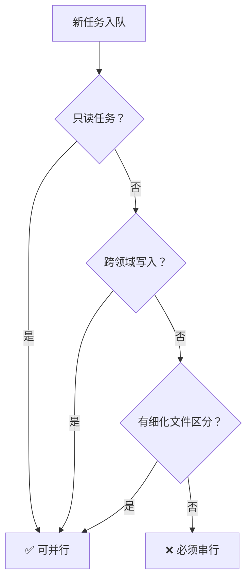

# 任务队列并行调度设计方案

> 版本: v1.0  
> 日期: 2026-01-14  
> 状态: 已批准，执行中

---

## 1. 背景与目标

### 1.1 现状问题

| 机制 | 入口 | 状态 | 问题 |
|------|------|------|------|
| `runningAsyncTasks` | 所有现有端点 | ✅ 在用 | 无管理能力（暂停/取消/重试/持久化） |
| `TaskQueueManager` | `use_queue=true` | ⚠️ 未启用 | 功能完善但没人用，且只支持串行 |

### 1.2 目标

| 目标 | 说明 |
|------|------|
| **异步化** | 解决阻塞执行问题，提升系统健壮性和可观察性 |
| **统一入口** | 所有任务走 TaskQueueManager，统一管理 |
| **智能并行** | 根据任务类型和文件领域自动判断是否可并行 |
| **可干涉** | 暂停/恢复/取消/重试/优先级调整 |
| **持久化** | 队列状态可恢复，任务不丢失 |

---

## 2. 并行策略

### 2.1 决策流程



### 2.2 核心原则

1. **只读任务**：可无限制并行（评审、审计、签收等）
2. **跨领域写入**：可并行（策划改设计文档、美术改美术资源、程序改代码互不干扰）
3. **同领域未细化**：必须串行（避免文件冲突）

---

## 3. 角色-领域-文件映射

### 3.1 领域定义

| 领域 | 标识 | 文件路径模式 |
|------|------|-------------|
| **设计** | `design` | `design/**/*`, `content/**/*` |
| **美术** | `art` | `game/assets/**/*` |
| **程序** | `code` | `game/src/**/*`, `workflows/**/*.ts`, `workflows/**/*.mjs` |
| **白盒** | `whitebox` | `game/src/data/**/*.yaml` |
| **只读** | `readonly` | 无写入 |

### 3.2 角色映射

| 角色 | 领域 | 访问模式 |
|------|------|---------|
| `l3-writer` | design | write |
| `l3-scripter` | design | write |
| `l3-level-designer` | design | write |
| `l3-environment-artist` | art | write |
| `l3-character-artist` | art | write |
| `l3-animator` | art | write |
| `l3-vfx-artist` | art | write |
| `l3-execute` | code | write |
| `l3-ui-engineer` | code | write |
| `l3-tester` | code | write |
| `l1-design-review` | readonly | read |
| `l0-audit-intake` | readonly | read |
| `l0-acceptance-review` | readonly | read |
| `l3-qa-signoff` | readonly | read |
| `l2-code-review` | readonly | read |
| `whitebox-*` | whitebox | write |

### 3.3 并行规则示例

| 任务A | 任务B | 是否可并行 | 原因 |
|-------|-------|-----------|------|
| L3-writer | L3-environment-artist | ✅ | 跨领域 |
| L3-execute | L3-writer | ✅ | 跨领域 |
| L3-execute | L3-ui-engineer | ⚠️ | 同领域，看 lock_key |
| L1-design-review | L3-execute | ✅ | 只读 vs 写入 |
| L3-writer（章节A） | L3-writer（章节B） | ✅ | 不同 lock_key |
| L3-execute（功能A） | L3-execute（功能A） | ❌ | 相同 lock_key |

---

## 4. 技术设计

### 4.1 数据结构扩展

```javascript
// QueuedTask 新增字段
{
  // ... 现有字段 ...
  
  domain: 'design' | 'art' | 'code' | 'whitebox' | 'readonly',
  access_mode: 'read' | 'write',
  lock_key: string | null,  // 用于同领域串行控制
}
```

### 4.2 并行调度器

```javascript
// parallel-scheduler.mjs
export class ParallelScheduler {
  constructor(options = {}) {
    this.maxConcurrentByDomain = {
      design: options.design || 3,
      art: options.art || 3,
      code: options.code || 2,
      whitebox: options.whitebox || 5,
      readonly: options.readonly || 10,
    };
    this.runningByDomain = new Map();
    this.runningLockKeys = new Set();
  }
  
  canStart(task) {
    // 只读任务几乎总是可以
    if (task.access_mode === 'read') {
      return this.getRunningCount('readonly') < this.maxConcurrentByDomain.readonly;
    }
    
    // 检查领域并发限制
    if (this.getRunningCount(task.domain) >= this.maxConcurrentByDomain[task.domain]) {
      return false;
    }
    
    // 检查 lock_key 冲突
    if (task.lock_key && this.runningLockKeys.has(task.lock_key)) {
      return false;
    }
    
    return true;
  }
  
  markRunning(task) {
    const domain = task.access_mode === 'read' ? 'readonly' : task.domain;
    if (!this.runningByDomain.has(domain)) {
      this.runningByDomain.set(domain, new Set());
    }
    this.runningByDomain.get(domain).add(task.id);
    
    if (task.lock_key) {
      this.runningLockKeys.add(task.lock_key);
    }
  }
  
  markFinished(task) {
    const domain = task.access_mode === 'read' ? 'readonly' : task.domain;
    this.runningByDomain.get(domain)?.delete(task.id);
    
    if (task.lock_key) {
      this.runningLockKeys.delete(task.lock_key);
    }
  }
  
  getRunningCount(domain) {
    return this.runningByDomain.get(domain)?.size || 0;
  }
}
```

### 4.3 API 变更

| 端点 | 变更 |
|------|------|
| `GET /queue` | `current` 改为 `running_tasks` 数组 |
| `POST /v2/run` | 默认 `use_queue: true` |
| `GET /async-tasks` | 废弃，统一用 `/queue` |

---

## 5. 实施计划

### Phase 1: 文档补全
- 更新 `09-ai-native-workflow.mdc`
- 更新 `QUEUE-ORCHESTRATION-DESIGN.md`

### Phase 2: 统一入口
- `server.mjs` 所有端点默认 `use_queue: true`
- `task-queue.mjs` 添加 domain/access_mode 字段
- 删除 `runningAsyncTasks`

### Phase 3: 并行调度
- 新增 `parallel-scheduler.mjs`
- 改造 `task-queue.mjs` 支持多任务并行
- API 返回 `running_tasks`

### Phase 4: UI 适配
- `QueuePanel.tsx` 显示多个运行中任务
- 移除 `getAsyncTasks` 调用

### Phase 5: 测试验证
- 并行调度器单元测试
- 跨领域并行集成测试
- 同领域串行冲突测试

---

## 6. 风险与对策

| 风险 | 对策 |
|------|------|
| 并行任务写同一文件 | lock_key 强制串行 |
| 并行导致 git 冲突 | 顺序 commit |
| 历史任务兼容 | 默认 domain: code，串行 |

---

*创建日期: 2026-01-14*
