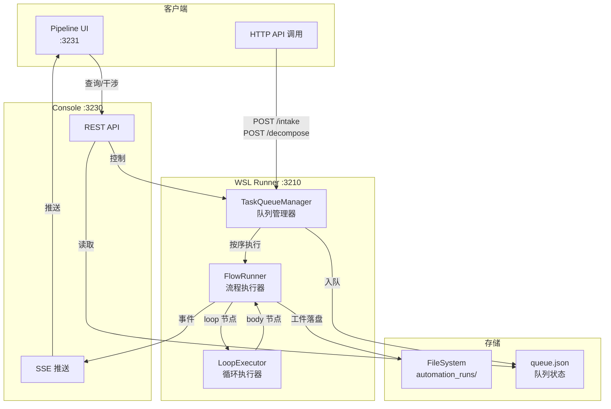

# 任务队列轮转 + 可视化干涉 设计文档

> 版本: v1.0  
> 日期: 2026-01-08  
> 状态: 设计中

---

## 1. 背景与目标

### 1.1 当前问题

1. **loop body 未真正执行**：`lead-decompose`、`l2-level-lead`、`l2-art-lead` 等 FlowSpec 中的 `loop` 节点只返回占位结果，body 中的 HTTP 分发调用不会真正触发
2. **无队列机制**：多个任务同时触发时会并发执行，可能导致 repo 冲突
3. **无法干涉运行中流程**：用户只能等待流程完成或超时，无法暂停/取消/重试

### 1.2 目标

| 能力 | 描述 |
|------|------|
| **自动轮转** | 粗粒度任务拆解后，子任务自动按队列串行执行 |
| **可视化** | 实时查看队列状态、当前任务、子任务进度 |
| **干涉能力** | 暂停队列、取消任务、重试失败任务、调整优先级 |
| **可选：流程编辑** | 简单的节点参数编辑（非必须） |

---

## 2. 架构设计

### 2.1 组件关系



### 2.2 核心数据结构

#### TaskQueueManager

```typescript
interface QueuedTask {
  id: string;                    // run_id
  flowspec: string;              // FlowSpec 路径
  inputs: Record<string, any>;   // 输入参数
  priority: number;              // 优先级（越大越优先）
  parent_id?: string;            // 父任务 ID（子任务用）
  status: 'queued' | 'running' | 'paused' | 'completed' | 'failed' | 'cancelled';
  queued_at: string;             // 入队时间
  started_at?: string;           // 开始时间
  finished_at?: string;          // 结束时间
  error?: string;                // 错误信息
}

interface QueueState {
  paused: boolean;               // 队列是否暂停
  current: string | null;        // 当前执行的任务 ID
  tasks: QueuedTask[];           // 任务列表
  history: QueuedTask[];         // 历史记录（最近 100 条）
}
```

#### 队列文件位置

```
workflows/project/logs/
├── queue.json                   # 队列状态（持久化）
└── automation_runs/
    └── {run_id}/
        ├── status.json
        ├── graph.json
        ├── events.ndjson
        ├── node_runs.json
        └── subtasks.json        # 子任务列表（新增）
```

---

## 3. API 设计

### 3.1 队列管理 API（WSL Runner :3210）

| 方法 | 路径 | 描述 |
|------|------|------|
| GET | `/queue` | 获取队列状态 |
| POST | `/queue/pause` | 暂停队列 |
| POST | `/queue/resume` | 恢复队列 |
| POST | `/queue/clear` | 清空待执行队列 |
| DELETE | `/queue/{task_id}` | 取消/移除任务 |
| POST | `/queue/{task_id}/retry` | 重试失败任务 |
| POST | `/queue/{task_id}/priority` | 调整优先级 |
| GET | `/queue/{task_id}/subtasks` | 获取子任务列表 |

### 3.2 响应示例

#### GET /queue

```json
{
  "ok": true,
  "paused": false,
  "current": "run-1704700000-abc123",
  "queue": [
    {
      "id": "run-1704700100-def456",
      "flowspec": "l3-execute.flowspec.json",
      "inputs": { "task_id": "T-001-SUB1" },
      "priority": 10,
      "parent_id": "run-1704700000-abc123",
      "status": "queued",
      "queued_at": "2026-01-08T12:00:00.000Z"
    }
  ],
  "history_count": 50
}
```

#### POST /queue/pause

```json
{
  "ok": true,
  "paused": true,
  "message": "Queue paused. Current task will complete, new tasks won't start."
}
```

### 3.3 Console API 扩展（:3230）

| 方法 | 路径 | 描述 |
|------|------|------|
| GET | `/api/queue` | 代理 WSL Runner 队列 API |
| POST | `/api/queue/*` | 代理队列控制操作 |
| GET | `/api/runs/{run_id}/subtasks` | 获取子任务详情 |

### 3.4 SSE 事件扩展

```typescript
// 新增事件类型
type QueueEvent = 
  | { type: 'QUEUE_TASK_ADDED'; task: QueuedTask }
  | { type: 'QUEUE_TASK_STARTED'; task_id: string }
  | { type: 'QUEUE_TASK_COMPLETED'; task_id: string; status: string }
  | { type: 'QUEUE_PAUSED' }
  | { type: 'QUEUE_RESUMED' }
  | { type: 'SUBTASK_DISPATCHED'; parent_id: string; subtask: QueuedTask };
```

---

## 4. FlowRunner Loop Body 执行

### 4.1 当前问题

`LoopExecutor.execute()` 在 `forEach` 等循环中，如果没有注入 `executor` 回调，只会返回 `{ nodes: [...] }` 占位，不会真正执行 body 节点。

### 4.2 解决方案

在 `FlowRunner._executeNode()` 中，当遇到 `loop` 节点时：

1. 解析 `items` 表达式获取数组
2. 对每个 item，递归执行 body 中的节点
3. 收集每次迭代的结果
4. 如果 body 中有 `http` 节点且 `async: true`，则入队而非直接执行

```javascript
// flow-runner.mjs 修改
async _executeLoopNode(node, config) {
  const items = this._evaluateExpression(config.items || config.in);
  const itemAs = config.itemAs || config.for_each || 'item';
  const bodyNodes = config.body || config.nodes || [];
  
  const iterations = [];
  
  for (let i = 0; i < items.length; i++) {
    // 设置循环变量
    this.context.setVariable(itemAs, items[i]);
    this.context.setVariable('index', i);
    this.context.setVariable('loop', { [itemAs]: items[i], index: i });
    
    // 执行 body 节点
    for (const bodyNode of bodyNodes) {
      const resolvedNode = this._resolveNodeConfig(bodyNode);
      
      // 如果是异步 HTTP 调用，入队
      if (resolvedNode.type === 'http' && resolvedNode.body?.async) {
        await this._enqueueSubtask(resolvedNode, items[i]);
      } else {
        await this._executeInlineNode(resolvedNode);
      }
    }
    
    iterations.push({ index: i, item: items[i], success: true });
  }
  
  return { ok: true, output: { iterations, totalIterations: items.length } };
}
```

### 4.3 子任务入队

```javascript
async _enqueueSubtask(httpNode, item) {
  const body = httpNode.body || {};
  const flowspec = body.flowspec;
  const inputs = body.inputs || {};
  
  // 通过 TaskQueueManager 入队
  await this.queueManager.enqueue({
    flowspec,
    inputs,
    priority: 10, // 子任务默认优先级
    parent_id: this.runId,
  });
  
  // 发出子任务分发事件
  this._emitEvent('SUBTASK_DISPATCHED', {
    parent_id: this.runId,
    flowspec,
    inputs,
  });
}
```

---

## 5. UI 设计

### 5.1 队列面板

```
┌─────────────────────────────────────────────────────────────┐
│  🚦 任务队列                                    [⏸ 暂停] [▶ 恢复] │
├─────────────────────────────────────────────────────────────┤
│  ▶ 当前执行: run-1704700000-abc123 (pm-intake)              │
│    └─ 进度: analyze_request ████████░░ 80%                  │
├─────────────────────────────────────────────────────────────┤
│  📋 等待队列 (3)                                             │
│  ┌─────────────────────────────────────────────────────────┐│
│  │ 1. T-001-SUB1 (l3-execute) [P:10] [子任务]    [×] [↑↓] ││
│  │ 2. T-001-SUB2 (l3-writer)  [P:10] [子任务]    [×] [↑↓] ││
│  │ 3. T-002 (pm-intake)       [P:5]              [×] [↑↓] ││
│  └─────────────────────────────────────────────────────────┘│
├─────────────────────────────────────────────────────────────┤
│  📜 历史 (50)                                    [查看全部 >] │
│  ✅ T-000 (pm-intake) 完成 12:30                 [🔄 重试]   │
│  ❌ T-ERR (l3-execute) 失败 12:25                [🔄 重试]   │
└─────────────────────────────────────────────────────────────┘
```

### 5.2 子任务视图

点击父任务可展开子任务树：

```
▼ run-1704700000-abc123 (pm-intake → lead-decompose)
  ├─ 📄 T-001-SUB1 (l3-execute) ✅ 完成
  ├─ 📄 T-001-SUB2 (l3-writer) ▶ 执行中...
  ├─ 📄 T-001-SUB3 (l3-tester) ⏳ 队列中
  └─ 📄 T-001-SUB4 (l3-scripter) ⏳ 队列中
```

### 5.3 干涉操作

| 操作 | 快捷键 | 说明 |
|------|--------|------|
| 暂停队列 | `P` | 当前任务继续，新任务不启动 |
| 恢复队列 | `R` | 继续处理队列 |
| 取消任务 | `Del` | 从队列移除（运行中的会发送取消信号） |
| 重试任务 | `Ctrl+R` | 重新入队失败的任务 |
| 调整优先级 | `↑/↓` | 调整任务在队列中的位置 |
| 查看日志 | `Enter` | 打开任务详情/日志 |

---

## 6. 可选：简单流程编辑

### 6.1 范围限定（MVP）

只支持编辑节点参数，不支持：
- 添加/删除节点
- 修改节点连接
- 修改节点类型

### 6.2 可编辑字段

```typescript
interface EditableNodeFields {
  // shell 节点
  command?: string;
  cwd?: string;
  env?: Record<string, string>;
  timeout_ms?: number;
  
  // http 节点
  url?: string;
  method?: string;
  headers?: Record<string, string>;
  body?: any;
  
  // condition 节点
  expression?: string;
  
  // transform 节点
  expression?: string;
  
  // 通用
  disabled?: boolean;
}
```

### 6.3 编辑 API

```
POST /api/flowspec/{flowspec_path}/nodes/{node_id}
Body: { field: value, ... }

Response: { ok: true, node: { ... } }
```

### 6.4 UI 交互

点击节点 → 侧边栏显示可编辑字段 → 修改 → 保存

---

## 7. 实现计划

### Phase 1: 队列核心（P0）

1. `TaskQueueManager` 类实现
2. 队列持久化（queue.json）
3. WSL Runner API 扩展
4. FlowRunner loop body 执行

### Phase 2: 可视化（P0）

1. Console API 代理
2. SSE 事件扩展
3. UI 队列面板
4. 子任务树视图

### Phase 3: 干涉能力（P1）

1. 暂停/恢复
2. 取消任务
3. 重试失败
4. 优先级调整

### Phase 4: 流程编辑（P2，可选）

1. 节点参数编辑 API
2. UI 编辑面板
3. 编辑历史/撤销

---

## 8. 测试场景

### 8.1 基本轮转

1. POST `/intake` 提交粗粒度任务
2. 验证 `pm-intake` → `lead-decompose` → 生成 N 个子任务
3. 验证子任务按顺序执行
4. 验证所有子任务完成后父任务标记完成

### 8.2 干涉测试

1. 队列中有 5 个任务时暂停
2. 验证当前任务继续完成
3. 验证暂停后新任务不启动
4. 恢复后验证继续执行

### 8.3 失败处理

1. 模拟子任务失败
2. 验证父任务状态更新
3. 验证可以重试失败任务
4. 验证重试后正确执行

---

## 9. 风险与对策

| 风险 | 对策 |
|------|------|
| 队列状态丢失 | 定期持久化 + 启动时恢复 |
| 长时间运行导致内存膨胀 | 历史记录限制 100 条 + 定期清理 |
| 并发写 queue.json | 使用锁文件 |
| 子任务过多导致队列爆炸 | 设置最大队列长度 + 优先级调度 |

---

## 10. 参考

- `workflows/reusable/pipeline-sys/v2-design/ROLE-FLOWS-DESIGN.md` - 多岗位流程设计
- `workflows/reusable/pipeline-sys/WORKFLOW-OVERVIEW.md` - 工作流总览
- `workflows/reusable/n8n-common/wsl-runner/lib/v2/flow-runner.mjs` - FlowRunner 实现
- `workflows/reusable/n8n-common/wsl-runner/lib/v2/executors/loop.mjs` - LoopExecutor 实现
