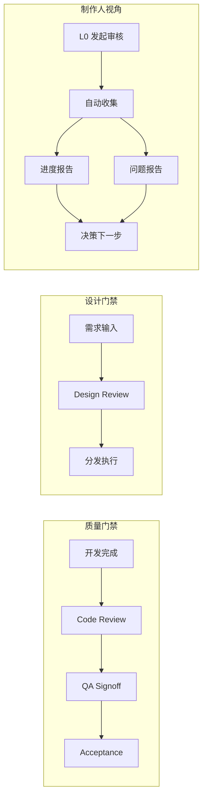
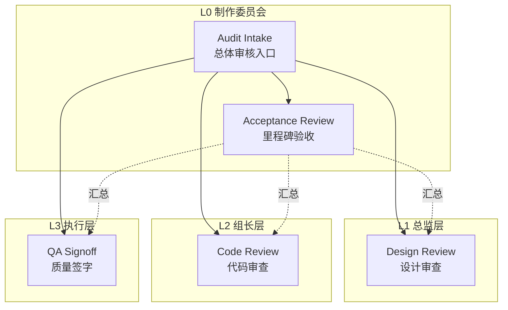
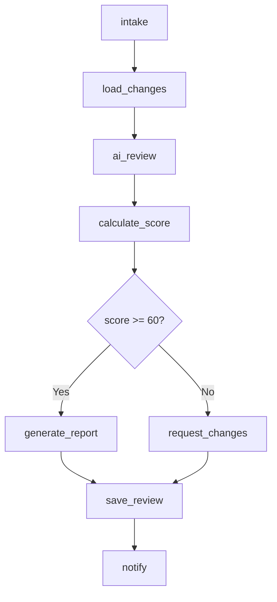
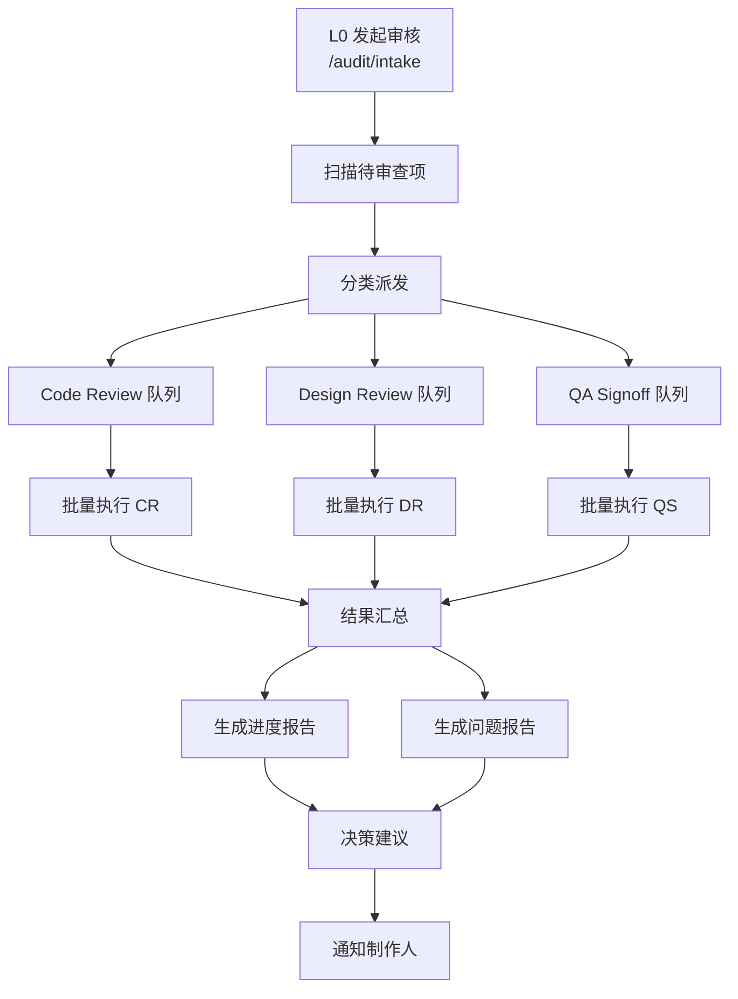

# 审查体系设计文档

> 版本: v1.0 | 创建日期: 2026-01-08

## 1. 概述

### 1.1 设计目标

建立完整的审查体系，支持：
- **4 类审查流程**：Code Review、Design Review、QA Signoff、Acceptance Review
- **制作人总体审核入口**：一键发起全面审核，自动收集进度和问题
- **报告生成**：进度报告 + 问题报告，支持下一步决策

### 1.2 核心价值



## 2. 审查类型定义

### 2.1 四类审查流程

| 类型 | ID | 触发时机 | 执行者 | 输出 |
|---|---|---|---|---|
| **Code Review** | `l2-code-review` | PR 提交 / 任务完成 | L2 组长 / AI | 审查意见 + 打分 |
| **Design Review** | `l1-design-review` | Spec 提交 / TaskPack 创建 | L1 总监 / AI | 设计评审意见 |
| **QA Signoff** | `l3-qa-signoff` | 功能开发完成 | L3 测试员 | 验收清单 + 签字 |
| **Acceptance Review** | `l0-acceptance-review` | 里程碑节点 | L0 制作委员会 | 阶段验收报告 |

### 2.2 审查层级关系



## 3. 流程详细设计

### 3.1 Code Review 代码审查

**场景**：L3 执行岗完成任务后，L2 组长审查代码质量

**输入**：
```json
{
  "task_id": "TASK-001",
  "pr_path": "path/to/changed/files",
  "commit_range": "HEAD~3..HEAD",
  "review_dimensions": ["logic", "style", "security", "performance"]
}
```

**审查维度**：
| 维度 | 权重 | 说明 |
|---|---|---|
| 逻辑正确性 | 30% | 业务逻辑是否正确 |
| 代码规范 | 25% | 是否符合项目规范 |
| 安全性 | 20% | 是否存在安全隐患 |
| 性能 | 15% | 是否有性能问题 |
| 可维护性 | 10% | 代码是否易读易维护 |

**输出**：
```json
{
  "review_id": "CR-2026-0108-001",
  "task_id": "TASK-001",
  "reviewer": "L2_lead",
  "result": "APPROVED|CHANGES_REQUESTED|REJECTED",
  "score": 85,
  "dimensions": {
    "logic": { "score": 90, "comments": "..." },
    "style": { "score": 80, "comments": "..." }
  },
  "issues": [
    { "severity": "warning", "file": "src/xxx.ts", "line": 42, "message": "..." }
  ],
  "summary": "总体评价..."
}
```

**流程节点**：


### 3.2 Design Review 设计审查

**场景**：Spec / TaskPack 提交后，审查设计质量，防止烂设计进入执行

**输入**：
```json
{
  "spec_path": "design/ai-native/02_specs/xxx.md",
  "review_type": "spec|taskpack|bible",
  "review_focus": ["completeness", "consistency", "feasibility"]
}
```

**审查维度**：
| 维度 | 权重 | 说明 |
|---|---|---|
| 完整性 | 35% | 是否覆盖所有必要内容 |
| 一致性 | 25% | 与上层文档是否一致 |
| 可行性 | 25% | 技术/资源是否可行 |
| 清晰度 | 15% | 表达是否清晰无歧义 |

**输出**：
```json
{
  "review_id": "DR-2026-0108-001",
  "spec_path": "...",
  "reviewer": "L1_director",
  "result": "APPROVED|REVISION_REQUIRED|REJECTED",
  "score": 75,
  "issues": [
    { "type": "missing", "section": "Constraints", "message": "缺少性能约束说明" }
  ],
  "suggestions": ["建议补充边界条件说明"],
  "approval_conditions": ["修改后无需再审"]
}
```

### 3.3 QA Signoff 质量签字

**场景**：功能开发完成后，QA 对照 TaskPack 验收清单逐项检查

**输入**：
```json
{
  "task_id": "TASK-001",
  "task_pack_path": "design/ai-native/03_taskpacks/TASK-001_task.md",
  "test_evidence_path": "workflows/project/logs/test-results/",
  "signoff_type": "feature|integration|release"
}
```

**验收流程**：
1. 解析 TaskPack 的 Acceptance Checklist
2. 自动检查可自动验证的项（lint、test、build）
3. 标记需人工验证的项
4. 生成签字报告

**输出**：
```json
{
  "signoff_id": "QA-2026-0108-001",
  "task_id": "TASK-001",
  "signer": "L3_tester",
  "result": "PASSED|FAILED|PARTIAL",
  "checklist": [
    { "item": "交付物落盘", "status": "PASS", "auto": true, "evidence": "..." },
    { "item": "无冻结目录修改", "status": "PASS", "auto": true },
    { "item": "UI可用性", "status": "MANUAL_REQUIRED", "auto": false }
  ],
  "pass_rate": "8/10",
  "blocking_issues": [],
  "notes": "..."
}
```

### 3.4 Acceptance Review 里程碑验收

**场景**：里程碑节点，L0 制作委员会对阶段成果进行综合验收

**输入**：
```json
{
  "milestone_id": "M1-Alpha",
  "scope": {
    "chapters": ["C0", "C1"],
    "systems": ["dialogue", "inventory"],
    "features": ["save-load", "card-collection"]
  },
  "review_period": {
    "start": "2026-01-01",
    "end": "2026-01-08"
  }
}
```

**验收内容**：
1. 收集期间所有 Code Review 结果
2. 收集期间所有 QA Signoff 结果
3. 检查里程碑目标完成情况
4. 生成综合验收报告

**输出**：
```json
{
  "acceptance_id": "ACC-M1-Alpha",
  "milestone_id": "M1-Alpha",
  "result": "ACCEPTED|CONDITIONAL|REJECTED",
  "summary": {
    "tasks_completed": 45,
    "tasks_total": 50,
    "completion_rate": "90%",
    "average_code_review_score": 82,
    "qa_pass_rate": "92%"
  },
  "highlights": ["对话系统完成", "存档功能稳定"],
  "concerns": ["卡片UI待优化"],
  "next_steps": ["修复阻塞问题", "进入M2开发"],
  "decision": "PROCEED|HOLD|ROLLBACK"
}
```

## 4. 制作人总体审核入口

### 4.1 设计目标

制作人（L0）可以一键发起总体审核，系统自动：
1. 收集所有待审查项
2. 并行触发各类审查
3. 汇总生成报告
4. 呈现决策建议

### 4.2 审核流程



### 4.3 输入参数

```json
{
  "audit_scope": "all|milestone|chapter|custom",
  "milestone_id": "M1-Alpha",
  "time_range": {
    "start": "2026-01-01",
    "end": "2026-01-08"
  },
  "include_reviews": {
    "code_review": true,
    "design_review": true,
    "qa_signoff": true
  },
  "auto_trigger_missing": true,
  "report_format": "markdown|json|html"
}
```

### 4.4 输出报告

#### 4.4.1 进度报告 (Progress Report)

```markdown
# 进度报告 - M1-Alpha
> 生成时间: 2026-01-08 15:30:00

## 总体进度
- 任务完成率: 45/50 (90%)
- 代码审查通过率: 42/45 (93%)
- QA签字通过率: 40/45 (89%)

## 章节进度
| 章节 | 任务数 | 完成 | CR通过 | QA通过 |
|---|---|---|---|---|
| C0-序章 | 12 | 12 | 12 | 11 |
| C1-第一章 | 18 | 15 | 14 | 13 |

## 系统进度
| 系统 | 状态 | 说明 |
|---|---|---|
| 对话系统 | ✅ 完成 | 所有功能已验收 |
| 存档系统 | ✅ 完成 | 所有功能已验收 |
| 卡片系统 | ⚠️ 进行中 | UI优化待完成 |

## 燃尽图
[ASCII/Mermaid 燃尽图]

## 下一步建议
1. 优先完成卡片UI优化 (TASK-046)
2. 修复2个阻塞问题
3. 准备M2开发启动
```

#### 4.4.2 问题报告 (Issue Report)

```markdown
# 问题报告 - M1-Alpha
> 生成时间: 2026-01-08 15:30:00

## 阻塞问题 (Blockers) - 2项
| ID | 标题 | 来源 | 负责人 | 状态 |
|---|---|---|---|---|
| ISS-001 | 存档加载崩溃 | QA-001 | L3_engineer | 修复中 |
| ISS-002 | 对话跳转异常 | CR-015 | L3_scripter | 待分配 |

## 警告问题 (Warnings) - 5项
| ID | 标题 | 来源 | 严重度 |
|---|---|---|---|
| ISS-003 | 字体大小不一致 | CR-008 | Medium |
| ... | ... | ... | ... |

## 待改进项 (Improvements) - 8项
- 建议统一错误处理方式
- 建议增加日志记录
- ...

## 技术债务 (Tech Debt)
- TODO 注释: 23处
- FIXME 注释: 5处
- 跳过的测试: 3个

## 建议优先级
1. 🔴 阻塞问题必须在M2前修复
2. 🟡 警告问题建议本周处理
3. 🟢 改进项纳入后续迭代
```

## 5. 数据结构

### 5.1 审查记录 Schema

```typescript
interface IReviewRecord {
  id: string;                    // 审查ID
  type: 'code' | 'design' | 'qa' | 'acceptance';
  target_id: string;             // 被审查对象ID
  target_path: string;           // 被审查对象路径
  reviewer: string;              // 审查者
  reviewer_type: 'ai' | 'human'; // 审查者类型
  created_at: string;            // 创建时间
  completed_at: string | null;   // 完成时间
  result: 'APPROVED' | 'CHANGES_REQUESTED' | 'REJECTED' | 'PENDING';
  score: number | null;          // 评分 (0-100)
  dimensions: Record<string, IDimensionScore>; // 各维度评分
  issues: IIssue[];              // 发现的问题
  comments: string;              // 总体评论
  metadata: Record<string, any>; // 扩展字段
}

interface IDimensionScore {
  score: number;
  weight: number;
  comments: string;
}

interface IIssue {
  id: string;
  severity: 'blocker' | 'critical' | 'major' | 'minor' | 'trivial';
  type: string;
  location?: {
    file: string;
    line?: number;
    section?: string;
  };
  message: string;
  suggestion?: string;
  auto_fixable: boolean;
}
```

### 5.2 审核报告 Schema

```typescript
interface IAuditReport {
  id: string;
  type: 'progress' | 'issue';
  scope: IAuditScope;
  generated_at: string;
  period: { start: string; end: string };
  
  // 进度报告字段
  progress?: {
    tasks: { completed: number; total: number; rate: string };
    reviews: { passed: number; total: number; rate: string };
    qa: { passed: number; total: number; rate: string };
    by_chapter: Record<string, IChapterProgress>;
    by_system: Record<string, ISystemProgress>;
  };
  
  // 问题报告字段
  issues?: {
    blockers: IIssue[];
    warnings: IIssue[];
    improvements: IIssue[];
    tech_debt: ITechDebt;
  };
  
  // 决策建议
  recommendations: string[];
  next_steps: string[];
  decision_suggestion: 'PROCEED' | 'HOLD' | 'ROLLBACK';
}
```

## 6. API 端点设计

| 端点 | 方法 | 说明 |
|---|---|---|
| `/review/code` | POST | 发起代码审查 |
| `/review/design` | POST | 发起设计审查 |
| `/review/qa-signoff` | POST | 发起QA签字 |
| `/review/acceptance` | POST | 发起里程碑验收 |
| `/audit/intake` | POST | 制作人发起总体审核 |
| `/audit/status/:audit_id` | GET | 查询审核状态 |
| `/audit/report/:audit_id` | GET | 获取审核报告 |
| `/audit/report/:audit_id/progress` | GET | 获取进度报告 |
| `/audit/report/:audit_id/issues` | GET | 获取问题报告 |
| `/reviews` | GET | 列出所有审查记录 |
| `/reviews/:review_id` | GET | 获取单个审查详情 |

## 7. 实现计划

### Phase 1: 基础审查流程
1. `l2-code-review.flowspec.json` - 代码审查
2. `l1-design-review.flowspec.json` - 设计审查
3. `l3-qa-signoff.flowspec.json` - QA签字

### Phase 2: 高级审查流程
4. `l0-acceptance-review.flowspec.json` - 里程碑验收
5. `l0-audit-intake.flowspec.json` - 总体审核入口

### Phase 3: 报告与可视化
6. 审查记录存储模块
7. 报告生成模块
8. UI 审查面板

## 8. 与现有系统集成

### 8.1 与任务队列集成

审查流程可以加入任务队列，支持：
- 批量审查时串行执行
- 审查失败时暂停队列
- 审查通过后自动继续

### 8.2 与通知系统集成

- 审查完成发送通知
- 阻塞问题即时告警
- 报告生成后推送

### 8.3 与 Git 集成

- Code Review 关联 commit
- 审查意见可转为 TODO 注释
- 通过后自动合并/打标签

---

*文档版本: v1.0*
*创建日期: 2026-01-08*
