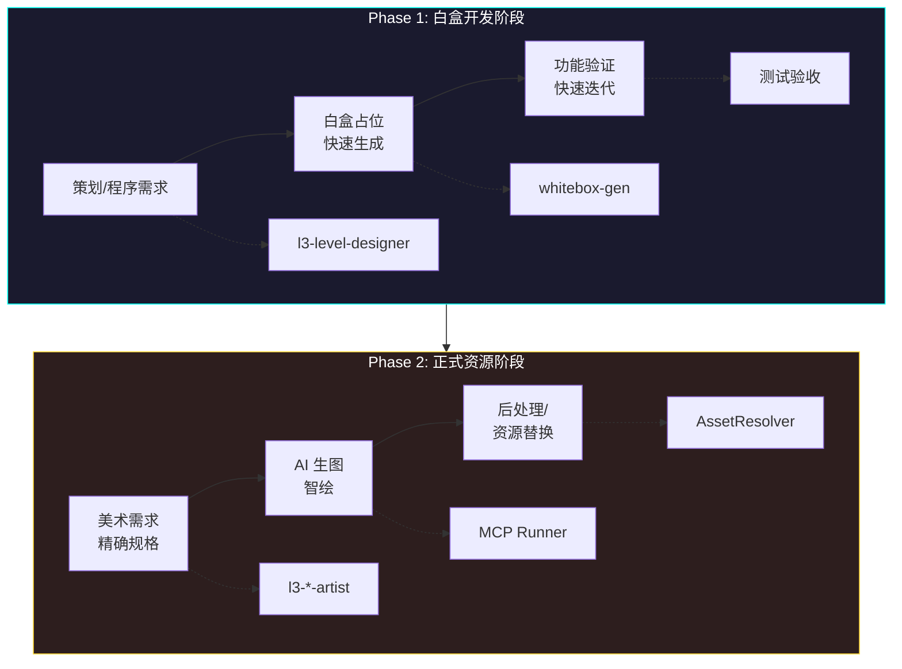
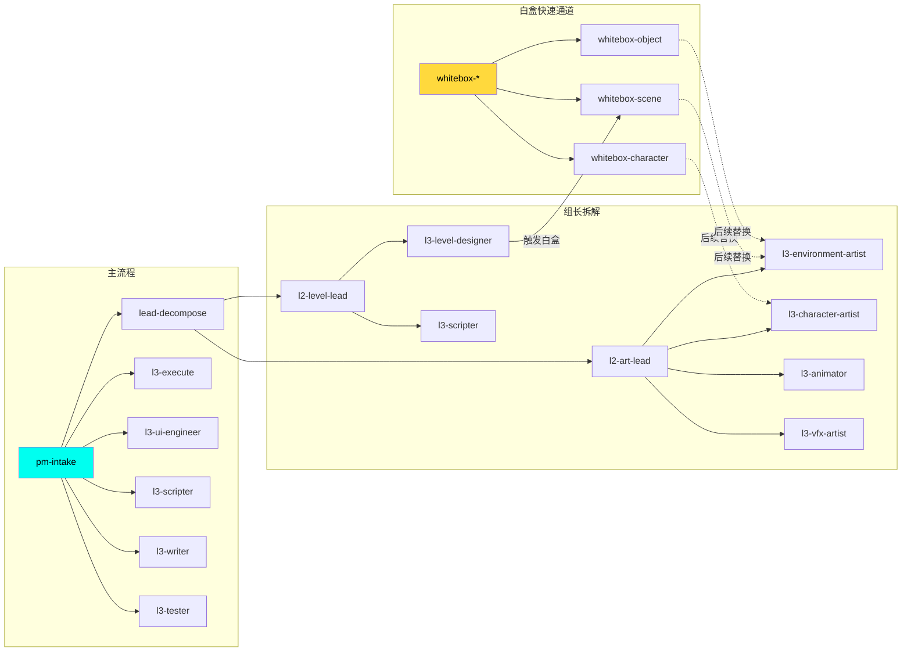
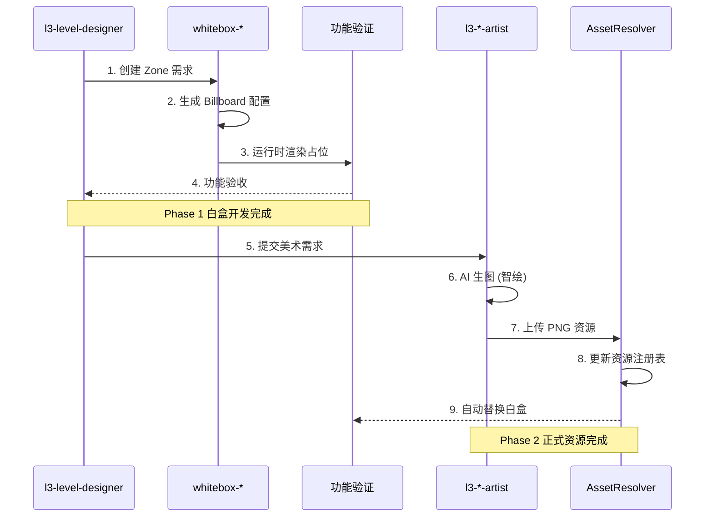

# 多岗位流程设计文档

> 创建时间：2026-01-07
> 更新时间：2026-01-07
> 状态：设计阶段 v2（含白盒占位流程）

> 快速入口：`../WORKFLOW-OVERVIEW.md`（粗/中/低粒度端到端工作流总览）

---

## 1. 设计目标

为 AI-Native 工作流覆盖所有关键岗位，确保：
- 每个岗位有明确的执行流程
- L2 组长有对应的拆解/审核流程
- L3 执行岗有对应的任务执行流程
- 流程之间可以级联调用
- **支持白盒占位 → 正式资源的两阶段生产**

---

## 1.1 资源规范

| 类型 | 格式 | 说明 |
|------|------|------|
| **复杂表达资产** | PNG | 角色、场景、物件、特效等 |
| **简单向量资源** | SVG | 仅用于白盒占位、简单图标 |
| **动画序列** | PNG 序列 / Spritesheet | 帧动画 |
| **Tileset** | WebP / PNG | 地图瓦片 |

---

## 1.2 两阶段资源生产模式

### 资源模式配置

参考 `src/config/assetMode.config.ts`：
- `WHITEBOX` - 白盒模式，全部使用占位资源
- `HYBRID` - 混合模式，部分使用正式资源
- `PRODUCTION` - 正式模式，全部使用正式资源

---

## 2. 岗位矩阵

### 2.1 现有流程覆盖

| 流程文件 | 覆盖角色 | 状态 |
|----------|----------|------|
| `fixed-flow.flowspec.json` | 通用固定流程 | ✅ |
| `pm-intake.flowspec.json` | L0_producer | ✅ |
| `lead-decompose.flowspec.json` | L2_* (通用组长) | ✅ |
| `l3-execute.flowspec.json` | L3_engineer, L3_gameplay_engineer | ✅ |
| `l3-writer.flowspec.json` | L3_writer | ✅ |
| `l3-tester.flowspec.json` | L3_tester | ✅ |

### 2.2 待创建流程

#### 程序类
| 流程文件 | 覆盖角色 | 优先级 |
|----------|----------|--------|
| `l3-scripter.flowspec.json` | L3_scripter（事件/Zone脚本） | P1 |
| `l3-ui-engineer.flowspec.json` | L3_ui_engineer（UI开发） | P1 |

#### 策划类
| 流程文件 | 覆盖角色 | 优先级 |
|----------|----------|--------|
| `l2-level-lead.flowspec.json` | L2_level_lead（关卡组长） | P1 |
| `l3-level-designer.flowspec.json` | L3_level_designer（场景策划） | P1 |

#### 白盒/占位类
| 流程文件 | 用途 | 优先级 |
|----------|------|--------|
| `whitebox-scene.flowspec.json` | 白盒场景占位生成 | P0 |
| `whitebox-character.flowspec.json` | 白盒角色占位生成 | P0 |
| `whitebox-object.flowspec.json` | 白盒物件占位生成 | P0 |

#### 美术类（正式资源）
| 流程文件 | 覆盖角色 | 优先级 | 输出格式 |
|----------|----------|--------|----------|
| `l2-art-lead.flowspec.json` | L2_art_lead（美术组长） | P1 | - |
| `l3-environment-artist.flowspec.json` | L3_environment_artist（场景美术） | P1 | **PNG** |
| `l3-character-artist.flowspec.json` | L3_character_artist（角色美术） | P1 | **PNG** |
| `l3-animator.flowspec.json` | L3_animator（角色动画） | P2 | **PNG序列** |
| `l3-vfx-artist.flowspec.json` | L3_vfx_artist（特效） | P2 | **PNG** |

---

## 3. 岗位流程详细设计

### 3.1 L3_scripter（脚本员）

**职责**：编写 Zone 脚本、Event 脚本、对白触发逻辑

**输入**：
- TaskPack（含脚本需求）
- Zone Spec（`design/03-level/章节×区域叙事布置/*.md`）
- Event Spec（`design/ai-native/02_specs/systems/event_system_spec.md`）
- 对白词库（`design/01-narrative/对白词库 v1.md`）

**输出**：
- 脚本文件（`src/data/zones/*.yaml` 或 `src/data/events/*.yaml`）
- 对白文件（`src/data/dialogues/*.yaml`）

**流程节点**：
1. `intake` - 接收参数
2. `load_taskpack` - 加载 TaskPack
3. `load_zone_spec` - 加载 Zone 规格
4. `load_event_spec` - 加载事件系统规格
5. `execute` - 调用 Cursor Agent 生成脚本
6. `validate_yaml` - 验证 YAML 格式
7. `validate_schema` - 验证数据结构
8. `git_commit` - 提交
9. `notify` - 通知

**特殊配置**：
- `task_type`: `code`
- `model_override`: `auto`（脚本生成需要较强推理）
- 需要加载多个参考文件

---

### 3.2 L3_ui_engineer（UI程序员）

**职责**：实现 UI 界面、组件、交互逻辑

**输入**：
- TaskPack（含 UI 需求）
- UI Spec（`design/ai-native/02_specs/ui/*.md`）
- UI 配置（`src/config/ui.config.ts`）
- Art Bible（`design/ai-native/01_bibles/art_bible.md`）

**输出**：
- UI 组件文件（`src/systems/ui/*.ts`）
- 场景文件（`src/scenes/*.ts`）

**流程节点**：
1. `intake` - 接收参数
2. `load_taskpack` - 加载 TaskPack
3. `load_ui_spec` - 加载 UI 规格
4. `load_ui_config` - 加载 UI 配置常量
5. `execute` - 调用 Cursor Agent 实现 UI
6. `validate_lint` - TypeScript 检查
7. `validate_ui_constants` - 检查是否使用 UI 常量（禁止硬编码）
8. `git_commit` - 提交
9. `notify` - 通知

**特殊配置**：
- `task_type`: `code`
- 需要强制使用 `ui.config.ts` 中的常量
- 验证阶段需要检查硬编码

---

### 3.3 L3_level_designer（场景策划）

**职责**：设计 Zone 布局、谜题、事件触发点、叙事节奏

**输入**：
- TaskPack（含关卡需求）
- Design Bible（`design/ai-native/01_bibles/design_bible.md`）
- 世界观文档（`design/01-narrative/世界观完整版 v3.md`）
- 伏笔索引（`design/01-narrative/伏笔索引 v2.md`）

**输出**：
- Zone 叙事布置文档（`design/03-level/章节×区域叙事布置/*.md`）
- Zone 数据文件（`src/data/zones/*.yaml`）

**流程节点**：
1. `intake` - 接收参数
2. `load_taskpack` - 加载 TaskPack
3. `load_design_bible` - 加载设计总纲
4. `load_worldview` - 加载世界观
5. `load_foreshadow` - 加载伏笔索引
6. `execute` - 调用 Cursor Agent 设计关卡
7. `validate_foreshadow` - 检查伏笔使用
8. `validate_narrative_flow` - 检查叙事流程
9. `git_commit` - 提交
10. `notify` - 通知

**特殊配置**：
- `task_type`: `doc`（主要是文档输出）
- 需要检查伏笔编号是否正确引用

---

### 3.4 L2_level_lead（关卡组长）

**职责**：拆解关卡任务、分配给场景策划和脚本员、审核产出

**输入**：
- 高层需求（章节目标）
- Design Bible
- 现有 Zone 列表

**输出**：
- 拆解后的 TaskPack 列表
- 分配给 L3_level_designer 或 L3_scripter

**流程节点**：
1. `intake` - 接收章节/Zone 需求
2. `analyze_scope` - 分析涉及的 Zone 数量
3. `check_dependencies` - 检查 Zone 之间的依赖
4. `generate_subtasks` - 生成子任务（策划任务 + 脚本任务）
5. `dispatch_level_design` - 分发给场景策划
6. `dispatch_scripting` - 分发给脚本员
7. `notify` - 通知

**特殊逻辑**：
- 一个 Zone 通常需要：1个策划任务 + 1个脚本任务
- 可以并行分发

---

### 3.5 白盒占位流程

#### 3.5.1 whitebox-scene（白盒场景）

**职责**：快速生成场景占位资源，用于功能验证

**输入**：
- Zone ID 和 Zone 名称
- Zone 类型（life/municipal/archive/clinic/temple/edge/anomaly）
- 尺寸规格

**输出**：
- 白盒背景（运行时由 `BillboardFactory` 生成）
- Zone 配置更新

**流程节点**：
1. `intake` - 接收 Zone 参数
2. `validate_zone` - 验证 Zone 是否存在
3. `generate_config` - 生成/更新 Zone 配置
4. `update_asset_registry` - 更新资源注册表
5. `git_commit` - 提交配置
6. `notify` - 通知

**特殊配置**：
- `task_type`: `code`
- `execution_runtime`: `wsl`
- 不生成实际图片文件，配置 `BillboardFactory` 运行时生成

---

#### 3.5.2 whitebox-character（白盒角色）

**职责**：快速生成角色占位，用于对话和交互测试

**输入**：
- 角色 ID 和名称
- 角色类型（主角/NPC/系统角色）
- 标识色（可选）

**输出**：
- 角色配置文件更新
- Billboard 配置

**流程节点**：
1. `intake` - 接收角色参数
2. `load_character_profile` - 加载角色档案
3. `generate_billboard_config` - 生成 Billboard 配置
4. `update_character_registry` - 更新角色注册表
5. `git_commit` - 提交
6. `notify` - 通知

---

#### 3.5.3 whitebox-object（白盒物件）

**职责**：快速生成场景物件占位

**输入**：
- 物件 ID 和名称
- 物件类型（interactable/decoration/trigger/blocker/door/item）
- 所属 Zone

**输出**：
- 物件配置
- Billboard 配置

**流程节点**：
1. `intake` - 接收物件参数
2. `generate_billboard_config` - 生成 Billboard 配置
3. `update_zone_objects` - 更新 Zone 物件列表
4. `git_commit` - 提交
5. `notify` - 通知

---

### 3.6 L3_environment_artist（场景美术）

**职责**：制作场景背景、地图元素、环境资源（正式资源）

**输入**：
- TaskPack（含美术需求）
- Art Bible（`design/ai-native/01_bibles/art_bible.md`）
- Zone 叙事布置（场景描述）
- 美术规范（`.cursor/rules/05-assets.mdc`）
- AI 生图指南（`.cursor/rules/06-ai-art-generation.mdc`）

**输出**：
- 场景背景（`assets/images/backgrounds/*.png`）
- 地图瓦片（`assets/images/tilesets/*.webp` 或 `*.png`）

**流程节点**：
1. `intake` - 接收参数
2. `load_taskpack` - 加载 TaskPack
3. `load_art_bible` - 加载美术总纲
4. `load_zone_description` - 加载场景描述
5. `generate_prompt` - 生成 AI 生图提示词
6. `execute_ai_generation` - 调用 AI 生图（智绘）
7. `post_process` - 后处理（裁剪、格式转换）
8. `validate_asset` - 验证资源规格（尺寸、格式）
9. `git_commit` - 提交
10. `notify` - 通知

**特殊配置**：
- `task_type`: `multimodal`
- `execution_runtime`: `windows`（需要 MCP 浏览器访问智绘）
- `requires_mcp`: `true`

---

### 3.7 L3_character_artist（角色美术）

**职责**：制作角色立绘、表情差分、角色图标（正式资源）

**输入**：
- TaskPack（含角色需求）
- Art Bible
- 角色档案（`design/01-narrative/角色人生线档案 v2.md`）
- AI 生图指南（`.cursor/rules/06-ai-art-generation.mdc`）

**输出**：
- 角色立绘（`assets/images/characters/*.png`）
- 表情差分（`assets/images/characters/expressions/*.png`）
- 角色图标（`assets/images/ui/icons/*.png`）

**流程节点**：
1. `intake` - 接收参数
2. `load_taskpack` - 加载 TaskPack
3. `load_art_bible` - 加载美术总纲
4. `load_character_profile` - 加载角色档案
5. `generate_prompt` - 生成角色提示词（含外貌特征）
6. `execute_ai_generation` - 调用 AI 生图（智绘）
7. `generate_expressions` - 生成表情差分（批量生成）
8. `post_process` - 后处理（背景移除、尺寸调整）
9. `validate_asset` - 验证资源（PNG 格式、透明通道）
10. `update_asset_registry` - 更新资源注册表，触发替换白盒
11. `git_commit` - 提交
12. `notify` - 通知

**特殊配置**：
- `task_type`: `multimodal`
- `execution_runtime`: `windows`（需要 MCP 浏览器访问智绘）
- `requires_mcp`: `true`
- 需要维护角色视觉一致性（使用角色种子/风格锁定）

---

### 3.8 L3_animator（角色动画）

**职责**：制作角色动画、过场动画、UI 动效（正式资源）

**输入**：
- TaskPack（含动画需求）
- 角色资源（已有立绘 PNG）
- 动画规格（帧数、时长、循环模式）
- Art Bible

**输出**：
- 动画序列帧（`assets/images/animations/*.png`）
- Spritesheet（`assets/images/spritesheets/*.png`）
- 动画配置（`src/data/animations/*.json`）

**流程节点**：
1. `intake` - 接收参数
2. `load_taskpack` - 加载 TaskPack
3. `load_character_assets` - 加载角色立绘资源
4. `generate_animation_prompt` - 生成动画提示词
5. `execute_ai_generation` - 调用 AI 生成动画帧（智绘/其他工具）
6. `export_frames` - 导出 PNG 序列帧
7. `pack_spritesheet` - 打包为 Spritesheet（可选）
8. `create_config` - 创建动画配置 JSON
9. `validate_animation` - 验证动画（帧数、尺寸、循环）
10. `git_commit` - 提交
11. `notify` - 通知

**特殊配置**：
- `task_type`: `multimodal`
- `execution_runtime`: `windows`
- `requires_mcp`: `true`
- 输出格式：**PNG 序列帧 / Spritesheet**

---

### 3.9 L3_vfx_artist（特效）

**职责**：制作粒子特效、转场效果、能力特效（正式资源）

**输入**：
- TaskPack（含特效需求）
- Art Bible
- 特效需求描述（效果、颜色、时长）

**输出**：
- 特效序列帧（`assets/images/vfx/*.png`）
- 粒子纹理（`assets/images/particles/*.png`）
- 粒子配置（`src/data/particles/*.json`）

**流程节点**：
1. `intake` - 接收参数
2. `load_taskpack` - 加载 TaskPack
3. `load_art_bible` - 加载美术总纲
4. `generate_vfx_prompt` - 生成特效提示词
5. `execute_ai_generation` - 生成特效素材（智绘）
6. `create_particle_config` - 创建 Phaser 粒子配置
7. `validate_vfx` - 验证特效规格（PNG 格式、尺寸）
8. `git_commit` - 提交
9. `notify` - 通知

**特殊配置**：
- `task_type`: `multimodal`
- `execution_runtime`: `windows`
- `requires_mcp`: `true`
- 输出格式：**PNG**

---

### 3.10 L2_art_lead（美术组长）

**职责**：拆解美术任务、分配给美术执行岗、审核美术风格一致性

**输入**：
- 高层美术需求
- Art Bible
- 现有资源清单

**输出**：
- 拆解后的 TaskPack 列表
- 分配给 L3_environment_artist / L3_character_artist / L3_animator / L3_vfx_artist

**流程节点**：
1. `intake` - 接收美术需求
2. `analyze_scope` - 分析涉及的资源类型
3. `categorize_tasks` - 分类任务（场景/角色/动画/特效）
4. `generate_subtasks` - 生成子任务
5. `dispatch_to_artists` - 分发给对应美术
6. `notify` - 通知

**特殊逻辑**：
- 根据资源类型自动路由到对应美术岗位

---

## 4. 流程依赖关系

### 4.1 整体流程图

```mermaid
flowchart TB
    INTAKE["pm-intake<br/>入口"]
    
    INTAKE --> DECOMPOSE["lead-decompose<br/>通用组长拆解"]
    INTAKE --> DIRECT["直接执行岗"]
    INTAKE --> WHITEBOX["白盒快速通道"]
    
    subgraph LEAD_GROUP["组长拆解"]
        DECOMPOSE --> LEVEL_LEAD["l2-level-lead<br/>关卡组长"]
        DECOMPOSE --> ART_LEAD["l2-art-lead<br/>美术组长"]
    end
    
    subgraph PLAN_EXEC["策划执行"]
        LEVEL_LEAD --> LEVEL_DSN["l3-level-designer<br/>场景策划"]
        LEVEL_LEAD --> SCRIPTER["l3-scripter<br/>脚本员"]
    end
    
    subgraph ART_EXEC["美术执行"]
        ART_LEAD --> ENV_ARTIST["l3-environment-artist<br/>场景美术"]
        ART_LEAD --> CHAR_ARTIST["l3-character-artist<br/>角色美术"]
        ART_LEAD --> ANIMATOR["l3-animator<br/>动画"]
        ART_LEAD --> VFX_ARTIST["l3-vfx-artist<br/>特效"]
    end
    
    subgraph DIRECT_EXEC["直接执行"]
        DIRECT --> EXECUTE["l3-execute<br/>程序员"]
        DIRECT --> UI_ENG["l3-ui-engineer<br/>UI程序员"]
        DIRECT --> WRITER["l3-writer<br/>写手"]
        DIRECT --> TESTER["l3-tester<br/>测试员"]
    end
    
    subgraph WHITEBOX_GROUP["白盒占位"]
        WHITEBOX --> WB_SCENE["whitebox-scene<br/>白盒场景"]
        WHITEBOX --> WB_CHAR["whitebox-character<br/>白盒角色"]
        WHITEBOX --> WB_OBJ["whitebox-object<br/>白盒物件"]
    end
    
    %% 白盒到正式资源的替换链
    WB_SCENE -.->|替换| ENV_ARTIST
    WB_CHAR -.->|替换| CHAR_ARTIST
    WB_OBJ -.->|替换| ENV_ARTIST
    
    style INTAKE fill:#00fff0,stroke:#333,color:#000
    style WHITEBOX fill:#ffd93d,stroke:#333,color:#000
    style WHITEBOX_GROUP fill:#2d2818,stroke:#ffd93d
```

### 4.2 详细依赖（树状图）

### 4.3 白盒 → 正式资源替换链

---

## 5. 运行时路由规则

### 5.1 执行环境选择

| 条件 | 执行环境 |
|------|----------|
| `task_type == code` | WSL (cursor-agent) |
| `task_type == doc` | WSL (cursor-agent) |
| `task_type == multimodal` | Windows (MCP Runner) |
| `requires_mcp == true` | Windows (MCP Runner) |
| `execution_runtime == windows` | Windows (MCP Runner) |

### 5.2 角色自动路由

| 关键词 | 目标角色 |
|--------|----------|
| 脚本、Zone、Event | L3_scripter |
| UI、界面、组件 | L3_ui_engineer |
| 关卡、Zone布局、谜题 | L3_level_designer |
| 场景、背景、地图 | L3_environment_artist |
| 角色、立绘、表情 | L3_character_artist |
| 动画、序列帧 | L3_animator |
| 特效、粒子 | L3_vfx_artist |

---

## 6. 实现计划

### Phase 0 - 白盒快速通道（最高优先级）
> 目标：支持功能开发阶段快速验证

- [ ] whitebox-scene.flowspec.json（白盒场景）
- [ ] whitebox-character.flowspec.json（白盒角色）
- [ ] whitebox-object.flowspec.json（白盒物件）

### Phase 1 - 程序类
> 目标：完善程序岗流程

- [x] l3-execute.flowspec.json（通用程序员）
- [ ] l3-scripter.flowspec.json（脚本员）
- [ ] l3-ui-engineer.flowspec.json（UI程序员）

### Phase 2 - 策划类
> 目标：支持关卡/内容策划

- [ ] l2-level-lead.flowspec.json（关卡组长）
- [ ] l3-level-designer.flowspec.json（场景策划）

### Phase 3 - 美术类（正式资源）
> 目标：支持正式美术资源生产（替换白盒）

- [ ] l2-art-lead.flowspec.json（美术组长）
- [ ] l3-environment-artist.flowspec.json（场景美术）
- [ ] l3-character-artist.flowspec.json（角色美术）
- [ ] l3-animator.flowspec.json（角色动画）
- [ ] l3-vfx-artist.flowspec.json（特效）

### Phase 4 - 集成更新
> 目标：完善路由和端点

- [ ] 更新 server.mjs 添加白盒便捷端点
- [ ] 更新 /run-role 路由逻辑
- [ ] 添加 /whitebox/* 便捷端点

### 预计工作量

| Phase | 流程数 | 预计耗时 |
|-------|--------|----------|
| Phase 0 | 3 | 2h |
| Phase 1 | 2 | 2h |
| Phase 2 | 2 | 2h |
| Phase 3 | 5 | 4h |
| Phase 4 | 集成 | 2h |
| **总计** | **12 流程** | **~12h** |

---

## 7. 角色包补充（需要创建）

以下角色包需要在 `workflows/project/promptx/roles/` 中创建：

### 7.1 程序类角色包

| 文件 | 角色 | 说明 |
|------|------|------|
| `L3_scripter.yaml` | 脚本员 | Zone/Event 脚本编写 |
| `L3_ui_engineer.yaml` | UI程序员 | UI 界面开发 |

### 7.2 策划类角色包

| 文件 | 角色 | 说明 |
|------|------|------|
| `L2_level_lead.yaml` | 关卡组长 | 关卡任务拆解分配 |
| `L3_level_designer.yaml` | 场景策划 | Zone 设计、谜题、事件布置 |

### 7.3 美术类角色包

| 文件 | 角色 | 说明 |
|------|------|------|
| `L2_art_lead.yaml` | 美术组长 | 美术任务拆解分配 |
| `L3_environment_artist.yaml` | 场景美术 | 背景、地图、环境资源 |
| `L3_character_artist.yaml` | 角色美术 | 角色立绘、表情 |
| `L3_animator.yaml` | 角色动画 | 动画序列帧 |
| `L3_vfx_artist.yaml` | 特效 | 粒子、转场特效 |

### 7.4 白盒流程（无需角色包）

白盒流程属于工具流程，不需要专门的角色包，由现有角色（策划、程序员）触发使用。

---

## 8. 资源输出规范汇总

| 流程 | 输出路径 | 格式 | 说明 |
|------|----------|------|------|
| **白盒场景** | 运行时生成 | - | BillboardFactory 动态创建 |
| **白盒角色** | 运行时生成 | - | BillboardFactory 动态创建 |
| **白盒物件** | 运行时生成 | - | BillboardFactory 动态创建 |
| **场景美术** | `assets/images/backgrounds/` | **PNG** | 竖版 750×1334px |
| **地图瓦片** | `assets/images/tilesets/` | **WebP/PNG** | Blob-16 格式 |
| **角色立绘** | `assets/images/characters/` | **PNG** | 透明背景 |
| **表情差分** | `assets/images/characters/expressions/` | **PNG** | 透明背景 |
| **动画帧** | `assets/images/animations/` | **PNG** | 序列帧 |
| **Spritesheet** | `assets/images/spritesheets/` | **PNG** | 打包图 |
| **粒子纹理** | `assets/images/particles/` | **PNG** | 透明背景 |
| **特效序列** | `assets/images/vfx/` | **PNG** | 序列帧 |

---

*文档版本: v2.0*
*更新时间: 2026-01-07*
*状态: 设计完成，待生成 FlowSpec*
*下一步: 根据设计生成 FlowSpec 文件*

